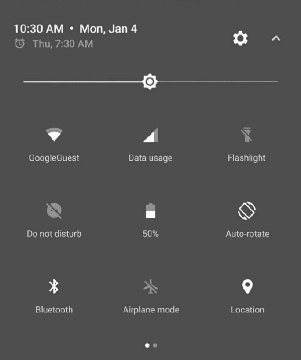

# Android 7 新特性介绍

> 原文：[`c.biancheng.net/view/2896.html`](http://c.biancheng.net/view/2896.html)

Android 7.0 Nougat 是迄今为止规模最大的 Android 版本。该版本为用户推出了各种崭新的功能，为开发者提供了数千个新的 API。不仅如此，它还将 Android 扩展得更广，小到手机、平板电脑和穿戴式设备，大到电视和汽车。

本节主要介绍 Android 7 新增的几个特性。

## 分屏显示

在运行 Android 7 的手机和平板电脑上，用户可以并排运行两个应用，或者处于分屏模式时，一个应用位于另一个应用之上。用户可以通过拖动两个应用之间的分隔线来调整应用所占屏幕的大小，如图 1 所示。

图 1　分屏显示

## 全新的通知设计

Android 7 对通知栏功能进行了进一步的丰富，使之速度更快且更加易于使用。可以实现通知栏内容分组、通知样式自定义、通知直接回复等功能，如图 2 所示。此外，借助于模板，开发者只需编写少量的代码便可以实现相关功能。
图 2　通知直接回复功能

## 基于配置文件的 JIT/AOT 编译

在 Android N 系统中，添加了 Just in Time(JIT) 编译器支持，可以在应用运行时对 ART 进行代码分析，持续提升 Android 应用的性能。

JIT 编译器对 Android 运行组件 Ahead of Time(AOT) 编译器进行了补充，有助于提升运行时性能，节省存储空间，加快应用更新和系统更新速度。基于配置文件的 JIT/AOT 编译可以让 Android N 系统的运行组件依据应用的实际情况对应用进行 JIT/AOT 编译，有助于降低 RAM 使用，降低耗电量，并且能够大幅度提升应用的安装速度。

优化的低电耗模式 Android 6.0 推出了低电耗模式，即设备处于空闲状态时，通过推迟应用的 CPU 和网络活动以实现省电目的的系统模式，例如设备放在桌上或抽屉里时。Android N 将低能耗模式更加推进了一步，只要屏幕关闭了一段时间，且设备未插入电源，低电耗模式就会对应用使用熟悉的 CPU 和网络限制。这意味着用户即使将设备放入口袋里也可以省电。

## Project Svelte : 后台优化

Android N 系统持续改善了 Project Svelte，以最大程度地减少 Android 设备中一系列系统和应用使用的 RAM。

在 Android N 中，删除了三个常用的隐式广播：CONNECTIVITY_ACTION、ACTION_NEW_PICTURE 和 ACTION_NEW_VIDEO。因为这些广播可能会一次唤醒多个应用的后台进程，同时会耗尽内存和电池。

## Data Saver

在移动设备的整个生命周期，蜂窝数据计划的成本通常会超出设备本身的成本。对于许多用户而言，蜂窝数据是他们想要节省的昂贵资源。

Android N 推出了 Data Saver 系统服务（下图 3 ）有助于减少应用使用的蜂窝数据，无论是在漫游、账单周期即将结束，还是使用少量的预付费数据包，Data Saver 让用户可以控制应用使用蜂窝数据的方式同时让开发者打开 Data Saver 时可以提供更多有效的服务。

Android N 还扩展了 ConnectivityManager，以便为应用检索用户的 Data Saver 首选项并监控首选项变更。所有应用均应检查用户是否已启用 Data Saver 并努力限制前台和后台的流量消耗。
图 3　Data Saver

## Quick Settings Tile API

快速设置贴片通常用于直接从通知栏显示关键设置和操作，如下图 4 所示。

在 Android N 中，扩展了快速设置贴片的范围，使其使用更加方便。

Android N 为快速设置贴片添加了更多空间，用户可以通过向左或向右滑动跨分页的显示区域访问它们。用户还可以控制显示哪些快速设置贴片，并且可以通过拖放贴片来添加或移动贴片位置。

Android N 为开发者提供了新的 API，以定义自己的快速设置贴片，进而使用户能够轻松访问应用中的关键控件和操作。

图 4　快速设置贴片

## 号码屏蔽和来电过滤

Android 7.0 对号码屏蔽和来电过滤功能提供了平台级别的支持，并提供了相关的 API。系统会形成一个号码屏蔽列表，系统默认的短信应用、系统应用和服务提供商开发的应用可以访问该列表，而其他应用不具有访问该列表的权限。

来电过滤功能除了会拒绝来电呼入之外，还可以将来电记录到系统日志，并且不向用户发送来电通知。借助号码屏蔽列表还可以完成短信屏蔽、跨设备使用该列表、多应用共用该列表等功能。

## OpenGL ES 3.2 API 支持

Android 7.0 支持 Khronos OpenGL ES 3.1 ，因此开发者可以在受支持的设备上为游戏和其他应用采用最高性能的 2D 和 3D 图形功能。

OpenGL ES 3.2 增加了计算着色器、模板纹理、加速的视觉效果、优化 ETC2 / EAC 纹理压缩、高级纹理渲染、标准化纹理尺寸以及渲染缓冲区格式等功能，针对 HDR 的浮点帧缓冲和延迟着色进行了优化，并通过强大的缓冲区访问控制减少了 WebGL 开销。

Android 7.0 还支持 Android 扩展程序包 (AEP)，这是一组 OpenGL ES 扩展程序，可让开发者使用镶嵌图案着色器、几何图形着色器、ASTC 纹理压缩扩展程序，按样本插入和着色以及其他高级渲染功能。有了 AEP，开发者就可以通过一系列 GPU 运用高性能图形。

## 密钥认证

Android 7.0 使用硬件支持的密钥库，可更安全地在 Android 设备上创建、存储和使用加密密钥。它们可保护 Linux 内核免受潜在的 Android 漏洞的攻击，也可防止别人从已取得 root 权限的设备提取密钥，以此提高 Android N 系统的安全性。