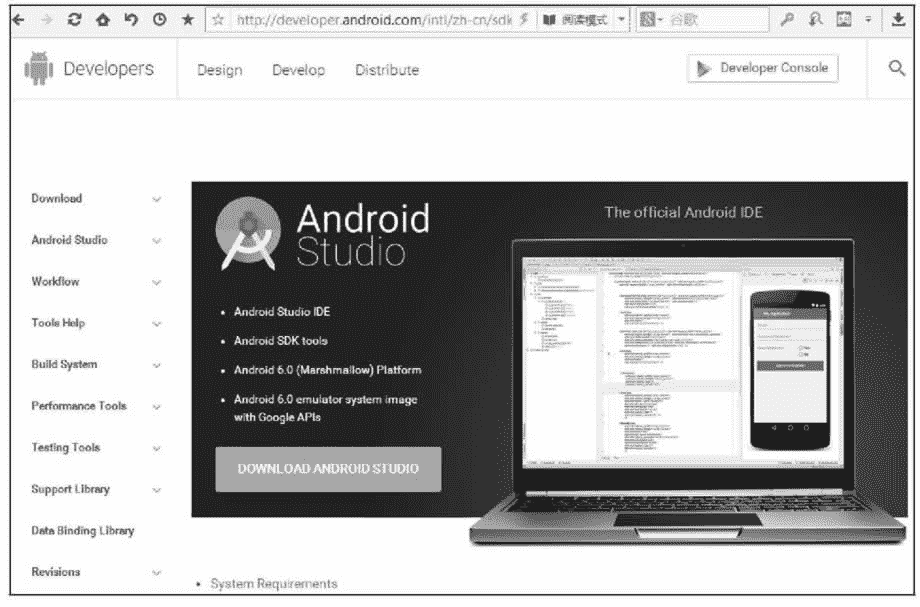
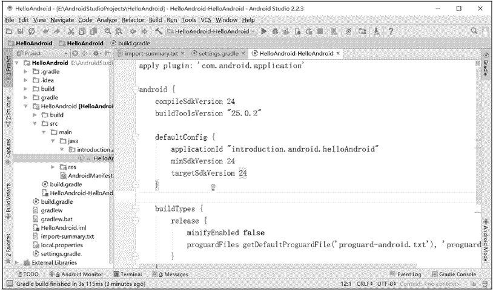
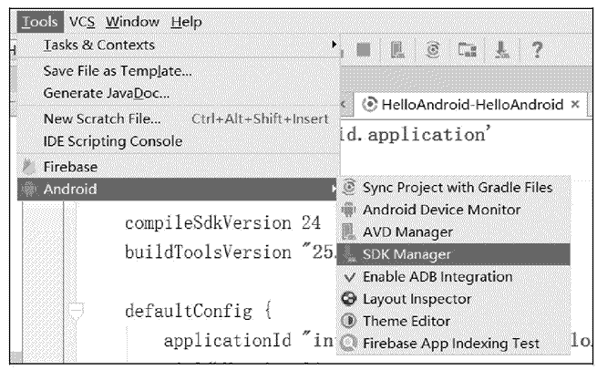
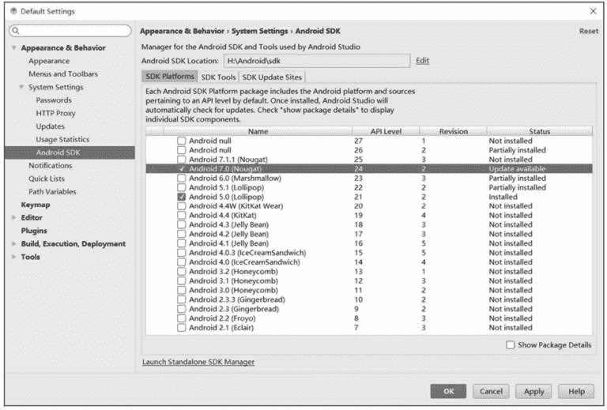
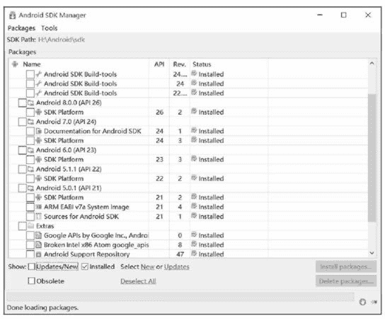
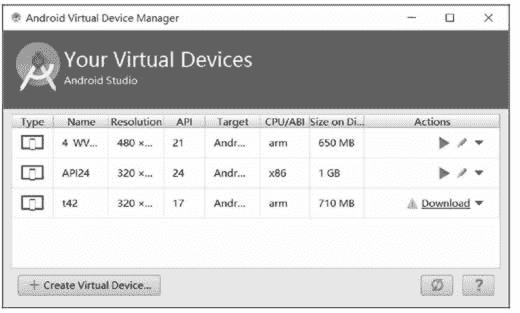
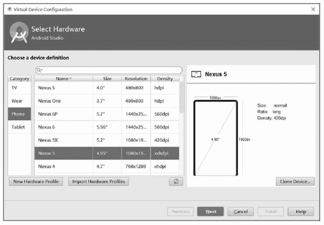
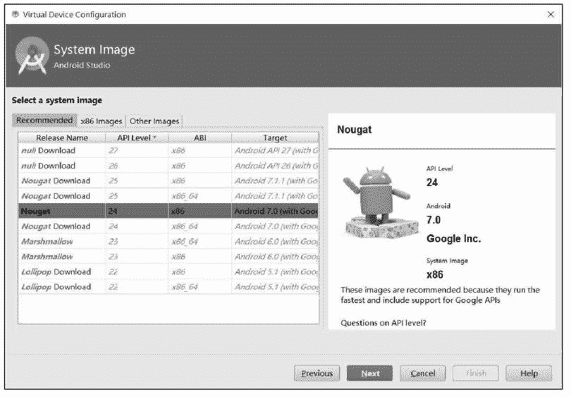
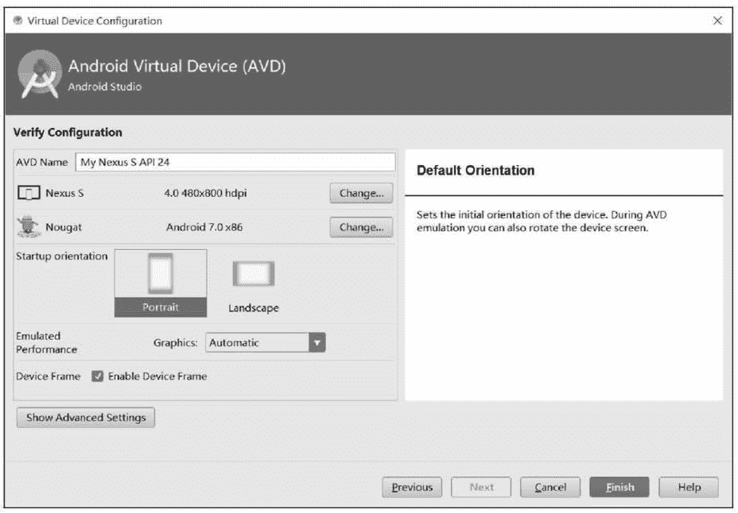
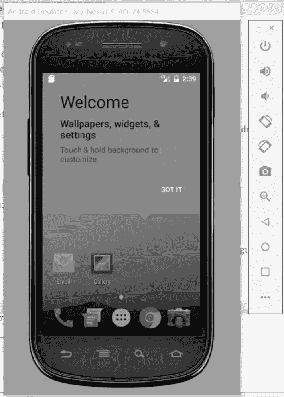

# Android 开发环境搭建教程（图解）

> 原文：[`c.biancheng.net/view/2899.html`](http://c.biancheng.net/view/2899.html)

支持 Android 开发的操作系统如下，读者可以选择自己喜欢的平台。

*   Windows XP（32 位）、Vista（32 位或 64 位）、Windows 7（32 位或 64 位）、Windows 10（32 位或 64 位）。
*   Mac OS X 10.5.8 或以后版本（x86）。
*   Linux Ubuntu。

考虑到大部分读者使用的都是 Windows，所以本套《Android 教程》也以 Windows 为例来讲解 Android 开发环境的搭建，其它操作系统与此类似，不再赘述。

## JDK 的安装

Android 开发使用的是 Java 语言，相信各位读者已经具备了 Java 基础，掌握了 JDK 的安装，这里不再赘述，不了解的读者请猛击下面的链接自行学习：

*   Java JDK 下载与安装教程
*   Java JDK 环境变量配置

没有掌握 Java 的读者是无法学习 Android 开发的，请先转到《Java 教程》学习 Java 基础知识。

## Android Studio

开发 Android 应用程序需要下载相关的 Android SDK。到 [`developer.Android.com/sdk/index.html`](http://http://developer.Android.com/sdk/index.html) 开发网页，如图 1 所示，根据自己的操作系统下载 Android SDK 软件开发包。

本教程下载的是 Android 7.0 版本（API Level 24）。本教程使用官方推荐的 Android Studio 进行开发，版本号是 2.2.3，Gradle 版本是 2.3.3。

图 1  Android SDK 下载页
下载完成后，双击即可安装。Android Studio 包含开发 Android 应用所需要的文件、运行环境及相关工具，如图 2 所示。
图 2  Android Studio 运行界面
Android Studio 的 "Tools" 菜单下包含一个 "Android" 菜单项，如图 3 所示，单击其中的子菜单 "SDK Manager" 会启动 SDK 管理器。
图 3  Android 子菜单
通过 SDK 管理器可以查看本机已经安装的 Android SDK 版本，如图 4 所示。
图 4  SDK Manager
单击“Launch Standalone SDK Manager”会启动独立的 SDK 管理器，如图 5 所示，可完成对 SDK 的文档、工具等进行相应的安装和更新工作。
图 5  独立的 SDK 管理器

## 创建 AVD

在 Android Studio 中单击 Tools|Android| AVD Manager 命令，启动 Android 虚拟设备管理器。如图 6 所示。单击“Create Virtual Device”按钮，出现新建虚拟设备界面。
图 6  AVD 管理器
如图 7 所示。总体而言，界面分为左中右三部分，左侧为 TV、Wear、Phone、Tablet 四个类别，说明 Android 7 对电视、可穿戴设备、手机和平板的开发都提供了支持；中间一列为针对左侧的某个类别已经建立好的虚拟设备的配置文件，可基于配置文件直接创建虚拟设备；右侧为配置文件的图形化描述，包括屏幕尺寸、现实精细度等。
图 7  新建虚拟设备界面
例如，要基于 Nexus S 配置文件创建虚拟手机，其分辨率为 480×800，现实效果为 hdpi，需要在左侧单击“Phone”，在中间选择“Nexus S”配置文件，然后单击“Next”按钮，出现系统映像选择界面。如图 8 所示，选择系统映像文件，决定虚拟手机的 Android 系统版本、系统架构以及 API 等级。

Android 7 支持 x86 架构、x86_64 架构、armeabi 架构以及 arm64 架构，可根据需要进行选择。
 
图 8  系统映像选择
选择 Nougat，API Level 为 24，架构为 x86，单击“Next”按钮，进入虚拟设备参数配置界面。如图 9 所示，为虚拟手机设备起一个名字，并可对虚拟设备的分辨率、Android 系统版本、横屏还是竖屏、3D 绘图使用硬件加速还是软件加速等信息进行配置。
图 9　虚拟设备参数配置
最后单击“Finish”按钮，完成虚拟手机设备的创建。创建的虚拟设备会出现在 AVD 管理器中，单击运行即可启动，如图 10 所示。
 
图 10  新创建的 AVD

## AVD 与真机的区别

AVD 提供了近乎真实手机的虚拟环境，以便于程序员进行调试。但是 AVD 毕竟不是真机，有些功能目前 AVD 尚不能模拟，比如：

*   AVD 不支持真实的电话接听和呼叫，但是可以通过控制台模拟电话呼叫。
*   AVD 不支持 USB 连接。
*   AVD 不支持相机/视频捕捉（输入）。
*   AVD 不支持耳机。
*   AVD 不支持蓝牙。
*   AVD 不能在运行时确认 SD 卡的插入和弹出状态。
*   AVD 不能确定电池的电量多少和充电状态。
*   AVD 不能确定连接状态。