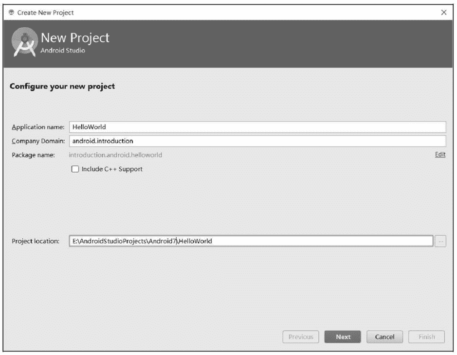
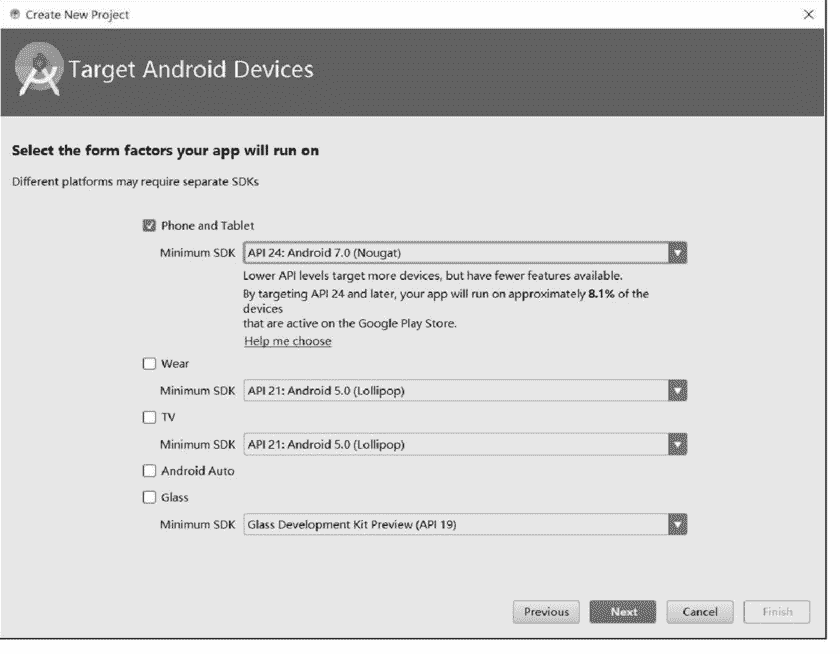
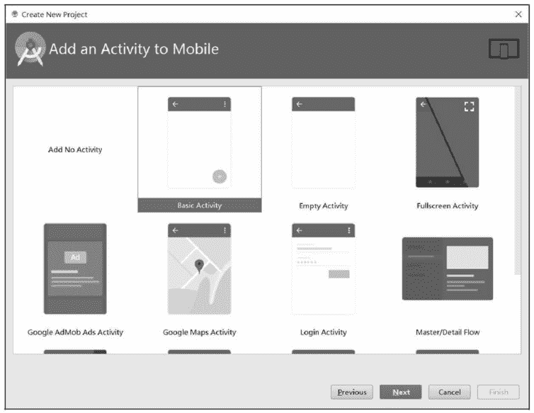
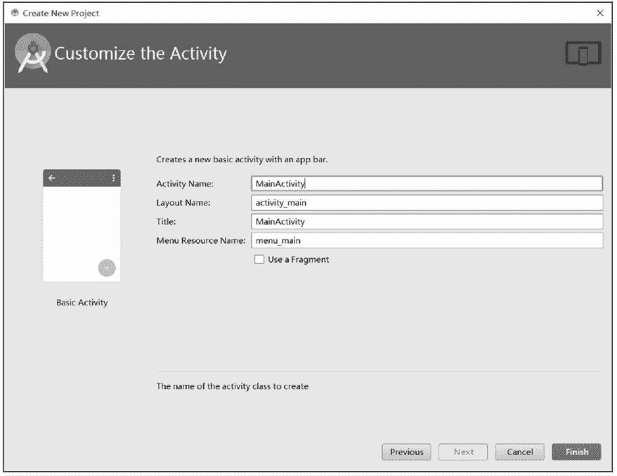
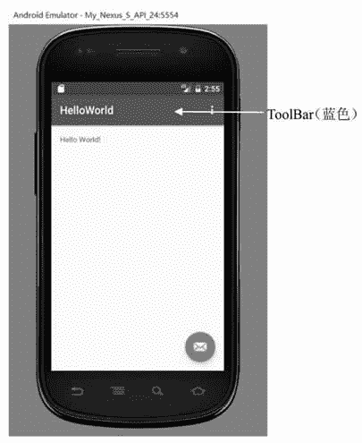
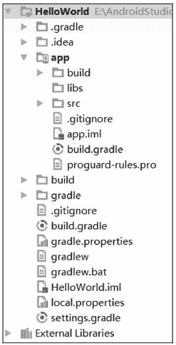
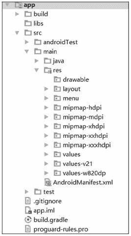

# 通过 Android Studio 创建 Android 应用程序（附带解析）

> 原文：[`c.biancheng.net/view/2913.html`](http://c.biancheng.net/view/2913.html)

这一节我们主要来创建一个简单的 Android 的应用程序。

## 创建 HelloWorld 工程

启动 Android Studio，依次选择 File --> New --> New Project，将会出现如图 1 所示的界面。在 Application name 中输入项目名称“HelloWorld”，在 Company Domain 中输入“android.introduction”，系统会自动生成包名为“introduction.Android.helloWorld”。
图 1  创建 HelloWorld 工程
 Project Location 指定工程文件存放的位置。单击“Next”按钮，出现如图 2 所示的界面，用于选择应用运行的系统版本。选择运行平台为“Android 7.0”。
图 2  选择应用系统平台
 再次单击“Next”按钮，进入创建 Activity 界面，如图 3 所示。该界面可以添加多种 Activity 的模板，本次添加一个基本的 Activity 即可，选择“Basic Activity”。
图 3　创建 Activity
 单击“Next”按钮，进入如图 4 所示的界面，指定 Activity 的相关信息，例如 Activity 的名字、布局文件的名字、菜单资源的名字以及 Activity 上显示的标题。此处使用默认设置，不做更改。
图 4  指定 Activity 的相关信息
 设置完成后，单击“Finish”按钮完成工程的创建。

Android Studio 会根据刚才指定的相关信息生成相关模板代码，用户无须编写任何一行代码，该工程就可以运行。按 Shift+F10 快捷键，选择要运行的 AVD，可查看运行效果，如图 5 所示。
图 5  运行效果

## 相关代码

双击 HelloWorld 工程中的 MainActivity.java，该文件中已有程序代码如下：

```

package introduction.android.helloworld;

import android.os.Bundle;
import android.support.design.widget.FloatingActionButton;
import android.support.design.widget.Snackbar;
import android.support.v7.app.AppCompatActivity;
import android.support.v7.widget.Toolbar;
import android.view.View;
import android.view.Menu;
import android.view.MenuItem;

public class MainActivity extends AppCompatActivity {

    @Override
    protected void onCreate(Bundle savedInstanceState) {
        super.onCreate(savedInstanceState);
        setContentView(R.layout.activity_main);
        Toolbar toolbar = (Toolbar) findViewById(R.id.toolbar);
        setSupportActionBar(toolbar);

        FloatingActionButton fab = (FloatingActionButton) findViewById(R.id.fab);
        fab.setOnClickListener(new View.OnClickListener() {
            @Override
            public void onClick(View view) {
                Snackbar.make(view, "Replace with your own action", Snackbar.LENGTH_LONG)
                        .setAction("Action", null).show();

            }
        });
    }

    @Override
    public boolean onCreateOptionsMenu(Menu menu) {
        // Inflate the menu; this adds items to the action bar if it is present.
        getMenuInflater().inflate(R.menu.menu_main, menu);
        return true;
    }

    @Override
    public boolean onOptionsItemSelected(MenuItem item) {
        // Handle action bar item clicks here. The action bar will
        // automatically handle clicks on the Home/Up button, so long
        // as you specify a parent activity in AndroidManifest.xml.
        int id = item.getItemId();

        //noinspection SimplifiableIfStatement
        if (id == R.id.action_settings) {
            return true;
        }

        return super.onOptionsItemSelected(item);
    }
}
```

MainActivity.java 中的代码比较简单，表明类 MainActivity 继承了 AppCompatActivity 类，并重写了 onCreate() 方法。

AppCompatActivity 类是 Android Studio 中默认的构建自定义 Activity 的模板类，与 Eclipse+ADT 环境中默认使用的 Activity 相比，AppCompatActivity 提供了对工具栏 ToolBar 的支持。相关代码如下：

Toolbar toolbar = (Toolbar) findViewById(R.id.toolbar);
setSupportActionBar(toolbar);

在 MainActivity 的 onCreate() 方法体中调用了父类的 onCreate() 方法，然后调用 setContentView() 方法显示视图界面。Android 工程中使用 XML 文件来设计视图界面，R.layout.activity_main 是 Android 工程中默认的布局文件的名字，即 activity_main.xml。

Activity_main.xml 的内容如下：

```

<?xml version="1.0" encoding="utf-8"?>
<android.support.design.widget.CoordinatorLayout
    xmlns:android="http://schemas.android.com/apk/res/android"
    xmlns:app="http://schemas.android.com/apk/res-auto"
    xmlns:tools="http://schemas.android.com/tools"
    android:layout_width="match_parent"
    android:layout_height="match_parent"
    tools:context="introduction.android.helloworld.MainActivity">

    <android.support.design.widget.AppBarLayout
        android:layout_width="match_parent"
        android:layout_height="wrap_content"
        android:theme="@style/AppTheme.AppBarOverlay">

        <android.support.v7.widget.Toolbar
            android:id="@+id/toolbar"
            android:layout_width="match_parent"
            android:layout_height="?attr/actionBarSize"
            android:background="?attr/colorPrimary"
            app:popupTheme="@style/AppTheme.PopupOverlay" />

    </android.support.design.widget.AppBarLayout>

    <include layout="@layout/content_main" />

    <android.support.design.widget.FloatingActionButton
        android:id="@+id/fab"
        android:layout_width="wrap_content"
        android:layout_height="wrap_content"
        android:layout_gravity="bottom|end"
        android:layout_margin="@dimen/fab_margin"
        app:srcCompat="@android:drawable/ic_dialog_email" />

</android.support.design.widget.CoordinatorLayout>
```

CoordinatorLayout 布局是 support v7 系统新增的布局，具有便于调度协调子布局的特点。该布局可看作是增强版的 FrameLayout，通常与 ToolBar 和 FloatingActionButton 合用。 ToolBar 是图 5 中显示 HelloWorld 的蓝色工具栏，具有承载系统菜单的功能。布局相关代码如下：

```

<android.support.design.widget.AppBarLayout
        android:layout_width="match_parent"
        android:layout_height="wrap_content"
        android:theme="@style/AppTheme.AppBarOverlay">

        <android.support.v7.widget.Toolbar
            android:id="@+id/toolbar"
            android:layout_width="match_parent"
            android:layout_height="?attr/actionBarSize"
            android:background="?attr/colorPrimary"
            app:popupTheme="@style/AppTheme.PopupOverlay" />

</android.support.design.widget.AppBarLayout>
```

FloatingActionButton 是图 5 中右下侧的邮箱图标的按钮，布局相关代码如下：

```

<android.support.design.widget.FloatingActionButton
        android:id="@+id/fab"
        android:layout_width="wrap_content"
        android:layout_height="wrap_content"
        android:layout_gravity="bottom|end"
        android:layout_margin="@dimen/fab_margin"
        app:srcCompat="@android:drawable/ic_dialog_email" />
```

在 MainActivity.java 中，FloatingActionButton 的事件处理代码为：

```

FloatingActionButton fab = (FloatingActionButton) findViewById(R.id.fab);
        fab.setOnClickListener(new View.OnClickListener() {
            @Override
            public void onClick(View view) {
                Snackbar.make(view, "Replace with your own action", Snackbar.LENGTH_LONG)
                        .setAction("Action", null).show();
            }
 });
```

该代码实现的功能是，当点击按钮时，显示 "Replace with your own action"。

<include layout ="@layout/content_main" />

这行代码将 content_main.xml 的布局嵌入 activity_main 布局中。content_main.xml 的代码为：

```

<?xml version="1.0" encoding="utf-8"?>

<android.support.constraint.ConstraintLayout
    xmlns:android="http://schemas.android.com/apk/res/android"
    xmlns:app="http://schemas.android.com/apk/res-auto"
    xmlns:tools="http://schemas.android.com/tools"
    android:layout_width="match_parent"
    android:layout_height="match_parent"
    app:layout_behavior="A@string/appbar_scrolling_view_behavior"
    tools:context="introduction.android.helloworld.MainActivity"
    tools:showIn="@layout/activity_main">

    <TextView
        android:layout_width="wrap_content"
        android:layout_height="wrap_content"
        android:text="Hello World!"
        app:layout_constraintBottom_toBottomOf="parent"
        app:layout_constraintLeft_toLeftOf="parent"
        app:layout_constraintRight_toRightOf="parent"
        app:layout_constraintTop_toTopOf="parent" />

</android.support.constraint.ConstraintLayout>
```

该文件中的代码表示当前的布局文件使用 LinearLayout 布局，该布局中仅有一个 TextView 组件用于显示信息，显示的内容为 "Hello World!"。

Android Studio 鼓励用户将所有组件放置到 content_main.xml 中，而对 activity_main 中的代码尽量不做修改。

为了简化代码，降低阅读难度，在本教程的范例程序代码中，除非需要用到工具栏和悬浮按钮，其余都会将 .java 文件和 .xml 文件中的 ToolBar 和 FloatingActionButton 的相关代码移除掉，并且直接使用单个布局文件搭建界面，避免使用 include 将一个布局嵌入另一个布局中。

## 工程文件结构解析

没有书写一句程序代码，一个 Android 应用便创建成功了，但是这只是一个简单的 Android 应用，要创建更多的 Android 应用，还要详细地了解 Android 应用程序结构。 Android Studio 的 Project 工程文件结构如图 6 所示。
图 6  Android Studio 工程文件结构
 主要目录和作用：

| 名称 | 作用 |
| .gradle 目录 | Gradle 在构建工程的过程中生成的文件 |
| .idea 目录 | Android Studio 生成的工程配置文件，类似 Eclipse 的 project.properties |
| build 目录 | 相当于 Eclipse 工程的 bin 目录，用于存放生成的文件，包括 APK |
| gradle 目录 | 用于存放 Gradle 构建工具系统的 JAR 和 Wrapper 等，以及配置文件 |
| External Libraries | 工程依赖的 LIB 文件，如 SDK 等 |
| app 目录 | Android Studio 创建工程中的一个 Module，是程序开发者的主要工作目录 |

app 目录下的结构如图 7 所示：
图 7  app 目录结构
 下面分别介绍各个目录或文件的作用：

| 目录/文件 | 作用 |
| src | 包含应用程序的所有源代码。在 src 用的 Activity，MainActivity.java 就是在创建项目的时候创建的一个 Activity，在 Activity 中可以编写控制 View 的逻辑。 |
| build | source 包中有一个 "R.java" 文件。R 类中包含 4 个静态内部类：attr、drawable、layout 和 string，分别代表属性、图片资源、布局文件及字符串的声明。R.java 文件是资源索引类，由 Eclipse 自动生成，开发者不用去修改和维护里面的内容，但是这个文件却非常有用，它和 res 文件夹紧密相连，对 res 下资源的操作都会导致 R.java 文件的重新编译。R.java 中定义的常量类也可以间接帮助 Activity 完成对资源的应用。Android 这样设计的好处是使得复杂的资源通过专门的类来管理而让程序中的代码变得整齐、强壮，并且减少程序出错和 bug 的产生。 |
| assets | 通常放置一些原始资源文件，会在 Android 打包的时候原封不动地一起打包，安装时会直接解压到对应的 Android 打包的时候原封不动地一起打包，安装时会直接解压到对应的 assets 目录中。这里通常放置一些项目中用到的多媒体资源等。 |
| res | 通常放置的是 Android 要用到的各种程序资源。其中，常见的子文件夹有 drawable、layout、values 等。其中，drawable 目录放置应用到的图片资源；layout 目录放置一些与 UI 相关的布局文件，都是以 XML 文件方式保存；values 目录中放置的是一些字符串、数组、颜色、样式和动画等资源，values 目录中的每一个文件都会转化成 R.java 中的一个静态类，文件中的每一个资源都会转化成 R.java 中对应静态类的静态整型常量，这样 Activity 中通过一个解析器就可以获取对应的资源。 |
| AndroidManifest.xml | 是整个项目的配置资源，里面配置的内容包括当前应用程序所在的包、应用程序中的 Activity、应用程序的访问权限等。 |