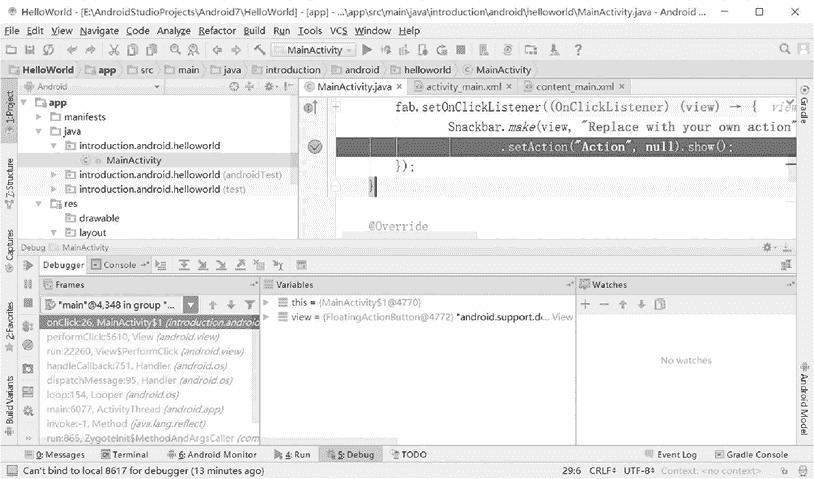

# Android Studio 的基本调试

> 原文：[`c.biancheng.net/view/2917.html`](http://c.biancheng.net/view/2917.html)

本节主要介绍 Android Studio 开发平台的基本调试方法。

## 设置断点

设置断点检查每个变量的运行输出，更适合一些大型项目的排错或状态检测，是 Java 开发中不可缺少的调试方法。

设置断点的方法有两种：

*   双击 Android Studio 代码编辑区左边的区域。
*   在需要添加或者移除断点的代码处接 Ctrl+F8 快捷键。

## 调试

通过单击工具栏上的按钮，或者在项目上右击，然后选择 Debug 'All Tests' 菜单命令，或者按 Shift+F9 快捷键，启动程序的调试模式，如图 1 所示。

当程序运行到设置的断点时就会停下，这时可以按照下面的功能键按需求进行调试：

*   快捷键 F8 单步执行程序。
*   快捷键 F7 单步执行程序，遇到方法时进入。
*   快捷键 Alt+F9 运行到光标处。

在调试界面，变量的值会出现在 Variables 窗口中，这样就可以查看运行至断点时变量当前的值，可在 Watches 界面添加想观测的变量或者对象的值。
图 1 调试界面