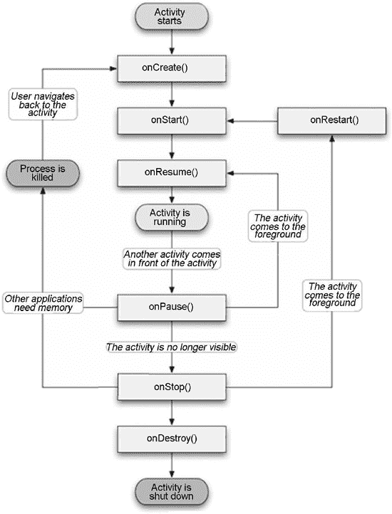
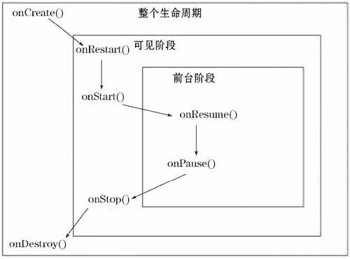

# Android Activity 组件及其生命周期

> 原文：[`c.biancheng.net/view/2923.html`](http://c.biancheng.net/view/2923.html)

Activity 是 Android 组件中最基本也是最为常见的组件。

Activity 是用户接口程序，原则上它会提供给用户一个交互式的接口功能，几乎所有的 Activity 都要和用户打交道，也有人把它比喻成 Android 的管理员。需要在屏幕上显示什么、用户在屏幕上做什么、处理用户的不同操作等都由 Activity 来管理和调度。

Activity 提供用户与 Android 系统交互的接口，用户通过 Activity 来完成自己的目的。例如打电话、拍照、发送 E-mail、查看地图等。

每个 Activity 都提供一个用户界面窗口，一般情况下，该界面窗口会填满整个屏幕，但是也可以比屏幕小，或者浮在其他的窗口之上。

一个 Android 应用程序通常由多个 Activity 组成，但是其中只有一个为主 Activity。其作用相当于 Java 应用程序中的 main 函数，当应用程序启动时，作为应用程序的入口首先呈现给用户。

Android 应用程序中的多个 Activity 可以直接相互调用以完成不同工作。

当新的 Activity 被启动的时候，之前的 Activity 会停止，但是不会被销毁，而是被压入“后退栈(Back Stack)”的栈顶，新启动的 Activity 获得焦点，显示给用户。

“后退栈”遵循“后入先出”的原则。当新启动的 Activity 被使用完毕，用户单击“Back”按钮时，当前的 Activity 会被销毁，而原先的 Activity 会被从“后退栈”的栈顶弹出并且激活。

当 Activity 状态发生改变时，都会通过状态回调函数通知 Android 系统。而程序编写人员可以通过这些回调函数对 Activity 进行进一步的控制。

## Activity 的生命周期

从本质上讲，Activity 在生命周期中共存在三个状态，这三个状态如下：

#### 1) 运行态

指 Activity 运行于屏幕的最上层并且获得了用户焦点。

#### 2) 暂停态

指当前 Activity 依然存在，但是没有获得用户焦点。

在其之上有其他的 Activity 处于运行态，但是由于处于运行态的 Activity 没有遮挡住整个屏幕，当前 Activity 有一部分视图可以被用户看见。处于暂停态的 Activity 保留了自己所使用的内存和用户信息，但是在系统极度缺乏资源的情况下，有可能会被杀死以释放资源。

#### 3) 停止态

指当前 Activity 完全被处于运行态的 Activity 遮挡住，其用户界面完全不能被用户看见。

处于停止态的 Activity 依然存活，也保留了自己所使用的内存和用户信息，但是一旦系统缺乏资源，停止态的 Activity 就会被杀死以释放资源。

Activity 在生命周期中从一种状态到另一种状态时会激发相应的回调方法，这几个回调方法如下：

| 名称 | 调用时间 |
| onCreate(Bundle savedInstanceState) | 创建 Activity 时调用。 
设置在该方法中，还以 Bundle 的形式提供对以前储存的任何状态的访问。其中参数 savedInstanceState 对象是用于保存 Activity 的对象的状态。 |
| onStart() | Activity 变为在屏幕上对用户可见时调用。 |
| onResume() | Activity 开始与用户交互时调用（无论是启动还是重启一个活动，该方法总是被调用）。 |
| onPause() | 当 Android 系统要激活其他 Activity 时，该方法被调用，暂停或收回 CPU 和其他资源时调用。 |
| onStop() | Activity 被停止并转为不可见阶段时调用。 |
| onRestart() | 重新启动已经停止的 Activity 时调用。 |
| onDestroy() | Activity 被完全从系统内存中移除时调用。 
该方法被调用可能是因为有人直接调用 finish() 方法或者系统决定停止该活动以释放资源。 |

上面 7 个生命周期方法分别在 4 个阶段按着一定的顺序进行调用，这 4 个阶段如下：

*   启动 Activity：在这个阶段依次执行 3 个生命周期方法：onCreate、onStart 和 onResume。
*   Activity 失去焦点：如果在 Activity 获得焦点的情况下进入其他的 Activity 或应用程序，这时当前的 Activity 会失去焦点。在这一阶段，会依次执行 onPause 和 onStop 方法。
*   Activity 重获焦点：如果 Activity 重新获得焦点，会依次执行 3 个生命周期方法：onRestart、onStart 和 onResume。
*   关闭 Activity：当 Activity 被关闭时，系统会依次执行 3 个生命周期方法：onPause、onStop 和 onDestroy。

Activity 生命周期中方法的调用过程如图 1 所示，可以很直观地了解到 Activity 的整个生命周期。
图 1  Activity 生命周期
 Activity 的生命周期表现在三个层面，如图 2 所示，可以更清楚地了解 Activity 的运行机制。
图 2  Activity 的整个生命周期
 如果 Activity 离开可见阶段，长时间失去焦点，就很可能被系统销毁以释放资源。当然，即使该 Activity 被销毁掉，用户对该 Activity 所做的更改也会被保存在 Bundle 对象中，当用户需要重新显示该 Activity 时，Android 系统会根据之前保存的用户更改信息将该 Activity 重建。

## Activity 的创建

在一个 Android 工程中，创建 Activity 的步骤如下：

#### 1) 新建类

创建一个 Activity，必须创建 Android.app.Activity（或者它的一个已经存在的子类）的一个子类，并重写 onCreate() 方法。

#### 2) 关联布局 XML 文件

在新建的 Activity 中设置其布局方式，需要在 res/layout 目录中新建一个 XML 布局文件，可以通过 setContentView() 来指定 Activity 的用户界面的布局文件。

#### 3) 注册

在 AndroidManifest.xml 文件中对建立的 Activity 进行注册，即在 <application> 标签下添加 <activity> 标签。例如，注册 ExampleActivity 的代码如下：

```

<manifest ... >
    <application ... >
        <activity android:name = ".ExampleActivity" />
        ...
    </application ... >
    ...
</manifest >

```

对于主 Activity，要为其添加 <intent-filter> 标签，代码如下：

```

<activity Android:name = ".ExampleActivity" Android:icon = "@drawable/app_icon">
    <intent-filter>
        <action Android:name = "Android.intent.action.MAIN" />
        <category Android:name = "Android.intent.category.LAUNCHER" />
    </intent-filter>
</activity>
```

对代码的说明：

*   <action Android:name = "Android.intent.action.MAIN" /> 表示该 Activity 作为主 Activity 出现。
*   <category Android:name = "Android.intent.category.LAUNCHER" /> 表示该 Activity 会被显示在最上层的启动列表中。 

## 启动 Activity

在 Android 系统中，除了主 Activity 由系统启动外，其他 Activity 都要由应用程序来启动。

1）通常情况下，通过 startActivity() 方法来启动 Activity，而要启动的 Activity 的信息由 Intent 对象来传递，例如：

Intent intent = new Intent(this,AnotherActivity.class);
startActivity(intent);

表示通过当前的 Activity 启动名为 AnotherActivity 的 Activity。

有时，用户不需要知道要启动的 Activity 的名字，而可以仅制定要完成的行为，由 Android 系统来为用户挑选合适的 Activity，例如：

Intent intent = new Intent(Intent.ACTION_SEND);
intent.putExtra(Intent.EXTRA_EMAIL,recipientArray);
startActivity(intent);

其中，Intent.EXTRA_EMAIL 放置的是 recipientArray 中存储的要发送的 E-mail 的目标地址。该 Intent 对象被 startActivity() 启动后，Android 系统会启动相应的 E-mail 处理应用程序，并将 Intent.EXTRA_EMAIL 中的内容放置到邮件的目标地址中。

2）有时，当需要从启动的 Activity 获取返回值的时候，需要使用 startActivityForResult() 方法代替 startActivity() 方法，并实现 onActivityResult() 方法来获取返回值。

例如，在发送短信的时候，用户需要从联系人列表中获取联系人的信息，然后返回到短信发送界面，代码如下：

Intent intent = new Intent(Intent.ACTION_PICK,Contacts.CONTENT_URI);
startActivityForResult(intent,PICK_CONTACT_REQUEST);

当用户选择了联系人后，相关信息会被存储到 Intent 对象中，并返回到 onActivityResult() 方法中。

## 关闭 Activity

关闭 Activity 使用 finish() 方法。关闭之前启动的其他 Activity 可以使用 finishActivity() 方法。

需要注意的是，虽然 Android SDK 提供了关闭 Activity 的方法，但是通常情况下，程序员不应该使用这些方法去强制关闭 Activity。

因为 Android 系统在为用户维护 Activity 的生命周期，并且提供了完备的资源回收机制和资源重建机制，可以动态地回收和重建 Activity，因此 Activity 应用交由 Android 系统来管理，除非已确定用户不再需要当前的 Activity，并且不允许用户回退到当前 Activity。

## Activity 数据传递

Activity 数据传递共有三种：

1.  通过 Intent 传递一些简单的数据。
2.  通过 Bundle 传递相对复杂的数据或者对象。
3.  通过 startActivityForResult 可以更方便地进行来回传递，当然前两种方法也可以来回传递。

假设由 Activity1 向 Activity2 传递数据，利用三种方式实现的实例代码如下：

#### 1) 利用 Intent 传递数据。

在传递数据的 Activity1 中：

```

Intent intent = new Intent(Activity1.this,Activity2.class);
intent.putExtra("author","leebo"); //在 Intent 中加入键值对数据，键为 "author"，值为 "leebo"
Activity1.this.startActivity(intent);
```

在取出数据的 Activity2 中：

```

Intent intent = getIntent(); //获得传过来的 Intent
String value = intent.getStringExtra("author");
//根据键名 author 取出对应键值为 "leebo"
```

#### 2) 利用 Bundle 传递数据。

在传递数据的 Activity1 中：

```

Intent intent = new Intent(Activity1.this,Activity2.class);
Bundle myBundle = new Bundle();
myBundle.putString("author","leebo");
intent.putExtras(myBundle);
Activity1.this.startActivity(intent);
```

在取出数据的 Activity2 中：

```

Intent intent = getIntent();
Bundle myBundle = intent.getExtras();
String value = myBundle.getString("author"); //根据键名 author 取出对应键值为 "leebo"
```

#### 3) 利用 startActivityForResult() 传递数据。

startActivityForResult() 方法不但可以把数据从 Activity1 传递给 Activity2，还可以把数据从 Activity2 传回给 Activity1。

在 Activity1 中：

```

final int REQUEST_CODE = 1;
Intent intent = new Intent(Activity1.this,Activity2.class);
Bundle mybundle = new Bundle();
mybundle.putString("author","leebo"); //把数据传过去
intent.putExtras(mybundle);
startActivityForResult(intent,REQUEST_CODE);
```

重载 onActivityResult 方法，用来接收传过来的数据（接收 b 中传过来的数据）：

```

protected void onActivityResult(int requestCode,int resultCode,Intent intent){
    if(requestCode == this.REQUEST_CODE){
        switch(resultCode){
            case RESULT_OK:
                Bundle b = intent.getExtras();
                    String str = b.getString("Result"); //获取 Result 中的值，为 "from Activity2"
                    break;
                default:
                    break;
        }
    }
}
```

在 Activity2 中:

```

Intent intent = getIntent();
Bundle myBundle = getIntent().getExtras();
String author = getBundle.getString("author");
Intent intent = new Intent();
Bundle bundle = new Bundle();
bundle.putString("Result","from Activity2");
intent.putExtras(bundle）;
// RESULT_OK 这个值相当于 onActivityResult 方法里面的 resultCode
Activity02.this.setResult(RESULT_OK,intent); //通过 intent 将数据返回给 Activity1，RESULT_OK
finish(); // 结束当前的 Activity
```

本质上，这三种数据传递方式都是通过 Intent 来完成的。