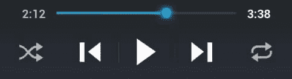

# Android App Widgets 组件详解

> 原文：[`c.biancheng.net/view/2944.html`](http://c.biancheng.net/view/2944.html)

App Widgets 是指能够嵌入其他应用程序中的小组件，并且能够周期性地进行更新。

App Widgets 并不是 Android 应用程序的核心组件，但却是应用程序开发不可或缺的部分。我们可以通过 App Widgets 使我们的 UI 界面更多样化，也可以通过 App Widget Provider 发布我们自己开发的 App Widgets 组件。

一个能够用于容纳 App Widgets 组件的应用程序组件被称为 App Widgets Host（App Widgets 宿主），例如图 1 所示的音乐播放程序。
图 1  App Widgets Host
 Android 7.0 中涉及部分 App Widgets 类的使用方法会在后面教程进行详细介绍，本节主要对使用 App Widget Provider 发布自己的 App Widget 组件的方法进行简单介绍。

## 基础知识

为了创建一个自己的 App Widget，需要完成以下工作。

#### 1) AppWidgetProviderInfo 元数据

定义在 XML 文件中的用于描述 App Widget 的元数据对象，比如 App Widget 的布局、更新频率以及相关的 AppWidgetProvider 类。

#### 2) 实现 AppWidgetProvider 类

在 AppWidgetProvider 类中定义了一系列方法，这些方法允许开发者以编程的方式和自己的 App Widget 进行交互，这种交互基于广播事件。当 App Widget 的状态发生改变，例如更新、启用、禁用和删除的时候，你都会接收到相应的广播通知。

#### 3) 视图布局

在 XML 文件中为 App Widget 定义初始布局。

#### 4) 实现 App Widget 配置 Activity

这是一个可选的 Activity，当用户添加 App Widget 时该 Activity 会被启动，并允许用户在创建 App Widget 时修改相关设置。

下面进行详细介绍。

## 在 Manifest 文件中声明 App Widget

首先，在 AndroidManifest.xml 文件中对 AppWidgetProvider 类进行声明。

```

<receiver android:name="ExampleAppWidgetProvider">
    <intent-filter>
        <action android:name = "android.appwidget.action.APPWIDGET_UPDATE"/>
    </intent-filter>
    <meta-data android:name = "android.appwidget.provider"
               android:resource = "@xml/example_appwidget_info" />
</receiver>
```

<receiver> 元素必须要指定 android:name 属性，它指定了 App Widget 使用的 AppWidgetProvider 的名字。

<intent-filter> 元素必须包括一个含有 android:name 属性的 <action> 元素。该元素指定 AppWidgetProvider 接受 ACTION_APPWIDGET_UPDATE 广播。这是唯一一个必须被显式声明的广播。当有必要的时候，AppWidgetManager 会自动发送所有其他 App Widget 广播给 AppWidgetProvider。

<meta-data> 元素指定了 AppWidgetProviderInfo 资源并需要以下属性。

*   android:name：指定元数据名称。
*   android:resource：指定 AppWidgetProviderInfo 资源路径。

## 增加 AppWidgetProviderInfo 元数据

AppWidgetProviderInfo 用于定义 App Widget 的一系列基本特性，例如最小布局的尺寸、初始的布局资源、刷新频率以及创建时要加载的配置 Activity 等。

使用 <appwidget-provider> 元素标签在 XML 中定义 AppWidgetProviderInfo 对象并保存到项目的 res/xml/ 目录下，例如：

```

<appwidget-provider xmlns:android = "http://schemas.android.com/apk/res/android" 
    android:minWidth = "294dip"  
    android:minHeight = "72dip" 
    android:updatePeriodMillis = "86400000" 
    android:initialLayout = "@layout/example_appwidget"
    android:configure = "com.example.android.ExampleAppWidgetConfigure" 
    > 
</appwidget-provider> 
```

其中：

*   minWidth 和 minHeight 属性的值指定了这个 App Widget 布局需要的最小区域。
*   updatePerdiodMillis 属性定义了 App Widget 框架调用 onUpdate() 方法来从 AppWidgetProvider 请求一次更新的频率。实际上更新的时间并不精准。建议更新频率越低越好，比如一小时更新一次，这样可以节省电力，或者根据用户的配置调整更新频率，比如有个人每 15 分钟想查看一下股票的报价，这样可以将频率设置为一小时更新 4 次。
*   initialLayout 属性指向 App Widget 使用的布局的资源。
*   configure 属性定义了该 App Widget 被加载时使用的配置 Activity。

## 创建 App Widget 布局

必须在 res/layout 目录下以 XML 文件的方式为 App Widget 定义一个布局文件。

App Widget 的布局是基于 RemoteViews 对象的，而 RemoteViews 对象可以支持以下布局：

*   Framelayout
*   LinearLayout
*   RelativeLayout
*   GridLayout

和以下的小组件类：

*   AnalogClock•Button
*   Chronometer
*   ImageButton
*   ImageView
*   ProgressBar
*   TextView
*   ViewFlipper
*   ListView
*   GridView
*   StackView
*   AdapterViewFlipper

但是并不支持它们的派生类。

此外，RemoteView 还支持 ViewStub，该组件不可见，自身无尺寸，可用于对布局资源进行支撑。

## 为 App Widget 添加边界

如果没有为自定义的 Widget 定义边界，它就会自动扩展到屏幕大小。因此，我们需要为自定义的 App Widget 定义边界。

自 Android 4.0 开始，App Widget 会自动在 Widget 的边界环绕盒之间添加空隙，以便为 Widget 和其他小组件以及屏幕上的图标提供更好的排列组合方式。为实现这个行为，我们需要将应用程序中的 "targetSdkVersion" 属性设置为大于 14。

实际上，我们可以自己定义一个带有自定义边界的布局，并且使该布局在应用于早期平台版本时正常显示边界，而在 Android 4.0 以后版本的平台上不显示额外边界。定义过程如下：

1) 设置 targetSdkVersion 为大于 14 的值。

2) 创建一个布局，并为其设置 dimension 资源，其边界信息由 dimension 资源设定，代码如下：

```

<FrameLayout
    android:layout_width = "match_parent"
    android:layout_height = "match_parent"
    android:padding = "@dimen/widget_margin">
    <LinearLayout
        android:layout_width="wrap_content"
        android:layout_height="wrap_content"
        android:orientation="horizontal">
        ...
    </LinearLayout>
</FrameLayout>
```

3) 创建两个 dimension 资源，一个在 res/values/ 目录下，用于提供低于 Android 4.0 版本的系统的边界信息，另一个在 res/values-v14 下，用于提供高于 Android 4.0 版本的操作系统的边界信息。

例如，res/values/dimens.xml 定义如下：

<dimen name = "widget_margin">8dip</dimen>

而 res/values-v14/dimens.xml 定义如下：

<dimen name="widget_margin">0dp</dimen>

## 使用 AppWidgetProvider 类

首先，AppWidgetProvider 类是 BroadcastReceiver 类的子类，可以方便地处理 App Widget 发出的广播，因此，其必须被声明在清单文件中的 <receiver> 元素中。

AppWidgetProvider 只接受和相应的 App Widget 相关的广播消息，例如这个 App Widget 被更新、被删除、被启用或者被禁用的时候。当这些广播事件发生的时候，AppWidgetProvider 会接收到以下方法的调用请求。

#### 1) onUpdate()

每间隔一定时间该方法就会被调用。

用于对 App Widget 进行更新。间隔时间由 AppWidgetProviderInfo 元数据中的 updatePeriodMillis 属性指定。当用户添加 App Widget 时，该方法也会被调用。因此，该方法中应该执行必要的操作，例如为视图定义事件处理器或者启动一个临时的服务等。

如果你为 App Widget 定义了配置 Activity，就应该由配置 Activity 负责进行第一次更新，而 onUpdate() 方法不会在用户执行添加操作的时候被调用，而只会在后期的更新时被调用。

#### 2) onAppWidgetOptionsChanged()

该方法在 Widget 被首次放置到应用程序中或者 Widget 的尺寸被更改时被调用。

#### 3) onDeleted(Context, int[])

该方法在 App Widget 被从 App Widget 宿主中删除的时候被调用。

#### 4) onEnabled(Context)

该方法在 App Widget 的第一个实例被创建时被调用。

若用户添加了两个 App Widget 的实例，则该方法只会在第一次添加时被调用。如果你需要打开数据库或者其他只需要进行一次的设置，那么将代码放在这个方法中是个不错的主意。

#### 5) onDisabled(Context)

该方法在最后一个 App Widget 实例从 App Widget 宿主中被删除的时候调用。

在该方法中，你应该对在 onEnabled() 方法中的操作进行善后，例如删除一个临时的数据库。

#### 6) onReceive(Context, Intent)

每当接收到一个广播，该方法都会被调用。

并且，该方法会在上述各个方法之前被调用。通常我们不需要重写该方法，因为默认的 AppWidgetProvider 类已经很好地实现了对所有广播的过滤和处理方法的调用。

可见 onUpdate() 方法是最重要的回调方法，如果你创建的 App Widget 不需要进行创建临时文件等操作，那么你可能只需要定义 onUpdate() 方法就可以了。

例如，当你创建了一个带有 Button 的 App Widget，当点击按钮时会启动一个 Activity，那么你的 AppWidgetProvider 类应该像下面这样定义：

```

public class ExampleAppWidgetProvider extends AppWidgetProvider {

    public void onUpdate(Context context, AppWidgetManager appWidgetManager, int[] appWidgetlds) {
        final int N = appWidgetlds.length;
        // Perform this loop procedure for each App Widget that belongs to this provider
        for (int i=0; i<N; i++) {
            int appWidgetld = appWidgetlds[i];

            // Create an Intent to launch ExampleActivity
            Intent intent = new Intent(context, ExampleActivity.class);
            Pendinglntent pendinglntent = Pendinglntent.getActivity(context, 0, intent, 0);

            // Get the layout for the App Widget and attach an on-click listener
            // to the button
            RemoteViews views = new RemoteViews(context.getPackageName(),
            R.layout.appwidget_provider_layout);
            views.setOnClickPendinglntent(R.id.button, pendinglntent);

            // Tell the AppWidgetManager to perform an update on the current app widget appWidgetManager.updateAppWidget(appWidgetld, views);
        }
    }
}
```

其中，appWidgetIds 是一个存放 ID 的数组，其中的每一个 ID 值都标识一个 AppWidgetProvider 创建的 App Widget。如果该数组中存放了多个 App Widget 的 ID，那么这些 App Widget 会被同步更新。

## 接收 App Widget 的广播

如果你想直接用自己的类接收并处理 App Widget 的广播，那么你需要实现自己的 BroadcastReceiver，重写 onReceiver() 方法，并处理以下 4 个 Intent：

*   ACTION_APPWIDGET_UPDATE
*   ACTION_APPWIDGET_DELETED
*   ACTION_APPWIDGET_ENABLED
*   ACTION_APPWIDGET_DISABLED

## 创建 App Widget 的配置 Activity

如果想让用户在添加新的 App Widget 的时候对颜色、尺寸、更新周期等属性进行配置，那么就需要创建一个配置 Activity。配置 Activity 会在 App Widget 被创建时由其宿主启动。

该配置 Activity 需要在 Manifest 文件中进行声明，通过 ACTION_APPWIDGET_CONFIGURE 活动被宿主启动，代码如下：

```

<activity android:name = ".ExampleAppWidgetConfigure">
    <intent-filter>
        <action android:name = "android.appwidget.action.APPWIDGET_CONFIGURE" />
    </intent-filter>
</activity>
```

此外，该 Activity 还需要在 AppWidgetProviderInfo XML 中通过 android:configure 属性被声明，例如：

```

<appwidget-provider xmlns:android = "http://schemas.android.com/apk/res/android"
    ...
    android:configure = "com.example.android.ExampleAppWidgetConfigure"
    ... >
</appwidget-provider>
```

当为 App Widget 定义了配置 Activity 后，Widget 在被创建时不会再调用 onUpdate 方法。

使用配置 Activity 对 App Widget 进行更新

当 Widget 使用了配置 Activity 后，配置 Activity 会在用户完成设置后对 Widget 进行更新。通过配置 Activity 对 Widget 进行更新并关闭配置 Activity 的过程如下：

1) 从启动 Activity 的 Intent 中获取 App Widget 的 ID 值。

```

Intent intent = getlntent();
Bundle extras = intent.getExtras();
if (extras != null) {
    mAppWidgetld = extras.getlnt(
    AppWidgetManager.EXTRA_APPWIDGET_ID, AppWidgetManager.INVALID_APPWIDGET_ID);
}
```

2) 执行 App Widget 配置。

3) 完成配置后，获取 AppWidgetManager 类的实例。

AppWidgetManager appWidgetManager = AppWidgetManager.getInstance(context);

4) 通过 RomoteViews 布局对 App Widget 进行更新。

RemoteViews views = new RemoteViews(context.getPackageName(),R.layout.example_appwidget);
appWidgetManager.updateAppWidget(mAppWidgetId,views);

5) 创建返回 Intent，设置 Activity 返回值，并关闭 Activity。

```

Intent resultValue = new Intent();
resultValue.putExtra(AppWidgetManager.EXTRA_APPWIDGET_ID,mAppWidgetId);
setResult(RESULT_OK,resultValue);
finish();
```