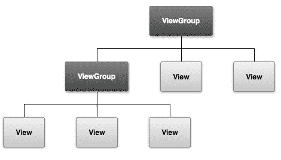

# Android View 和 ViewGroup

> 原文：[`c.biancheng.net/view/2966.html`](http://c.biancheng.net/view/2966.html)

Android 系统提供了丰富的可视化界面组件，包括菜单、按钮、对话框等。Android 系统采用 Java 程序设计中的 UI 设计思想，其中包括事件处理机制及布局管理方式。

Android 系统中的所有 UI 类都是建立在 View 和 ViewGroup 两个类的基础之上的，所有 View 的子类称为 Widget，所有 ViewGroup 的子类称为 Layout。

Activity 是 Android 应用程序与用户交互的接口，每一个屏幕视图都对应一个 Activity。

Activity 本身无法显示在屏幕上，其更像一个用于装载可显示组件的容器。就好比一个 JSP 页面，它本身并没有显示出来任何东西，负责显示的是 JSP 页面内的各种 HTML 标签，而 JSP 页面好比一个容器，负责将这些表情装载到页面内。

那么在 Android 应用程序里，谁才是真正负责显示的那部分呢？答案是 View 和 ViewGroup，其中 ViewGroup 是 View 的子类。

Android UI 界面是通过 View（视图）和 ViewGroup 及其派生类组合而成的。

View 是所有 UI 组件的基类，基本上所有的高级 UI 组件都是继承 View 类实现的，如 TextView（文本框）、Button、List、EditText（编辑框）、Checkbox 等。一个 View 在屏幕占据一块矩形区域，负责渲染这块矩形区域，也可以处理这块矩形区域发生的事件，并可以设置该区域是否可见以及获取焦点等。

ViewGroup 是容纳这些组件的容器，其本身也是从 View 中派生出来的，它继承于 Android.view.View，功能就是装载和管理下一层的 View 对象或 ViewGroup 对象，也就是说它是一个容纳其他元素的容器，负责对添加进来的 View 和 ViewGroup 进行管理和布局。

View 和 ViewGroup 的关系如图 1 所示。
图 1  View 和 ViewGroup 关系图 
 从图 1 可以看到，ViewGroup 可以包含一个或任意个 View（视图），也可以包含作为更低层次的子 ViewGroup，而子 ViewGroup 又可以包含下一层的叶子节点的 View 和 ViewGroup。这种灵活的层次关系可以形成复杂的 UI 布局。

在开发过程中形成的用户界面 UI 一般来自于 View 和 ViewGroup 类的直接子类或者间接子类。

例如，View 派生出的直接子类有 AnalogClock、ImageView、KeyboardView、ProgressBar、Space、SurfaceView、TextView、TextureView、ViewGroup、ViewStub 等。

ViewGroup 派生出的直接子类有 AbsoluteLayout、FragmentBreadCrumbs、FrameLayout、GridLayout、LinearLayout、RelativeLayout、SlidingDrawer 等。

本教程不对 View 和 ViewGroup 的所有子类都进行详细的介绍，只简单介绍其中常用的一小部分。如果需要了解各 UI 组件的相关信息，请参考相关文档（可参阅博客：[`blog.csdn.net/m0_37597069/article/details/70196271`](https://blog.csdn.net/m0_37597069/article/details/70196271)）。