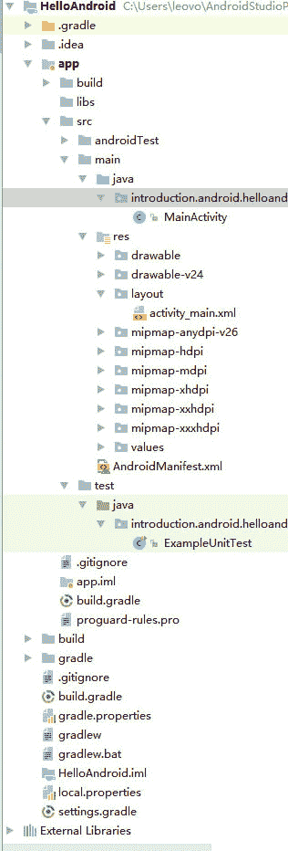

# Android 使用 XML 文件定义用户界面

> 原文：[`c.biancheng.net/view/2968.html`](http://c.biancheng.net/view/2968.html)

在使用 XML 构建一个用户界面之前，我们需要重温一下 Android 工程的目录结构。如图 1 所示，以 HelloAndroid 为例，project 视图列出了工程的目录结构。


图 1  Android 目录结构
下面对 Android 目录进行简单介绍：

*   以`.`开头的目录是 AS 生成的辅助目录，无须用户干预。
*   HelloAndroid 文件夹是模块目录，编程工作主要集中在这个目录中，相当于使用 Eclipse 构建的工程文件夹，包含 build、src、res 等文件夹。
*   res 目录为 Android 工程中所使用的资源目录，用户 UI 所涉及的资源基本都放置在该目录下。res 目录下的每一项资源文件都会由 AAPT（Android Asset Packaging Tool）为其生成一个对应的 public static final 类型的 ID 号，放置到 build 目录下的 R.java 文件中，Android 系统根据该 ID 号来访问对应资源。
*   build 目录由 AS 自动生成，不需要用户修改，由系统维护。
*   res/drawable/ 目录用来存放工程中使用到的图片文件，drawable 之后的 hdpi、ldpi、mdpi 分别放高分辨率、低分辨率和中分辨率的图片以适应不同分辨率的手机，Android 系统会根据用户手机的配置信息自动选取合适分辨率的图片文件，无须程序员干预。
*   res/layout/ 目录下存放着定义 UI 布局文件用的 XML 文件，默认文件名为 main.xml。
*   res/values/ 目录下存放着用于存储工程中所使用到的一些字符串信息的文件，默认文件名为 strings.xml。

当然，每个目录下都可以存放多个 XML 文件，可由开发者自行创建。由此可见，Android 工程中使用的用户 UI 设计以及用户 UI 中涉及的字符串都是由 XML 文件来存储的。Android 系统使用 XML 文件来定义用户视图。

单击打开 values 文件夹下的 string.xml 文件显示出如下代码：

```

<?xml version="1.0" encoding="UTF-8" ?>
<resources>
    <string name="hello">Hello Android!</string>
    <string name="app_name">HelloAndroid</string>
</resources>
```

文件的开头部分`<?xml version="1.0" encoding="utf-8"?>`定义了 XML 的版本号和字符编码，这个部分在所有的 XML 文件中都会有，由系统自动添加，不需要修改。

<resources> 标签定义了 hello 和 app_name 两个变量，可以被 HelloAndroid 工程直接使用。当该文件被修改时，gen 目录下的 R.java 文件也会跟随进行更新。

双击 main.xml 文件，代码如下：

```

<?xml version="1.0" encoding="utf-8"?>
<LinearLayout xmlns:android="http://schemas.android.com/apk/res/android"
    android:layout_width="fill_parent"
    android:layout_height="fill_parent"
    android:orientation="vertical">
    <TextView
        android:id="@+id/textView1"
        android:layout_width="fill_parent"
        android:layout_height="wrap_content"
        android:text="@string/hello"/>
</LinearLayout>
```

在 <LinearLayout ...> 和 </LinearLayout> 之间可以添加各种 UI 组件并设置组件的相关属性，例如组件的高度、宽度、内容等，后边会详细介绍各种常见组件的使用方法。

在 HelloAndroid 实例中添加的是一个 TextView 组件，相当于一个显示内容的标签。Android SDK 提供了`@[<package_ name>:]<resource_type>/<resource_name>`方式，以便于从 XML 文件中访问工程的资源。

下面简单介绍一下 TextView 中的属性：

*   android:layout_width="fill_parent" 指定其宽度覆盖满容器的宽。
*   android:layout_height= "wrap_content" 指定其高度跟随其显示内容变化。
*   android:id="@+id/textView1" 指明该 TextView 的 ID 值为 R.java 文件中 ID 类的成员常量 textView1。
*   android:text="@string/hello" 指明该 TextView 组件显示的内容为资源文件 string.xml 中定义的 hello 变量的内容。
*   android:text 属性也可以直接指定要显示的字符串，但是在实际的工程开发过程中不鼓励这种方式，而应该使用资源文件中的变量，因为这样便于工程维护和国际化。

在本教程中，为了节省篇幅，部分显示内容简单的组件使用了字符串直接赋值的方法。

Android 工程中使用到的资源文件都会在 gen 目录下的 R.java 中生成对应项，由系统为每个资源分配一个十六进制的整型数值，唯一标明每个资源。

HelloAndroid 工程中的 R.java 文件代码如下：

```

package introduction.android.helloandroid;

public final class R {
    public static final class attr {
    }
    public static final class drawable {
        public static final int ic_launcher=0x7f020000;
    }
    public static final class id {
        public static final int textView1=0x7f050000;
    }
    public static final class layout {
        public static final int main=0x7f030000;
    }
    public static final class string {
        public static final int app_name=0x7f040001;
        public static final int hello=0x7f040000;
    }
}
```

由该文件可见，R 为静态最终类。其中 public static final class layout 代表的是 res/layout 文件夹的内容，layout 类的每个整型常量代表该文件夹下的一个 XML 布局文件。

例如，public static final int main 代表的是 main.xml 文件，0x7f030000 为系统 main.xml 文件生成的整型数值。在 Android 工程中根据该数值找到 main.xml 文件。public static final class string 代表的是 res/values/strings.xml 文件，string 类中的每个整型常量型成员代表 strings.xml 文件中定义的一个变量。例如，public static final int app_name 代表 strings.xml 中定义的 app_name 变量，public static final int hello 代表 stings.xml 文件中定义的 hello 变量。

在工程开发过程中，可以通过 [<package_name>.]R.<resource_type>.<resource_name> 方式来访问 R 中定义的任意资源。其中：

*   package_name 为资源文件被放置的包路径，一般可以省略。
*   resource_type 为资源类型，例如 layout、string、color、drawable、menu 等。
*   resource_ name 指的是为资源文件在类中定义的整型常量的名字。

请看下面的例子：

setContentView(R.layout.main);

这行代码中，通过 R.layout.main 找到了布局文件 main.xml，并通过 setContentView 方法将其设置为当前 Activity 的视图。要从视图中查找某个组件，需要使用 findViewById 方法，通过组件 ID 获取组件的对象。

例如，要获取 main.xml 中的 TextView 组件对象，需要执行以下代码：

TextView textview=(TextView)findViewById(R.id.textView1);