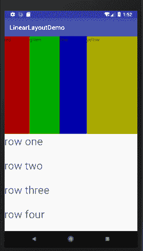
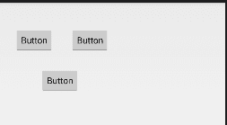

# Android 五大布局：FrameLayout、LinearLayout、AbsoluteLayout、RelativeLayout 和 TableLayout

> 原文：[`c.biancheng.net/view/2976.html`](http://c.biancheng.net/view/2976.html)

Android SDK 定义了多种布局方式以方便用户设计 UI。各种布局方式均为 ViewGroup 类的子类，结构如图 1 所示。


图 1  Android SDK 布局方式结构图
 本节将对 FrameLayout（单帧布局）、LinearLayout（线性布局）、AbsoluteLayout（绝对布局）、RelativeLayout（相对布局）和 TableLayout（表格布局）进行简单的介绍。

## FrameLayout  

FrameLayout 又称单帧布局，是 Android 所提供的布局方式里最简单的布局方式，它指定屏幕上的一块空白区域，在该区域填充一个单一对象。例如图片、文字、按钮等。

应用程序开发人员不能为 FrameLayout 中填充的组件指定具体填充位置，默认情况下，这些组件都将被固定在屏幕的左上角，后放入的组件会放在前一个组件上进行覆盖填充，形成部分遮挡或全部遮挡。

开发人员可以通过组件的 android:layout_gravity 属性对组件位置进行适当的修改。

实例 FrameLayoutDemo 演示了 FrameLayout 的布局效果。该布局中共有 4 个 TextView 组件，前 3 个组件以默认方式放置到布局中，第 4 个组件修改 gravity 属性后放置到布局中，运行效果如图 2 所示。


图 2  FrameLayout 的布局效果
实例 FrameLayoutDemo 中的布局文件 main.xml 的代码如下：

```

<?xml version="1.0" encoding="utf-8"?>

<FrameLayout xmlns:android="http://schemas.android.com/apk/res/android"
    android:layout_height="fill_parent"
    android:layout_width="fill_parent">

    <TextView
        android:id="@+id/text1"
        android:layout_width="wrap_content"
        android:layout_height="wrap_content"
        android:textColor="#00ff00"
        android:textsize="1OOdip"
        android:text="@string/first"/>
    <TextView
        android:id="@+id/text2"
        android:layout_width="wrap_content"
        android:layout_height="wrap_content"
        android:textColor="#00ffff"
        android:textsize="70dip"
        android:text="@string/second"/>
    <TextView
        android:id="@+id/text3"
        android:layout_width="wrap_content"
        android:layout_height="wrap_content"
        android:textColor="#ffOOOO"
        android:textsize="40dip"
        android:text="@string/third"/>
    <TextView
        android:id="@+id/text4"
        android:layout_width="wrap_content"
        android:layout_height="wrap_content"
        android:textColor="#fffffOO"
        android:textSize="40dip"
        android:layout_gravity="bottom"
        android:text="@string/forth"/>

</FrameLayout>
```

其中：

android:layout_width="wrap_content"
android:layout_height="wrap_content"

表明 FrameLayout 布局覆盖了整个屏幕空间。

实例 FrameLayoutDemo 中的 strings.xml 文件内容如下：

```

<?xml version="1.0" encoding="UTF-8" ?>
<resources>
    <string name="app_name">FrameLayoutDemo</string>
    <string name="first">第一层</string>
    <string name="second">第二层</string>
    <string name="third">第三层</string>
    <string name="forth">第四层</string>
</resources>

```

从运行后的结果可见，前 3 个被放置到 FrameLayout 的 TextView 组件都是以屏幕左上角为基点进行叠加的。第 4 个 TextView 因为设置了 android:layout_gravity="bottom" 属性而显示到了布局的下方。可自行将 android:layout_gravity 属性值修改为其他属性，查看运行效果。

## LinearLayout

LinearLayout 又称线性布局，该布局应该是 Android 视图设计中最经常使用的布局。该布局可以使放入其中的组件以水平方式或者垂直方式整齐排列，通过 android:orientation 属性指定具体的排列方式，通过 weight 属性设置每个组件在布局中所占的比重。

实例 LinearLayoutDemo 演示了 LinearLayout 布局的使用方法，效果如图 3 所示。


图 3  LinearLayout 的布局效果
实例 LinearLayoutDemo 中的 strings.xml 文件代码如下：

```

<?xml version="1.0" encoding="UTF-8"?>
<resources>
    <string name="app_name">LinearLayoutDemo</string>
    <string name="red">red</string>
    <string name="yellow">yellow</string>
    <string name="green">green</string>
    <string name="blue">blue</string>
    <string name="row1">row one</string>
    <string name="row2">row two</string>
    <string name="row3">row three</string>
    <string name="row4">row four</string>
</resources>
```

实例 LinearLayoutDemo 中的布局文件 main.xml 代码如下：

```

<?xml version="1.0" encoding="utf-8"?>

<LinearLayout xmlns:android="http://schemas.android.com/apk/res/android"
    android:layout_width="fill_parent"
    android:layout_height="fill_parent"
    android:orientation="vertical">

    <LinearLayout
        android:layout_width="fill_parent"
        android:layout_height="fill_parent"
        android:layout_weight="1"
        android:orientation="horizontal">

        <TextView
            android:layout_width="wrap_content"
            android:layout_height="fill_parent"
            android:layout_gravity="center_horizontal"
            android:layout_weight="1"
            android:background="#aa0000"
            android:text="@string/red" />

        <TextView
            android:layout_width="wrap_content"
            android:layout_height="fill_parent"
            android:layout_gravity="center_horizontal"
            android:layout_weight="1"
            android:background="#00aa00"
            android:text="@string/green" />

        <TextView
            android:layout_width="wrap_content"
            android:layout_height="fill_parent"
            android:layout_gravity="center_horizontal"
            android:layout_weight="1"
            android:background="#0000aa"
            android:text="@string/blue" />

        <TextView
            android:layout_width="wrap_content"
            android:layout_height="fill_parent"
            android:layout_gravity="center_horizontal"
            android:layout_weight="1"
            android:background="#aaaa00"
            android:text="@string/yellow" />
    </LinearLayout>

    <LinearLayout
        android:layout_width="fill_parent"
        android:layout_height="fill_parent"
        android:layout_weight="1"
        android:orientation="vertical">

        <TextView
            android:layout_width="fill_parent"
            android:layout_height="wrap_content"
            android:layout_weight="1"
            android:text="@string/row1"
            android:textSize="15pt" />

        <TextView
            android:layout_width="fill_parent"
            android:layout_height="wrap_content"
            android:layout_weight="1"
            android:text="@string/row2"
            android:textSize="15pt" />

        <TextView
            android:layout_width="fill_parent"
            android:layout_height="wrap_content"
            android:layout_weight="1"
            android:text="@string/row3"
            android:textSize="15pt" />

        <TextView
            android:layout_width="fill_parent"
            android:layout_height="wrap_content"
            android:layout_weight="1"
            android:text="@string/row4"
            android:textSize="15pt" />
    </LinearLayout>
</LinearLayout>
```

该布局中放置了两个 LinearLayout 布局对象。

第一个 LinearLayout 布局通过 android:orientation="horizontal" 属性将布局设置为横向线性排列。

第二个 LinearLayout 布局通过 android:orientation="vertical" 属性将布局设置为纵向线性排列。

每个 LinearLayout 布局中都放入了 4 个 TextView，并通过 android:layout_weight 属性设置每个组件在布局中所占的比重相同，即各组件大小相同。

layout_weight 用于定义一个线性布局中某组件的重要程度。所有的组件都有一个 layout_weight 值，默认为 0。意思是需要显示多大的视图就占据多大的屏幕空间。若赋值为大于 0 的值，则将可用的空间分割，分割的大小取决于当前的 layout_weight 数值与其他空间的 layout_weight 值的比率。

例如水平方向上有两个按钮，每个按钮的 layout_weight 数值都设置为 1，那么这两个按钮平分宽度；若第一个为 1，第二个为 2，则可将空间的三分之一分给第一个，三分之二分给第二个。

将 LinearLayoutDemo 中水平 LinearLayout 的第 4 个 TextView 的 android:layout_weight 属性赋值为 2，运行效果如图 4 所示。


图 4  修改 android:layout_weight 属性
LinearLayout 布局可使用嵌套。活用 LinearLayou 布局可以设计出各种各样漂亮的布局方式。

## RelativeLayout

RelativeLayout 又称相对布局。从名称上可以看出，这种布局方式是以一种让组件以相对于容器或者相对于容器中的另一个组件的相对位置进行放置的布局方式。

RelativeLayout 布局提供了一些常用的布局设置属性用于确定组件在视图中的相对位置。下面列举了 RelativeLayout 相关属性及其所代表的含义。

RelativeLayout 布局常用属性

| 属性 | 描述 |
| --- | --- |
| android:layout_above="@id/xxx" | 将控件置于给定 ID 控件之上 |
| android:layout_below="@id/xxx" | 将控件置于给定 ID 控件之下 |
| android:layout_toLeftOf="@id/xxx" | 将控件的右边缘和给定 ID 控件的左边缘对齐 |
| android:layout_toRightOf="@id/xxx" | 将控件的左边缘和给定 ID 控件的右边缘对齐 |
| android:layout_alignBaseline="@id/xxx" | 将控件的 baseline 与给定 ID 的 baseline 对齐 |
| android:layout_alignTop="@id/xxx" | 将控件的上边缘和给定 ID 控件的上边缘对齐 |
| android:layout_alignBottom="@id/xxx" | 将控件的底边缘和给定 ID 控件的底边缘对齐 |
| android:layout_alignLeft="@id/xxx"  | 将控件的左边缘和给定 ID 控件的左边缘对齐 |
| android:layout_alignRight="@id/xxx" | 将控件的右边缘和给定 ID 控件的右边缘对齐 |
| android:layout_alignParentLeft="true" | 将控件的左边缘和父控件的左边缘对齐 |
| android:layout_alignParentTop="true" | 将控件的上边缘和父控件的上边缘对齐 |
| android:layout_alignParentRight="true" | 将控件的右边缘和父控件的右边缘对齐 |
| android:layout_alignParentBottom="true" | 将控件的底边缘和父控件的底边缘对齐 |
| android:layout_centerInParent="true" | 将控件置于父控件的中心位置 |
| android:layout_centerHorizontal="true" | 将控件置于水平方向的中心位置 |
| android:layout_centerVertical="true" | 将控件置于垂直方向的中心位置 |

实例 RelativeLayoutDemo 演示了相对布局的使用方法，其运行效果如图 5 所示。


图 5  RelativeLayout 布局效果
实例 RelativeLayoutDemo 中的布局文件 main.xml 代码如下：

```

<?xml version="1.0" encoding="utf-8"?>

<RelativeLayout xmlns:android="http://schemas.android.com/apk/res/android"
    android:layout_width="fill_parent"
    android:layout_height="fill_parent">

    <TextView
        android:id="@+id/label"
        android:layout_width="fill_parent"
        android:layout_height="wrap_content"
        android:text="@string/hello" />

    <EditText
        android:id="@+id/enter"
        android:layout_width="fill_parent"
        android:layout_height="wrap_content"
        android:layout_alignParentLeft="true"
        android:layout_below="@+id/label" />

    <Button
        android:id="@+id/button1"
        android:layout_width="wrap_content"
        android:layout_height="wrap_content"
        android:layout_alignParentRight="true"
        android:layout_below="@+id/enter"
        android:text="@string/butltext" />

    <Button
        android:id="@+id/ok"
        android:layout_width="wrap_content"
        android:layout_height="wrap_content"
        android:layout_alignBottom="@+id/button1"
        android:layout_alignParentLeft="true"
        android:text="@string/but2text" />

</RelativeLayout>
```

该 RelativeLayout 布局的过程如下：

1）放置一个 ID 为 label 的 TextView 组件。

2）通过 android:layout_below="@+id/label" 属性将 ID 为 enter 的组件 EditText 放置到 TextView 的下面。

3）在布局中加入一个 ID 为 button1 的 Button，通过 android:layout_below="@+id/enter" 属性将该 Button 放置到 enter 的下面，通过 android:layout_alignParentRight= "true" 属性将 Button 放置到相对布局的右侧。

4）在相对布局中加入一个名为 ok 的 Button，通过 android:layout_alignBottom="@+ id/button1" 属性将该 Button 底边与 button1 对齐，通过 android:layout_alignParentLeft ="true" 属性将该 Button 放置到布局的左边。

## TableLayout

TableLayout 又称为表格布局，以行列的方式管理组件。

TableLayout 布局没有边框，可以由多个 TableRow 对象或者其他组件组成，每个 TableRow 可以由多个单元格组成，每个单元格是一个 View。TableRow 不需要设置宽度 layout_width 和高度 layout_height，其宽度一定是 match_parent，即自动填满父容器，高度一定为 wrap_content，即根据内容改变高度。但对于 TableRow 中的其他组件来说，是可以设置宽度和高度的，只是必须是 wrap_content 或者 fill_parent。

实例 TableLayoutDemo 演示了使用 TableLayout 制作 UI 的方法，效果如图 6 所示。


图 6  TableLayout 布局效果
 实例 TableLayoutDemo 中 strings.xml 的代码如下：

```

<?xml version="1.0" encoding="UTF-8"?>

<resources>
    <string name="hello">Hello World,TableLayout!</string>
    <string name="app_name">TableLayoutDemo</string>
    <string name="column1">第一行第一列</string>
    <string name="column2">第一行第二列</string>
    <string name="column3">第一行第三列</string>
    <string name="empty">最左面的可伸缩 TextView</string>
    <string name="row2column2">第二行第三列</string>
    <string name="row2column3">End</string>
    <string name="merger">合并三个单元格</string>
</resources>
```

实例 TableLayoutDemo 中的布局文件 main.xml 的代码如下：

```

<?xml version="1.0" encoding="utf-8"?>

<TableLayout xmlns:android="http://schemas.android.com/apk/res/android"
    android:layout_width="fill_parent"
    android:layout_height="fill_parent">

    <TableRow>

        <TextView android:text="@string/column1" />

        <TextView android:text="@string/column2" />

        <TextView android:text="@string/column3" />
    </TableRow>

    <TextView
        android:layout_height="wrap_content"
        android:background="#fff000"
        android:gravity="center"
        android:text="单独的一个 TextView" />

    <TableRow>

        <Button
            android:layout_span="3"
            android:gravity="center_horizontal"
            android:text="@string/merger"
            android:textColor="#f00" />
    </TableRow>

    <TextView
        android:layout_height="wrap_content"
        android:background="#fa05"
        android:text="单独的一个 TextView" />

    <TableRow android:layout_height="wrap_content">

        <TextView android:text="@string/empty" />

        <Button android:text="@string/row2column2" />

        <Button android:text="string/row2column3" />
    </TableRow>
</TableLayout>
```

布局文件 main.xml 在 TableLayout 布局内添加了两个 TableRow 和两个 TextView，形成了如图 6 所示的效果。从运行效果看，第一行和第五行都没能完全显示。

TableLayout 布局提供了几个特殊属性，可以实现以下特殊效果。

*   android:shrinkColumns 属性：该属性用于设置可收缩的列。当可收缩的列太宽以至于布局内的其他列不能完全显示时，可收缩列会纵向延伸，压缩自己所占的空间，以便于其他列可以完全显示出来。android:shrinkColumns="1" 表示将第 2 列设置为可收缩列，列数从 0 开始。
*   android:stretchColumns 属性：该属性用于设置可伸展的列。可伸展的列会自动扩展长度以填满所有可用空间。android:stretchColumns="1" 表示将第 2 列设置为可伸展的列。
*   android:collapseColumns 属性：该属性用于设置隐藏列。android:collapseColumns="1" 表示将第 2 列隐藏不显示。

在 <TableLayout> 标签添加属性 android:shrinkColumns="0"，再次运行，效果如图 7 所示，可以看出第一行和第五行都完全显示出来了。


图 7  完全显示的效果

## AbsoluteLayout

AbsoluteLayout 又称绝对布局，放入该布局的组件需要通过 android:layout_x 和 android:layout_y 两个属性指定其准确的坐标值，并显示在屏幕上。

理论上，AbsoluteLayout 布局可用以完成任何的布局设计，灵活性很大，但是在实际的工程应用中不提倡使用这种布局。因为使用这种布局不但需要精确计算每个组件的大小，增大运算量，而且当应用程序在不同屏幕尺寸的手机上运行时会产生不同效果。

实例 AbsoluteLayoutDemo 演示了 AbsoluteLayout 布局的使用方法，效果如图 8 所示。


图 8  AbsoluteLayout 布局效果
实例 AbsoluteLayoutDemo 的布局文件 main.xml 代码如下：

```

<?xml version="1.0" encoding="utf-8"?>
<AbsoluteLayout xmlns:android="http://schemas.android.com/apk/res/android"
    android:layout_width="match_parent"
    android:layout_height="match_parent" >

    <Button
        android:id="@+id/button1"
        android:layout_width="wrap_content"
        android:layout_height="wrap_content"
        android:layout_x="32px"
        android:layout_y="53px"
        android:text="Button" />

    <Button
        android:id="@+id/button2"
        android:layout_width="wrap_content"
        android:layout_height="wrap_content"
        android:layout_x="146px"
        android:layout_y="53px"
        android:text="Button" />

    <Button
        android:id="@+id/button3"
        android:layout_width="wrap_content"
        android:layout_height="wrap_content"
        android:layout_x="85px"
        android:layout_y="135px"
        android:text="Button" />

</AbsoluteLayout>
```

其中：

android:layout_x="85px"
android:layout_y="135px"

表示将组件放置到以屏幕左上角为坐标原点的坐标系下，x 值为 85 像素、y 值为 135 像素的位置。

在这里简单介绍一下 Android 系统常用的尺寸类型的单位。

*   像素：缩写为 px。表示屏幕上的物理像素。
*   磅：points，缩写为 pt。1pt 等于 1 英寸的 1/72，常用于印刷业。
*   放大像素：sp。主要用于字体的显示，Android 默认使用 sp 作为字号单位。
*   密度独立像素：缩写为 dip 或 dp。该尺寸使用 160dp 的屏幕作为参考，然后用该屏幕映射到实际屏幕，在不同分辨率的屏幕上会有相应的缩放效果以适用于不同分辨率的屏幕。若用 px 的话，320px 占满 HVGA 的宽度，到 WVGA 上就只能占一半不到的屏幕了，那一定不是你想要的。
*   毫米：mm。

## WebView

WebView 组件是 AbsoluteLayout 的子类，用于显示 Web 页面。借助于 WebView，可以方便地开发自己的网络浏览器。此处仅对 WebView 的基本用法进行介绍，在后面进行 Web App 的学习时会有更进一步的讲解。

创建工程 WebViewDemo，为其在 AndroidManifest.xml 文件中添加 Internet 访问权限：

<uses-permission android:name="android.permission.INTERNET" />

在布局文件 main.xml 中添加一个 WebView 组件。Main.xml 内容如下：

```

<?xml version="1.0" encoding="utf-8"?>

<LinearLayout xmlns:android="http://schemas.android.com/apk/res/android"
    android:layout_width="fill_parent"
    android:layout_height="fill_parent"
    android:orientation="vertical">

    <WebView
        android:id="@+id/webView1"
        android:layout_width="match_parent"
        android:layout_height="match_parent"/>

</LinearLayout>
```

实例 WebViewDemo 中的 Activity 文件 WebViewDemoActivity.java 代码如下：

```

package introduction.android.webView;

import android.app.Activity;
import android.os.Bundle;
import android.webkit.WebView;

public class WebViewDemoActivity extends Activity {
    private WebView webView;

    /**
     * Called when the acctivity is first crested.
     */
    @Override
    public void onCreate(Bundle saveInstanceState) {
        super.onCreate(saveInstanceState);
        setContentView(R.layout.main);
        webView = (WebView) findViewById(R.id.webView1);
        webView.getSettings().setJavaScriptEnabled(true);
        webView.loadUrl("http://www.google.com");
    }
}
```

运行效果如图 9 所示：
图 9  WebViewDemo 运行界面