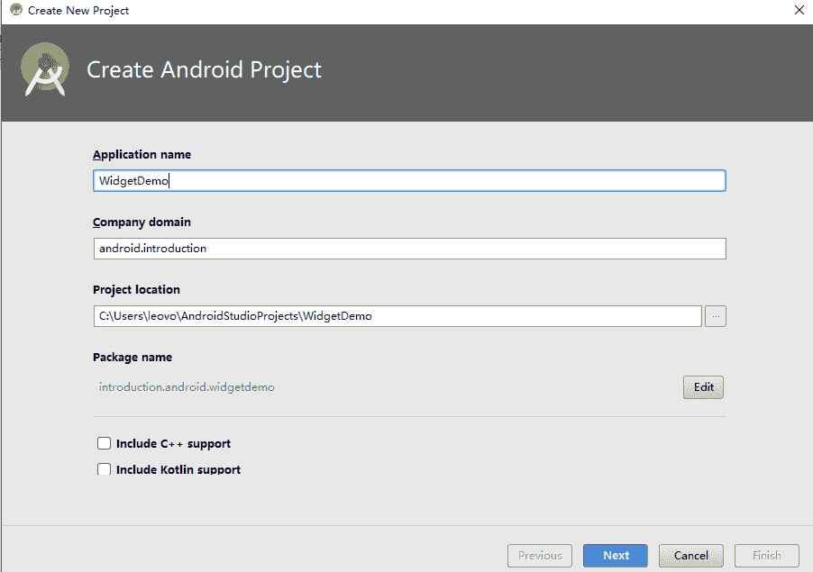
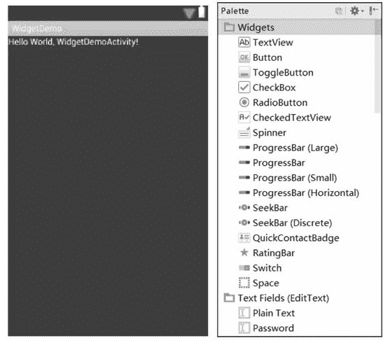

# Android 创建 Widget 组件实例详解

> 原文：[`c.biancheng.net/view/2988.html`](http://c.biancheng.net/view/2988.html)

在前面我们讲解了用户界面 UI 设计中布局方面的知识，其中涉及少数几个常用的组件，例如按钮、文本框等。接下来我们会着重讲解 Android 用户 UI 设计中常用的各种组件的用法。

Android SDK 提供了名为 android.widget 的包，其中提供了在应用程序界面设计中大部分常用的 UI 可视组件。之前教程涉及的各种布局以及文本框、按钮等组件都包含在这个包中。

Android 提供了强大的用户 UI 功能，要设计自己独特的应用程序界面，需要对各个组件有一个详细的了解。

## 创建 Widget 组件实例

在 Android Studio 中创建一个新的工程，名字为 WidgetDemo，用于对各种常见 UI 组件进行学习。下面是工程实现的步骤：

1）新建项目。单击 File | New | New Project，打开 New Android Project 对话框，如图 1 所示。
图 1  新建项目
2）输入工程名称 WidgetDemo，在 Location 后的文本框中输入工程的保存路径，单击 Next 按钮后，选择 API24:Android 7.0，再次单击 Next 按钮。

3）选择 EmptyActivity，确定 Activity 名字和 Layout 文件的名字，单击 Finish 按钮，则 AS 会生成工程目录和相关文件。若需要向以前版本兼容，则勾选 “Backwards Compatibility(AppCompat)” 复选框即可。

MainActivity.java 文件是当前应用程序的入口类 MainActivity 的定义文件。双击 MainActivity.java，发现已经为其生成代码如下：

```

package introduction.android.widgetdemo;

import android.support.v7.app.AppCompatActivity;
import android.os.Bundle;

public class MainActivity extends AppCompatActivity {

    @Override
    protected void onCreate(Bundle savedInstanceState) {
        super.onCreate(savedInstanceState);
        setContentView(R.layout.activity_main);
    }
}
```

其中，onCreate() 方法中的 setContentView(R.layout.main) 表明 MainActivity 使用的用户界面 UI 文件为 main.xml。

双击 main.xml 文件，发现提供了“Graphical Layout”和“main.xml”两种浏览方式。

*   “Graphical Layout”方式为以图形方式浏览 main.xml 文件，其效果等同于 main.xml 在手机设备上运行的效果。
*   “main.xml”方式为以代码方式浏览 main.xml 文件。

这两种方式是等效的，都可以对 main.xml 文件进行编辑和查看。单击“main.xml”标签，发现已经为其生成代码如下：

```

<?xml version="1.0" encoding="utf-8"?>

<LinearLayout xmlns:android="http://schemas.android.com/apk/res/android"
    android:layout_width="fill_parent"
    android:layout_height="fill_parent"
    android:orientation="vertical">

    <TextView
        android:layout_width="fill_parent"
        android:layout_height="wrap_content"
        android:text="@string/hello" />
</LinearLayout>
```

该文件表明，当前 main.xml 文件所使用的布局为 LinearLayout 布局，该布局自动填满整个手机屏幕。

在该布局中，放置了一个 TextView 组件，该 TextView 显示的内容为“@string/hello”，表示 string.xml 文件中定义的 hello 变量的内容。双击 values 目录下的 string.xml 文件，会发现 hello 变量对应的值为“Hello World, WidgetDemoActivity!”。

单击 main.xml 的“Graphical Layout”浏览方式，可查看当前文件的图形化效果，如图 2 所示。
图 2  文件的图形化效果
程序开发人员可以在该图形方式下将左侧的各种组件直接拖曳到屏幕上，形成自己想要的布局，也可以直接修改 main.xml 文件的代码。

在后边教程中，在对布局文件进行修改时，若非特殊情况，将不再单独描述。