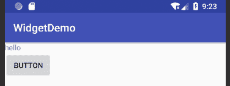
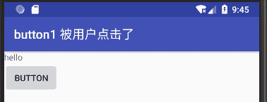

# Android Button：按钮控件

> 原文：[`c.biancheng.net/view/2996.html`](http://c.biancheng.net/view/2996.html)

按钮（Button）应该是用户交互中使用最多的组件，在很多应用程序中都很常见。当用户单击按钮的时候，会有相对应的响应动作。

下面在 WidgetDemo 工程的主界面 main.xml 中放置一个名为 Button 的按钮。文件代码如下：

```

<?xml version="1.0" encoding="utf-8"?>

<LinearLayout xmlns:android="http://schemas.android.com/apk/res/android"
    android:layout_width="fill_parent"
    android:layout_height="fill_parent"
    android:orientation="vertical">

    <TextView
        android:layout_width="fill_parent"
        android:layout_height="wrap_content"
        android:text="@string/hello" />

    <Button
        android:id="@+id/button1"
        android:layout_width="wrap_content"
        android:layout_height="wrap_content"
        android:text="Button" />
</LinearLayout>
```

其中：

```

<Button
    android:id="@+id/button1"
    android:layout_width="wrap_content"
    android:layout_height="wrap_content"
    android:text="Button" />
```

表明在用户界面上放置了一个 ID 为“button1”的按钮，按钮的高度（layout_height）和宽度（layout_width）都会根据实际内容调整（wrap_content），按钮上显示文字为 Button，其运行效果如图 1 所示。


图 1  Button 的应用界面
按钮最重要的用户交互事件是“单击”事件。下面为 Button1 添加事件监听器和相应的单击事件。该过程在 WidgetDemoActivity.java 文件中完成，代码如下：

```

package introduction.android.widgetdemo;

import android.support.v7.app.AppCompatActivity;
import android.os.Bundle;
import android.util.Log;
import android.view.View;
import android.widget.Button;

public class MainActivity extends AppCompatActivity {

    @Override
    protected void onCreate(Bundle savedInstanceState) {
        super.onCreate(savedInstanceState);
        setContentView(R.layout.activity_main);
        Button btn = (Button) this.findViewById(R.id.button1);
        btn.setOnClickListener(new View.OnClickListener() {
            @Override
            public void onClick(View v) {
                //TODO Auto-generated method stub
                setTitle("button1 被用户点击了");
                Log.i("widgetDemo", "button1 被用户点击了。");

            }
        });
    }

}
```

在 WidgetDemoActivity 的 onCreate() 方法中，通过 findViewById(R.id.button1) 方法获得 Button1 的对象，通过 setOnClickListener() 方法为 Button1 设置监听器。

此处新建了一个实现 OnClickListener 接口的匿名类作为监听器，并实现了 onClick() 方法。当 Button1 被点击时，当前应用程序的标题被设置成“button1 被用户点击了”运行结果如图 2 所示。


图 2  点击按钮运行效果