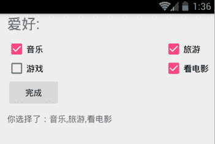

# Android CheckBox：多选按钮控件

> 原文：[`c.biancheng.net/view/3018.html`](http://c.biancheng.net/view/3018.html)

多项选择按钮（CheckBox）属于输入型组件，该组件允许用户一次选择多个选项。当用户不方便在手机屏幕上直接进行输入操作时，该组件的使用显得尤为方便。

下面通过实例讲解 CheckBox 的使用方法。该实例的运行效果如图 1 所示。


图 1  CheckBox 的应用界面
工程 WidgetDemo 中的布局文件 main.xml 中增加的代码如下：

```

<?xml version="1.0" encoding="utf-8"?>
<LinearLayout xmlns:android="http://schemas.android.com/apk/res/android"
    xmlns:tools="http://schemas.android.com/tools"
    xmlns:app="http://schemas.android.com/apk/res-auto"
    android:layout_width="match_parent"
    android:layout_height="match_parent"
    android:paddingRight="10dp"
    android:paddingLeft="@dimen/activity_horizontal_margin"
    android:orientation="vertical"
    app:layout_behavior="@string/appbar_scrolling_view_behavior"
    tools:context=".MainActivity">

    <TextView android:text="爱好:"
        android:textSize="24sp"
        android:layout_width="wrap_content"
        android:layout_height="wrap_content"
        android:id="@+id/tv" />

    <RelativeLayout
        android:layout_width="wrap_content"
        android:layout_height="wrap_content">
        <CheckBox
            android:layout_width="wrap_content"
            android:layout_height="wrap_content"
            android:text="音乐"
            android:id="@+id/chb_music"
            android:layout_alignParentLeft="true"
            android:layout_alignParentStart="true"
            android:layout_marginTop="10dp"
            android:checked="false" />

        <CheckBox
            android:layout_width="wrap_content"
            android:layout_height="wrap_content"
            android:text="游戏"
            android:id="@+id/chb_game"
            android:layout_below="@+id/chb_music"
            android:layout_alignParentLeft="true"
            android:layout_alignParentStart="true" />

        <CheckBox
            android:layout_width="wrap_content"
            android:layout_height="wrap_content"
            android:text="旅游"
            android:id="@+id/chb_trip"
            android:layout_alignTop="@+id/chb_music"
            android:layout_alignRight="@+id/chb_film"
            android:layout_alignLeft="@+id/chb_film" />

        <CheckBox
            android:layout_width="wrap_content"
            android:layout_height="wrap_content"
            android:text="看电影"
            android:id="@+id/chb_film"
            android:layout_below="@+id/chb_trip"
            android:layout_alignParentRight="true"
            android:layout_alignParentEnd="true" />

    </RelativeLayout>
    <Button
        android:id="@+id/end"
        android:text="完成"
        android:layout_width="wrap_content"
        android:layout_height="wrap_content" />

    <TextView
        android:paddingTop="10dp"
        android:id="@+id/result_tv"
        android:layout_width="wrap_content"
        android:layout_height="wrap_content"
        />
</LinearLayout>
```

当用户对多项选择按钮进行选择时，为了确定用户选择的是哪几项，需要对每个多项选择按钮进行监听。

CompoundButton.OnCheckedChangedListener 接口可用于对 CheckBox 的状态进行监听。当 CheckBox 的状态在未被选中和被选中之间变化时，该接口的 onCheckedChanged() 方法会被系统调用。CheckBox 通过 setOnCheckedChangeListener() 方法将该接口对象设置为自己的监听器。

MainActivity 代码如下：

```

package introduction.android.widgetdemo;

import android.os.Bundle;
import android.support.design.widget.FloatingActionButton;
import android.support.design.widget.Snackbar;
import android.support.v7.app.AppCompatActivity;
import android.support.v7.widget.Toolbar;
import android.view.View;
import android.view.Menu;
import android.view.MenuItem;
import android.widget.Button;
import android.widget.CheckBox;
import android.widget.CompoundButton;
import android.widget.TextView;
import java.util.ArrayList;

public class MainActivity extends AppCompatActivity implements CompoundButton.OnCheckedChangeListener {
    private CheckBox musicCkb;
    private CheckBox tripCkb;
    private CheckBox filmCkb;
    private CheckBox gameCkb;
    private TextView result_tv;
    private Button endBtn;
    //爱好数组
    ArrayList<String> hobbies=new ArrayList<String>();

    @Override
    protected void onCreate(Bundle savedInstanceState) {
        super.onCreate(savedInstanceState);
        setContentView(R.layout.activity_main);
        //初始化控件
        musicCkb = (CheckBox) findViewById(R.id.chb_music);
        tripCkb = (CheckBox) findViewById(R.id.chb_trip);
        filmCkb = (CheckBox) findViewById(R.id.chb_film);
        gameCkb = (CheckBox) findViewById(R.id.chb_game);
        result_tv = (TextView) findViewById(R.id.result_tv);
        endBtn= (Button) findViewById(R.id.end);
        //设置监听器
        musicCkb.setOnCheckedChangeListener(this);
        tripCkb.setOnCheckedChangeListener(this);
        filmCkb.setOnCheckedChangeListener(this);
        gameCkb.setOnCheckedChangeListener(this);
        //为 button 设置监听器
        endBtn.setOnClickListener(new View.OnClickListener() {
            @Override
            public void onClick(View v) {
                StringBuilder sb=new StringBuilder();
              for (int i =0;i<hobbies.size();i++) {
                  //把选择的爱好添加到 string 尾部
                  if(i==(hobbies.size()-1))
                  {
                      sb.append(hobbies.get(i));
                  }else {
                      sb.append(hobbies.get(i)+",");
                  }
              }
                //显示选择结果
                result_tv.setText("你选择了："+sb);
            }
        });
    }

    @Override
    public void onCheckedChanged(CompoundButton buttonView, boolean isChecked) {
        if (isChecked){
            //添加到爱好数组
            hobbies.add(buttonView.getText().toString().trim());
        }else {
            //从数组中移除
            hobbies.remove(buttonView.getText().toString().trim());
        }

    }
}

```

当 CheckBox 的状态发生改变时，通过 Checkbox.isChecked() 方法可以获取当前 CheckBox 按钮的选中状态，进而进行处理。