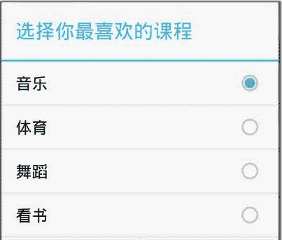

# Android RadioGroup：单选按钮控件

> 原文：[`c.biancheng.net/view/3019.html`](http://c.biancheng.net/view/3019.html)

RadioGroup 为单项选择按钮组，其中可以包含多个 RadioButton，即单选按钮，它们共同为用户提供一种多选一的选择方式。

在多个 RadioButton 被同一个 RadioGroup 包含的情况下，多个 RadioButton 之间自动形成互斥关系，仅有一个可以被选择。

单选按钮的使用方法和 CheckBox 的使用方法高度相似，其事件监听接口使用的是 RadioGroup.OnCheckedChangeListener()，使用 setOnCheckedChangeListener() 方法将监听器设置到单选按钮上。

按照 CheckBox 的讲解思路，启动一个名为 RadioGroupActivity 的 Activity 来对 RadioGroup 进行讲解。

RadioGroupActivity 的运行效果如图 1 所示。


图 1  RadioGroup 的应用界面
在工程 WidgetDemo 的布局文件 main.xml 中添加一个 Button，并启动 RadioGroupActivity 的相关代码。

在 main.xml 中添加代码如下：

```

<Button
    android:id="@+id/button3"
    android:layout_width="wrap_content"
    android:layout_height="wrap_content"
    android:text="RadioGroupDemo"/>
```

启动处理 RadioGroup 的 Activity RadioGroupActivity 的代码如下：

```

Button radiotn = (Button)this.findViewById(R.id.button3);
radiotn.setOnClickListener(new OnClickListener(){

    @Override
    public void onClick(View v){
        Intent intent = new Intent(WidgetDemoActivity.this,RadioGroupActivity.class);
        startActivity(intent);
    }

})
```

同时在 AndroidManifest.xml 文件中声明该 Activity：

<activity android:name=".RadioGroupActivity "></activity>

RadioGroupActivity 使用的是 radiogroup.xml，其代码如下：

```

<?xml version="1.0" encoding="utf-8"?>

<LinearLayout xmlns:android="http://schemas.android.com/apk/res/android"
    android:layout_width="match_parent"
    android:layout_height="match_parent"
    android:orientation="vertical">

    <TextView
        android:id="@+id/radiohello"
        android:layout_width="fill_parent"
        android:layout_height="wrap_content"
        android:text="@string/hello" />

    <RadioGroup
        android:id="@+id/radiogroup1"
        android:layout_width="wrap_content"
        android:layout_height="wrap_content"
        android:layout_x="3px"
        android:orientation="vertical">

        <RadioButton
            android:id="@+id/radiobutton1"
            android:layout_width="wrap_content"
            android:layout_height="wrap_content"
            android:text="@string/music" />

        <RadioButton
            android:id="@+id/radiobutton2"
            android:layout_width="wrap_content"
            android:layout_height="wrap_content"
            android:text="@string/gym" />

        <RadioButton
            android:id="@+id/radiobutton3"
            android:layout_width="wrap_content"
            android:layout_height="wrap_content"
            android:text="@string/dance" />

        <RadioButton
            android:id="@+id/radiobutton4"
            android:layout_width="wrap_content"
            android:layout_height="wrap_content"
            android:text="@string/lookBook" />

    </RadioGroup>
</LinearLayout>
```

该布局文件使用了 LinearLayout 布局，并且在其中放置了一个 TextView 和一个 RadioGroup。RadioGroup 中含有三个 RadioButton。这些组件对应的 strings.xml 文件中定义的变量为：

```

<resources>
    <string name="radiohello">选择你最喜欢的课程：</string>
    <string name="music">音乐</string>
    <string name="gym">体育</string>
    <string name="dance">舞蹈</string>
    <string name="lookBook">看书</string>
</resources>
```

RadioGroupActivity.java 的代码如下：

```

package introduction.android.widgetdemo;

import android.app.Activity;
import android.os.Bundle;
import android.widget.RadioButton;
import android.widget.RadioGroup;
import android.widget.TextView;

public class RadioGroupActivity extends Activity {
    private TextView textView;
    private RadioGroup radiogroup;
    private RadioButton radio1,radio2,radio3,radio4;

    @Override
    protected void onCreate(Bundle saveInstanceState) {
        super.onCreate(saveInstanceState);
        this.setContentView(R.layout.radiogroup);
        textView = (TextView) findViewById(R.id.radiohello);
        radiogroup = (RadioGroup)findViewById(R.id.radiogroup1);
        radio1 = (RadioButton) findViewById(R.id.radiobutton1);
        radio2 = (RadioButton) findViewById(R.id.radiobutton2);
        radio3 = (RadioButton) findViewById(R.id.radiobutton3);
        radio4 = (RadioButton) findViewById(R.id.radiobutton4);
        radiogroup.setOnCheckedChangeListener(new RadioGroup.OnCheckedChangeListener() {
            @Override
            public void onCheckedChanged(RadioGroup group, int checkedId) {
                String text="我最喜欢运动是";
                if (checkedId == radio1.getId()) {
                    text+=radio1.getText().toString();
                    textView.setText(text);
                } else if(checkedId == radio2.getId()){
                    text+=radio2.getText().toString();
                    textView.setText(text);
                }else if(checkedId == radio3.getId()) {
                    text += radio3.getText().toString();
                    textView.setText(text);
                }else if(checkedId == radio4.getId()) {
                    text += radio4.getText().toString();
                    textView.setText(text);
                }
            }
        });
    }
}
```

在 RadioGroupActivity 的 onCreate() 方法中为 RadioGroup 添加监视器 RadioGroup。

OnCheckedChangeListener 在其回调方法 onCheckedChanged() 中对 4 个 RadioButton 分别进行处理。需要说明的是，如果把 RadioGroup 去掉，只使用 RadioButton 的话，则需要为每个 RadioButton 单独设置监听器，其使用方法和 CheckBox 没有任何区别。