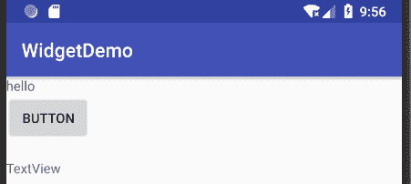
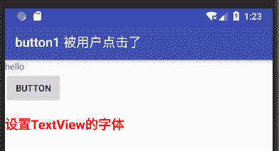

# Android TextView：文本框控件

> 原文：[`c.biancheng.net/view/2997.html`](http://c.biancheng.net/view/2997.html)

文本框（TextView）是用于在界面上显示文字的组件，其显示的文本不可被用户直接编辑。

程序开发人员可以设置 TextView 的字体大小、颜色、样式等属性。在工程 WidgetDemo 的 main.xml 中添加一个 TextView，代码如下：

```

<TextView
    android:id="@+id/textView1"
    android:layout_width="wrap_content"
    android:layout_height="wrap_content"
    android:text="TextView"/>
```

运行效果如图 1 所示。

图 1  TextView 的应用界面
修改 Button1 的单击事件为：

```

public void onClick(View v) {
    //TODO Auto-generated method stub
    setTitle("button1 被用户点击了");
    Log.i("widgetDemo", "button1 被用户点击了。");
    TextView textView = (TextView)findViewById(R.id.textView1);
    textView.setText("设置 TextView 的字体");
    textView.setTextColor(Color.RED);
    textView.setTextSize(TypedValue.COMPLEX_UNIT_SP,20);
    textView.setTypeface(Typeface.defaultFromStyle(Typeface.BOLD));
}

```

当 Button1 被单击时，我们可以通过使用如下几种不同的方法来设置显示内容的风格

*   通过 setText() 方法更改 textView 的显示内容为“设置 TextView 的字体”。
*   通过 setTextColor() 方法修改 textView 显示字体的颜色为红色。
*   通过 setTextSize() 方法修改 textView 显示字体的大小为 20sp。
*   通过 setTypeface() 方法修改 textView 显示字体的风格为加粗。

如图 2 所示。
图 2  单击按钮运行效果当然，该过程也可以通过修改 main.xml 文件来实现。将 TextView 标签按照如下代码修改也可以得到同样的效果，但是失去了应用程序中与用户交互的过程：

```

<TextView
    android:id="@+id/textView1"
    android:layout_width="wrap_content"
    android:layout_height="wrap_content"
    android:text="设置 TextView 的字体"
    android:textColor="#ff0000"
    android:textSize="20sp"
    android:textStyle="bold"/>

```