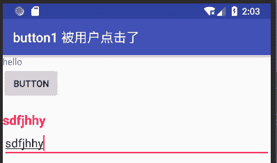

# Android EditText：编辑框控件

> 原文：[`c.biancheng.net/view/3020.html`](http://c.biancheng.net/view/3020.html)

编辑框（EditText）是 TextView 的子类，在 TextView 的基础上增加了文本编辑功能，用于处理用户输入，例如登录框等，是非常常用的组件。

在工程 WidgetDemo 的 main.xml 文件中添加一个 EditText，并实现这个功能：用户在 EditText 中输入信息的同时，用一个 TextView 显示用户输入的信息。

工程 WidgetDemo 中的布局文件 main.xml 中增加的代码如下：

```

<EditText
    android:id="@+id/editText1"
    android:layout_width="match_parent"
    android:layout_height="wrap_content" />
```

在 WidgetDemoActivity 的 onCreate() 方法中添加下列代码：

```

final EditText editText = (EditText) findViewById(R.id.editText1);
        editText.addTextChangedListener(new TextWatcher() {

            @Override
            public void beforeTextChanged(CharSequence charSequence, int start, int count, int after) {

            }

            @Override
            public void onTextChanged(CharSequence s, int start, int before, int count) {
                String text = editText.getText().toString();
                textView.setText(text);
            }

            @Override
            public void afterTextChanged(Editable s) {
            }
        });
```

运行结果如图 1 所示。
图 1  EditText 的应用界面