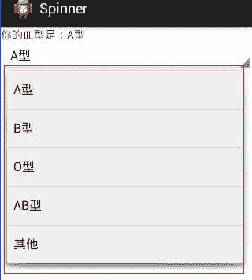

# Android Spinner：下拉列表控件

> 原文：[`c.biancheng.net/view/3006.html`](http://c.biancheng.net/view/3006.html)

Spinner 提供下拉列表式的输入方式，该方法可以有效节省手机屏幕上的显示空间。

下面用一个简单的实例讲解 Spinner 的使用方法。在工程 WidgetDemo 的布局文件 main.xml 中添加一个 Button，用以启动 SpinnerActivity。

在 main.xml 中添加代码如下：

```

<Button
    android:id="@+id/button4"
    android:layout_width="wrap_content"
    android:layout_height="wrap_content"
    android:text="SpinnerDemo"/>

```

单击 Button 并启动 SpinnerActivity 的代码如下

```

Button spinnerbtn = (Button) this.findViewById(R.id.button4);
spinnerbtn.setOnClickListener(new View.OnClickListener() {
    @Override
    public void onClick(View v) {
        Intent intent = new Intent(MainActivity.this, SpinnerActivity.class);
        startActivity(intent);
    }
});
```

同时在 AndroidManifest.xml 文件中声明该 Activity：

<activity android:name=".SpinnerActivity "></activity>

SpinnerActivity 的运行效果如图 1 所示。
图 1  Spinner 的应用界面
SpinnerActivity 使用的布局文件为 spiner.xml，其代码如下：

```

<?xml version="1.0" encoding="utf-8"?>
<LinearLayout xmlns:android="http://schemas.android.com/apk/res/android"
    android:layout_width="match_parent"
    android:layout_height="match_parent"
    android:orientation="vertical">
    <TextView
        android:id="@+id/textView1"
        android:layout_width="wrap_content"
        android:layout_height="wrap_content"
        android:text="textview"/>
    <Spinner
        android:id="@+id/spinner1"
        android:layout_width="match_parent"
        android:layout_height="wrap_content"/>
</LinearLayout>
```

SpinnerActivity.java 文件的代码如下：

```

package introduction.android.widgetDemo;

import java.util.ArrayList;
import java.util.List;

import android.app.Activity;
import android.os.Bundle;
import android.view.MotionEvent;
import android.view.View;
import android.widget.AdapterView;
import android.widget.ArrayAdapter;
import android.widget.Spinner;
import android.widget.TextView;

public class SpinnerActivity extends Activity {

    private List<String> list = new ArrayList<String>();
    private TextView textview;
    private Spinner spinnertext;
    private ArrayAdapter<String> adapter;

    public void onCreate(Bundle savedlnstanceState) {
        super.onCreate(savedlnstanceState);
        setContentView(R.layout.spiner);
        //第一步：定义下拉列表内容
        list.add("A 型");
        list.add("B 型");
        list.add("O 型");
        list.add("AB 型");
        list.add("其他");
        textview = (TextView) findViewByld(R.id.textViewl);
        spinnertext = (Spinner) findViewByld(R.id.spinnerl);
        //第二步：为下拉列表定义一个适配器
        adapter = new ArrayAdapter<String>(this, android.R.layout.simple_spinner_item, list);
        //第三步：设置下拉列表下拉时的菜单样式
        adapter.setDropDownViewResource(android.R.layout.simple_spinner_dropdown_item);
        //第四步：将适配器添加到下拉列表上
        spinnertext.setAdapter(adapter);
        //第五步：添加监听器，为下拉列表设置事件的响应
        spinnertext.setOnltemSelectedListener(new Spinner.OnltemSelectedListener() {
            public void onltemSelected(AdapterView<?> argO, View argl, int arg2, long arg3) {
                // TODO Auto-generated method stub
                /* 将所选 spinnertext 的值带入 myTextView 中*/
                textview.setText("你的血型是:" + adapter.getItem(arg2));
                /* 将 spinnertext 显示^*/
                argO.setVisibility(View.VISIBLE);
            }

            public void onNothingSelected(AdapterView<?> argO) {
                // TODO Auto-generated method stub
                textview.setText("NONE");
                argO.setVisibility(View.VISIBLE);
            }
        });

        //将 spinnertext 添加到 OnTouchListener 对内容选项触屏事件处理
        spinnertext.setOnTouchListener(new Spinner.OnTouchListener() {
            @Override
            public boolean onTouch(View v, MotionEvent event) {
                // TODO Auto-generated method stub
                // 将 mySpinner 隐藏
                v.setVisibility(View.INVISIBLE);
                Log.i("spinner", "Spinner Touch 事件被触发!");
                return false;
            }
        });

        //焦点改变事件处理
        spinnertext.setOnFocusChangeListener(new Spinner.OnFocusChangeListener() {
            public void onFocusChange(View v, boolean hasFocus) {
                // TODO Auto-generated method stub
                v.setVisibility(View.VISIBLE);
                Log.i("spinner", "Spinner FocusChange 事件被触发！");
            }
        });

    }
}
```

SpinnerActivity 通过 5 个步骤将 Spinner 初始化并进行事件处理，分别为：

*   定义下拉列表的列表项内容 List<String>。
*   为下拉列表 Spinner 定义一个适配器 ArrayAdapter<String> ，并与列表项内容相关联。
*   使用 ArrayAdapter.setDropDownViewResource() 设置 Spinner 下拉列表在打开时的下拉菜单样式。
*   使用 Spinner. setAdapter() 将适配器数据与 Spinner 关联起来。
*   为 Spinner 添加事件监听器，进行事件处理。

在本实例中，SpinnerActivity 在程序代码中动态建立了下拉列表每一项的内容。除此之外，还可以在 XML 文件中定义 Spinner 的下拉列表项，步骤如下。

1）在 res/values 文件夹下新建 cities.xml 文件夹：

```

<?xml version="1.0" encoding="utf-8"?>
<resources>
    <string-array name="city">
        <item>A 型</item>
        <item>B 型</item>
        <item>AB 型</item>
        <item>O 型</item>
        <item>其他</item>
    </string-array>
</resources>
```

2）在 SpinnerActivity.java 中初始化 Spinner：

```

Spinner spinner=(Spinner)findViewById(R.id.spinner1);
ArrayAdapter<CharSequence> adapter=ArrayAdapter.createF
romResource(this, R.array.city,android.R.layout.simple_spinner_item);
adapter.setDropDownViewResource
(android.R.layout.simple_spinner_dropdown_item);
spinner.setAdapter(adapter);
```