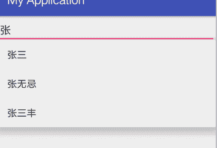

# Android AutoCompleteTextView：自动完成文本框控件

> 原文：[`c.biancheng.net/view/3001.html`](http://c.biancheng.net/view/3001.html)

在使用百度或者 Google 搜索信息时，只需要在搜索框中输入几个关键字，就会有很多相关的信息以列表形式被列举出来供用户选择，这种效果在 Android SDK 中可以通过 AutoCompleteTextView 来实现。

下面用一个简单的实例讲解 AutoCompleteTextView 的使用方法。在工程 WidgetDemo 的布局文件 main.xml 中添加一个 Button，用以启动 AutoCompleteTextViewActivity。

在 main.xml 中添加代码如下：

```

<Button
    android:id="@+id/button5"
    android:layout_width="wrap_content"
    android:layout_height="wrap_content"
    android:text="AutoCompleteTextViewDemo"/>
```

单击 Button 并启动 AutoCompleteTextViewActivity 的代码如下：

```

Button autobtn = (Button)this.findViewById(R.id.button5);
autobtn.setOnClickListener(new OnClickListener(){
    @Override
    public void onClick(View v){
        Intent intent = new Intent(WidgetDemoActivity.this, AutoCompleteTextViewActivity.class);
        startActivity(intent);
    }
});
```

同时在 AndroidManifest.xml 文件中声明该 Activity：

<activity android:name=".AutoCompleteTextViewActivity"></activity>

AutoCompleteTextViewActivity 的运行效果如图 1 所示。


图 1  AutoCompleteTextViewActivity 的运行效果
AutoCompleteTextViewActivity 使用的布局文件为 autocompletetextview.xml，其具体内容如下：

```

<?xml version="1.0" encoding="utf-8"?>
<LinearLayout xmlns:android="http://schemas.android.com/apk/res/android"
    android:layout_width="match_parent"
    android:layout_height="match_parent"
    android:orientation="vertical">

    <TextView
        android:layout_width="fill_parent"
        android:layout_height="wrap_content"
        android:text="AutoCompleteTextView 演示：" />

    <AutoCompleteTextView
        android:id="@+id/autoCompleteTextView1"
        android:layout_width="match_parent"
        android:layout_height="wrap_content"
        android:text="" />

    <requestFocus />
</LinearLayout>
```

AutoCompleteTextViewActivity.java 的代码如下：

```

package introduction.android.widgetdemo;

import android.app.Activity;
import android.support.v7.app.AppCompatActivity;
import android.os.Bundle;
import android.widget.ArrayAdapter;
import android.widget.AutoCompleteTextView;
import android.widget.Button;

public class MainActivity extends Activity {
    private AutoCompleteTextView textView;
    private static final String[] autotext = new String[]{"张三","张无忌","张三丰"};

    @Override
    public void onCreat(Bundle savedInstanceState){
        super.onCreate(savedInstanceState);
        setContentView(R.layout.autocompletetextview);
        textView = (AutoCompleteTextView)findViewById(R.id.autoCompleteTextView1);
        /*new ArrayAdapterd 对象将 autotext 字符串数组传入*/
        ArrayAdapter<String> adapter = new ArrayAdapter<String>(this,android.R.layout.simple_dropdown_item_1line,autotext);
        /*将 ArrayAdapter 添加到 AutoCompleteTextView 中*/
        textView.setAdapter(adapter);
    }
}
```

AutoCompleteTextViewActivity 中为可自动补全的内容建立对应字符串数组 autotext，将该数组关联到 ArrayAdapter 中，然后将 ArrayAdapter 与 AutoCompleteTextView 相关联，进而实现自动完成文本功能。

AutoCompleteTextView 提供一系列属性对显示效果进行设置，分别说明如下。

*   completionThreshold：它的值决定了你在 AutoCompleteTextView 中至少输入几个字符，才会具有自动提示的功能。另外，默认最多提示 20 条。
*   dropDownAnchor：它的值是一个 View 的 ID，指定后，AutoCompleteTextView 会在这个 View 下弹出自动提示。
*   dropDownSelector：应该是设置自动提示的背景色之类的，没有尝试过，有待进一步考证。
*   dropDownWidth：设置自动提示列表的宽度。