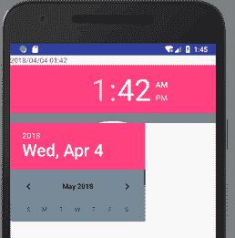

# Android DatePicker 和 TimePicker：时间日期选择器

> 原文：[`c.biancheng.net/view/3007.html`](http://c.biancheng.net/view/3007.html)

Android SDK 提供了 DatePicker 和 TimePicker 组件，分别对日期和时间进行选择，方便日期和时间设定。

下面用一个简单的实例讲解 DatePicker 和 TimePicker 组件的使用方法。在工程 WidgetDemo 的布局文件 main.xml 中添加一个名为“Date/Time”的 Button，用以启动 TimeActivity。

在 main.xml 中添加代码如下：

```

<Button
    android:id="@+id/button6"
    android:layout_width="wrap_content"
    android:layout_height="wrap_content"
    android:text="Date/Time"/>
```

单击 Button 并启动 TimeActivity 的代码如下：

```

Button timebtn = (Button)this.findViewById(R.id.button6);
timebtn.setOnClickListener(new OnClickListener(){
    @Override
    public void onClick(View v){
        Intent intent = new Intent(WidgetDemoActivity.this, TimeActivity.class);
        startActivity(intent);
    }
});
```

同时在 AndroidManifest.xml 文件中声明该 Activity：

<activity android:name=" .TimeActivity"></activity>

TimeActivity 的运行效果如图 1 所示。
图 1  TimeActivity 的运行效果
TimeActivity 使用的布局文件为 time.xml，其内容如下：

```

<?xml version="1.0" encoding="utf-8"?>
<LinearLayout xmlns:android="http://schemas.android.com/apk/res/android"
    android:layout_width="match_parent"
    android:layout_height="match_parent"
    android:orientation="vertical">
    <TextView
        android:id="@+id/timeview"
        android:layout_width="fill_parent"
        android:layout_height="wrap_content"
        android:text="DatePicker 和 TimePicker"/>
    <TimePicker
        android:id="@+id/timepicker"
        android:layout_width="wrap_content"
        android:layout_height="116dp"
        android:background="#778888"/>
    <!--设置背景色为墨绿-->
    <DatePicker
        android:id="@+id/datepicker"
        android:layout_width="271dp"
        android:layout_height="196dp"
        android:background="#778899"/>
</LinearLayout>
```

TimeActivity.java 的代码如下：

```

package introduction.android.widgetdemo;

import java.util.Calendar;

import android.app.Activity;
import android.os.Bundle;
import android.widget.DatePicker;
import android.widget.TextView;
import android.widget.TimePicker;

public class TimeActivity extends Activity {
    private TextView textview;
    private TimePicker timepicker;
    private DatePicker datepicker;

    /* 声明日期及时间变量*/
    private int year;
    private int month;
    private int day;
    private int hour;
    private int minute;

    @Override
    public void onCreate(Bundle savedInstanceState) {
        super.onCreate(savedInstanceState);
        setContentView(R.layout.time);
        /*获取当前日期及时间 */
        Calendar calendar = Calendar.getInstance();
        year = calendar.get(Calendar.YEAR);
        month = calendar.get(Calendar.MONTH);
        day = calendar.get(Calendar.DAY_OF_MONTH);
        hour = calendar.get(Calendar.HOUR);
        minute = calendar.get(Calendar.MINUTE);

        datepicker = (DatePicker) findViewById(R.id.datepicker);
        timepicker = (TimePicker) findViewById(R.id.timepicker);
        /* 设置 TextView 对象，显示初始日期时间 */
        textview = (TextView) findViewById(R.id.timeview);
        textview.setText(new StringBuilder().append(year).append("/")
                .append(format(month + 1)).append("/")
                .append(format(day)).append(" ")
                .append(format(hour)).append(":")
                .append(format(minute)));
        /* 设置 OnDateChangedListener()*/
        datepicker.init(year, month, day,
                new DatePicker.OnDateChangedListener() {
                    @Override
                    public void onDateChanged(DatePicker view, int year, int monthOfYear, int dayOfMonth) {

                        // TODO Auto-generated method stub
                        TimeActivity.this.year = year;
                        month = monthOfYear;
                        day = dayOfMonth;
                        textview.setText(new StringBuilder().append(year).
                                append("/").append(format(month + 1))
                                .append("/").append(format(day)).append(" ")
                                .append(format(hour)).append(":")
                                .append(format(minute)));

                    }

                });

        timepicker.setOnTimeChangedListener(new TimePicker.OnTimeChangedListener() {
            @Override
            public void onTimeChanged(TimePicker view, int hourOfDay, int minute) {
                // TODO Auto-generated method stub
                hour = hourOfDay;
                TimeActivity.this.minute = minute;
                textview.setText(new StringBuilder().append(year)
                        .append("/").append(format(month + 1))
                        .append("/").append(format(day)).append(" ")
                        .append(format(hour)).append(":")
                        .append(format(minute)));
            }
        });
    }

    private String format(int time) {
        String str = "" + time;
        if (str.length() == 1)
            str = "0" + str;
        return str;
    }
}
```

TimeActivity 中使用 java.util.Calendar 对象获取当前系统时间。

当更改 DatePicker 组件中的日期时，会触发 DatePicker 的 OnDateChange() 事件；

当修改 TimePacker 的时间时，会触发 TimePacker 的 OnDateChange() 事件。

由本实例可见，DatePicker 实现 OnDateChangedListener 监听器的方法与 TimePicker 实现 setOnTimeChangedListener 监听器的方法有所类似。

DatePicker 用 init() 方法设定年、月、日的同时设定监听器，而 TimePicker 使用 setOnTimeChangedListener() 直接设定。