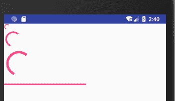

# Android ProgressBar：进度条控件

> 原文：[`c.biancheng.net/view/3011.html`](http://c.biancheng.net/view/3011.html)

当应用程序在后台运行时，可以使用进度条（ProgressBar）反馈给用户当前的进度信息。进度条被用以显示当前应用程序的运行状况、功能完成多少等情况。

Android SDK 提供两种样式的进度条，一种是圆形的进度条，另一种是水平进度条。其中圆形进度条分大、中、小三种。

进度条本质上是一个整数，显示当前的整数值在特定范围内的比重。下面用一个简单的实例讲解 ProgressBar 组件的使用方法。

在工程 WidgetDemo 的布局文件 main.xml 中添加一个名为 ProgressBarDemo 的 Button，用以启动 ProcessBarActivity。

在 main.xml 中添加代码如下：

```

<Button
    android:id="@+id/button7"
    android:layout_width="wrap_content"
    android:layout_height="wrap_content"
    android:text="ProgressBarDemo"/>
```

单击 Button 并启动 ProcessBarActivity 的代码如下：

```

Button processbtn = (Button)this.findViewById(R.id.button7);
processbtn.setOnClickListener(new View.OnClickListener(){
    @Override
    public void onClick(View v){
        Intent intent;
        intent = new Intent(MainActivity.this, ProcessBarActivity.class);
        startActivity(intent);
    }
});
```

同时在 AndroidManifest.xml 文件中声明该 Activity：

<activity android:name=".ProcessBarActivity"></activity>

ProcessBarActivity 的运行效果如图 1 所示。


图 1  ProcessBarActivity 的运行效果
ProcessBarActivity 使用的布局文件为 processbar.xml，其内容如下：

```

<?xml version="1.0" encoding="utf-8"?>
<LinearLayout xmlns:android="http://schemas.android.com/apk/res/android"
    android:layout_width="match_parent"
    android:layout_height="match_parent"
    android:orientation="vertical">

    <ProgressBar
        android:id="@+id/progressBar1"
        style="?android:attr/progressBarStyleSmall"
        android:layout_width="wrap_content"
        android:layout_height="wrap_content" />

    <ProgressBar
        android:id="@+id/progressBar2"
        android:layout_width="wrap_content"
        android:layout_height="wrap_content" />

    <ProgressBar
        android:id="@+id/progressBar3"
        style="?android:attr/progressBarStyleLarge"
        android:layout_width="wrap_content"
        android:layout_height="wrap_content" />

    <ProgressBar
        android:id="@+id/progressBar4"
        style="?android:attr/progressBarStyleHorizontal"
        android:layout_width="209dp"
        android:layout_height="30dp"
        android:max="100" />

</LinearLayout>
```

该布局中放置了小、中、大三种类型的圆形进度条各一个，以及一个水平放置的条形进度条。

一般情况下，开发人员不会为圆形进度条指定进度，圆形进度条只是展示运行效果，而不反映实际的进度。条形进度条则不同，开发人员会为条形进度条指定最大值，以及进度条当前值的获取方法。

在本实例中，条形进度条的最大值为 100。

ProcessBarActivity.java 的代码如下：

```

package introduction.android.widgetdemo;

import android.app.Activity;
import android.os.Bundle;
import android.os.Handler;
import android.widget.ProgressBar;

public class ProcessBarActivity extends Activity {
    ProgressBar progressBar;
    int i = 0;
    int progressBarMax = 0;
    /* 创建 Handler 对象*/
    Handler handler = new Handler();

    @Override
    public void onCreate(Bundle savedInstanceState) {
        super.onCreate(savedInstanceState);
        setContentView(R.layout.processbar);
        progressBar = (ProgressBar) findViewById(R.id.progressBar4);
        /* 获取最大值*/
        progressBarMax = progressBar.getMax();
        /* 匿名内部类启动实现效果的线程*/
        new Thread(new Runnable() {
            @Override
            public void run() {
                while (i++ < progressBarMax) {
                    //设置滚动条当前状态值
                    progressBar.setProgress(i);
                    try {
                        Thread.sleep(15);
                    } catch (Exception e) {
                        e.printStackTrace();
                    }
                }
            }
        }).start();
    }
}
```

ProcessBarActivity 对水平进度条进行了处理。先获取了水平进度条的最大值，然后启动了一个线程，由该线程来控制进度条的值，从 0 开始，每隔 15 毫秒增加 1。