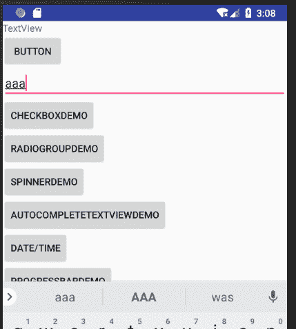
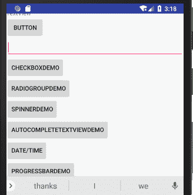

# Android ScrollView：滚动视图

> 原文：[`c.biancheng.net/view/3012.html`](http://c.biancheng.net/view/3012.html)

当 Activity 提供的用户界面上有很多内容，以至于当前手机屏幕不能完全显示全部内容时，就需要滚动视图来帮助浏览全部的内容。

以工程 WidgetDemo 为例，由于在讲述过程中不断地在 main.xml 文件中添加按钮和其他组件，目前已经不能显示全部内容，效果如图 1 所示。


图 1  添加大量组件后的效果
这时候就需要使用 ScrollView，即将当前的 Activity 的视图转化为滚动视图，以便于浏览。ScrollView 的使用非常方便，只需在 main.xml 的 <LinearLayout> 标签外面加上 ScrollView 组件的声明即可。布局文件 main.xml 的内容如下：

```

<ScrollView
    xmlns:android="http://schemas.android.com/apk/res/android"
    android:layout_width="fill_parent"
    android:layout_height="fill_parent">
    <LinearLayout>...</LinearLayout>
</ScrollView>
```

添加 ScrollView 后，main.xml 布局的运行效果如图 2 所示。


图 2  ScrollView 的运行效果（右边有滑动条）