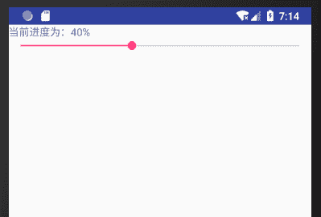

# Android SeekBar：拖动条控件

> 原文：[`c.biancheng.net/view/3014.html`](http://c.biancheng.net/view/3014.html)

SeekBar 是水平进度条 ProgressBar 的间接子类，相当于一个可以拖动的水平进度条。下面仍以一个简单的实例讲解 SeekBar 组件的使用方法。

在工程 WidgetDemo 的布局文件 main.xml 中添加一个名为“SeekBarDemo”的 Button，用以启动 SeekBarActivity。

在 main.xml 中添加代码如下：

```

<Button
    android:id="@+id/button8"
    android:layout_width="wrap_content"
    android:layout_height="wrap_content"
    android:text="SeekBarDemo" />
```

单击 Button 并启动 SeekBarActivity 的代码如下：

```

Button seekbtn2 = (Button)this.findViewById(R.id.button8);
seekbtn2.setOnClickListener(new View.OnClickListener(){
    @Override
    public void onClick(View v){
        Intent intent;
        intent = new Intent(MainActivity.this, SeekBarActivity.class);
        startActivity(intent);
    }
});
```

同时在 AndroidManifest.xml 文件中声明该 Activity：

<activity android:name=".SeekBarActivity"></activity>

SeekBarActivity 的运行效果如图 1 所示。


图 1  SeekBarActivity 的运行效果
SeekBarActivity 使用的布局文件为 seekbar.xml，其内容如下：

```

<?xml version="1.0" encoding="utf-8"?>
<LinearLayout xmlns:android="http://schemas.android.com/apk/res/android"
    android:layout_width="match_parent"
    android:layout_height="match_parent"
    android:orientation="vertical">
    <TextView
        android:id="@+id/textView1"
        android:layout_width="wrap_content"
        android:layout_height="wrap_content"
        android:text="TextView"/>
    <SeekBar
        android:id="@+id/seekBar1"
        android:layout_width="match_parent"
        android:layout_height="wrap_content"
        android:max="100"/>
</LinearLayout>
```

该文件确定 SeekBar 对象的最大值为 100，宽度为手机屏幕的宽度。

SeekBarActivity.java 的代码如下：

```

package introduction.android.widgetdemo;

import android.app.Activity;
import android.os.Bundle;
import android.util.Log;
import android.widget.SeekBar;
import android.widget.TextView;

public class SeekBarActivity extends Activity {
    private TextView textView;
    private SeekBar seekBar;

    @Override
    public void onCreate(Bundle savedlnstanceState) {
        super.onCreate(savedlnstanceState);
        setContentView(R.layout.seekbar);
        textView = (TextView) findViewById(R.id.textView1);
        seekBar = (SeekBar) findViewById(R.id.seekBar1);
        /* 设置 SeekBar 监听 setOnSeekBarChangeListener */
        seekBar.setOnSeekBarChangeListener(new SeekBar.OnSeekBarChangeListener() {
            /*拖动条停止拖动时调用 */
            @Override
            public void onStopTrackingTouch(SeekBar seekBar) {
                Log.i("SeekBarActivity", "拖动停止");
            }

            /*拖动条开始拖动时调用*/
            @Override
            public void onStartTrackingTouch(SeekBar seekBar) {
                Log.i("SeekBarActivity", "开始拖动");
            }

            /* 拖动条进度改变时调用*/
            @Override
            public void onProgressChanged(SeekBar seekBar, int progress, boolean fromUser) {
                textView.setText("当前进度为：" + progress + "%");
            }
        });
    }
}
```

SeekBar 的事件处理接口为 OnSeekBarChangeListener，该监听器提供对三种事件的监听，分别为当 SeekBar 的拖动条开始被拖动时、拖动条拖动停止时和拖动条的位置发生改变时。

SeekBarActivity 在拖动条开始被拖动和拖动停止时，会通过 Logcat 打印相关信息。
当拖动条位置发生改变时，将当前的数值显示到 TextView 中。