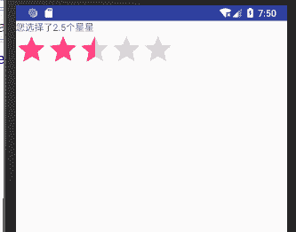

# Android RatingBar：评价条控件

> 原文：[`c.biancheng.net/view/3016.html`](http://c.biancheng.net/view/3016.html)

RatingBar 是 SeekBar 和 ProgressBar 的扩展，是 ProgressBar 的间接子类，可以使用 ProgressBar 相关的属性。

RatingBar 有三种风格，分别为默认风格（ratingBarStyle）、小风格（ratingBarStyleSmall）和大风格（ratingBarStyleIndicator ）。其中，默认风格的 RatingBar 是我们通常使用的，可以进行交互，而其他两种不能进行交互。

以一个简单的实例讲解 RatingBar 组件的使用方法。在工程 WidgetDemo 的布局文件 main.xml 中添加一个名为“RatingBarDemo”的 Button，用以启动 RatingBarActivity。

在 main.xml 中添加代码如下：

```

<Button
    android:id="@+id/button9"
    android:layout_width="wrap_content"
    android:layout_height="wrap_content"
    android:text="RatingBarDemo" />
```

单击 Button 并启动 RatingBarActivity 的代码如下：

```

Button ratingbar = (Button)this.findViewById(R.id.button9);
ratingbar.setOnClickListener(new View.OnClickListener(){
    @Override
    public void onClick(View v){
        Intent intent;
        intent = new Intent(MainActivity.this, RatingBarActivity.class);
        startActivity(intent);
    }
});
```

同时在 AndroidManifest.xml 文件中声明该 Activity：

<activity android:name=".RatingBarActivity"></activity>

RatingBarActivity 的运行效果如图 1 所示。


图 1  RatingBarActivity 的运行效果
RatingBarActivity 使用的布局文件 ratingbar.xml 的内容如下：

```

<?xml version="1.0" encoding="utf-8"?>
<LinearLayout xmlns:android="http://schemas.android.com/apk/res/android"
    android:layout_width="match_parent"
    android:layout_height="match_parent"
    android:orientation="vertical">

    <TextView
        android:id="@+id/textView1"
        android:layout_width="wrap_content"
        android:layout_height="wrap_content"
        android:text="TextView" />

    <RatingBar
        android:id="@+id/ratingBar1"
        android:layout_width="wrap_content"
        android:layout_height="wrap_content"
        android:numStars="5"
        android:rating="3"
        android:stepSize="0.5" />
</LinearLayout>
```

该布局文件使用 LinearLayout 布局，其中放置了一个 TextView 和一个 RatingBar，并对 RatingBar 的相关属性进行了设置。

下面是各个属性的作用：

*   android:numStars="5" 用于设置 RatingBar 显示的星星数量为 5 个。
*   android:stepSize="0.5" 用于设置 RatingBar 的最小变化单位为半个星星。
*   android:rating ="3" 表示 RatingBar 在初始状态下被选中的星星数量为 3 个。

RatingBarActivity.java 的代码如下：

```

package introduction.android.widgetdemo;

import android.app.Activity;
import android.os.Bundle;
import android.util.Log;
import android.view.MotionEvent;
import android.view.View;

import android.view.View.OnTouchListener;
import android.widget.RatingBar;

import android.widget.RatingBar.OnRatingBarChangeListener;
import android.widget.TextView;
import android.widget.Toast;

public class RatingBarActivity extends Activity {
    private RatingBar chooseRatingBar;
    private TextView textView;

    @Override
    public void onCreate(Bundle savedlnstanceState) {
        super.onCreate(savedlnstanceState);
        setContentView(R.layout.ratingbar);
        textView = (TextView) findViewById(R.id.textView1);
        chooseRatingBar = (RatingBar) findViewById(R.id.ratingBar1);
        /*创建 RatingBar 监听器 */
        chooseRatingBar.setOnRatingBarChangeListener(new OnRatingBarChangeListener() {
            @Override
            public void onRatingChanged(RatingBar ratingBar, float rating, boolean fromUser) {
                chooseRatingBar = (RatingBar) findViewById(R.id.ratingBar1);
                chooseRatingBar.setRating(rating);
                textView.setText("您选择了" + rating + "个星星");

            }

        });
    }
}

```

RatingBarActivity 为 RatingBar 对象设置了 OnRatingBarChangeListener 监听器，当用户单击 RatingBar 引起被选中星星数量的变化时，该接口会监测到该事件，并且调用 onRatingChanged() 方法，更新 TextView 显示的内容。

onRatingChanged() 的三个参数所对应的含义如下。

*   ratingBar：多个 RatingBar 可以同时指定同一个 RatingBar 监听器。该参数就是当前触发 RatingBar 监听器的那个 RatingBar 对象。
*   rating：当前评级分数。取值范围从 0 到 RatingBar 的总星星数。
*   fromUser：如果触发监听器的是用户触屏单击或轨迹球左右移动，则为 true。