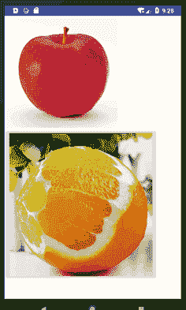
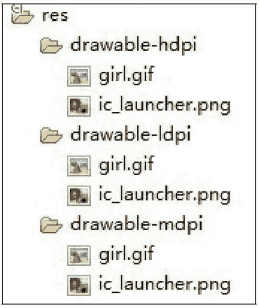

# Android ImageView 和 ImageButton：图片视图和图片按钮

> 原文：[`c.biancheng.net/view/3021.html`](http://c.biancheng.net/view/3021.html)

ImageView 是用于显示图片的组件，在很多场合都有比较普遍的使用。

ImageView 可以显示任意图像，加载各种来源的图片（如资源或图片库）。它还可以负责计算图片的尺寸，以便在任意的布局中使用，并且可以提供缩放或者着色等选项供开发者使用。

ImageButton 是 ImageView 的子类，相当于一个表明是图片而不是文字的 Button。其使用方法和 Button 完全相同。

下面通过一个实例来了解一下这两个组件的使用方法。在工程 WidgetDemo 的布局文件 main.xml 中添加一个名为 ImageButtonDemo 的 Button，用以启动 ImageButtonActivity。

在 main.xml 中添加代码如下：

```

<Button
        android:id="@+id/button10"
        android:layout_width="wrap_content"
        android:layout_height="wrap_content"
        android:text="ImageButtonDemo" />
```

单击 Button 并启动 RatingBarActivity 的代码如下：

```

Button imgbtn = (Button)this.findViewById(R.id.button10);
mgbtn.setOnClickListener(new View.OnClickListener(){
    @Override
    public void onClick(View v){
        Intent intent;
        intent = new Intent(MainActivity.this, ImageButtonActivity.class);
        startActivity(intent);
    }
});
```

同时在 AndroidManifest.xml 文件中声明该 Activity：

<activity android:name=".ImageButtonActivity"></activity>

ImageButtonActivity 的运行效果如图 1 所示。


图 1  ImageButtonActivity 的运行效果
ImageButtonActivity 的布局文件 imgbtn.xml 内容如下：

```

<?xml version="1.0" encoding="utf-8"?>
<LinearLayout xmlns:android="http://schemas.android.com/apk/res/android"
    android:layout_width="match_parent"
    android:layout_height="match_parent"
    android:orientation="vertical">

    <ImageView
        android:id="@+id/imageView1"
        android:layout_width="250dp"
        android:layout_height="250dp"
        android:src="@drawable/girl"/>
    <ImageButton
        android:id="@+id/imageButton1"
        android:layout_width="wrap_content"
        android:layout_height="wrap_content"
        android:src="@drawable/ic_launcher"/>
</LinearLayout>
```

该文件使用 LinearLayout 布局，其中放入了一个 ImageView 组件和一个 ImageButton 组件。两个组件都通过 android:src 属性指定了显示的图片。

该实例用到了两个图片资源，一个为 girl，另一个为 ic_launcher，如图 2 所示。

由于 Android 会根据手机设备的配置高低选择不同的资源，因此为了应用程序的通用性，在三个 drawable 文件夹下都放置了 girl.gif 图像。ic_launcher.png 是系统自带的资源文件。


图 2  工程中的图片资源
ImageButtonActivity.java 的代码如下：

```

package introduction.android.widgetdemo;

import android.app.Activity;
import android.os.Bundle;
import android.view.View;

import android.view.ViewGroup.LayoutParams;
import android.widget.ImageButton;
import android.widget.ImageView;

public class ImageButtonActivity extends Activity {
    private ImageButton imgbtn;
    private ImageView imgview;

    @Override
    protected void onCreate(Bundle savedInstanceState) {
        // TODO Auto-generated method stub
        super.onCreate(savedInstanceState);
        setContentView(R.layout.imgbtn);
        imgbtn = (ImageButton) this.findViewById(R.id.imageButton1);
        imgview = (ImageView) this.findViewById(R.id.imageView1);
        imgbtn.setOnClickListener(new View.OnClickListener() {
            @Override
            public void onClick(View v) {
                // TODO Auto-generated method stub
                LayoutParams params = imgview.getLayoutParams();
                params.height += 3;
                params.width += 3;
                imgview.setLayoutParams(params);
            }
        });
    }
}
```

ImageButtonActivity 为 ImageButton 添加了单击监听器，对用户单击 imgbtn 的事件进行了处理。用户每次单击图片按钮，都把 ImageView 组件的宽和高增大 3。随着用户的不断单击，ImageView 中显示的图片越来越大，显示了 ImageView 组件对图片的缩放功能。