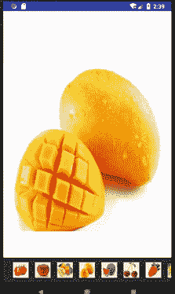

# Android ImageSwitcher 和 Gallery：图片切换器和图库

> 原文：[`c.biancheng.net/view/3027.html`](http://c.biancheng.net/view/3027.html)

在使用 Android 手机设置壁纸的时候，会看到屏幕底部有很多可以滚动的图片，当单击某一图片时，在其上面的空间会显示当前选中的图片，此时我们用到的就是 Gallery（图库）和 ImageSwitcher（图片切换器）。

Gallery 组件用于横向显示图像列表，并且自动将当前图像放置到中间位置。

ImageSwitcher 则像是图片浏览器，可以切换图片，通过它可以制作简单的幻灯片等。通常将这两个类结合在一起使用，可以制作有一定效果的相册。

下面通过一个实例来了解一下这两个组件的使用方法。

在工程 WidgetDemo 的布局文件 main.xml 中添加一个名为 GalleryDemo 的 Button，用以启动 GalleryActivity。在 main.xml 中添加代码如下：

```

<Button
    android:id="@+id/button11"
    android:layout_width="wrap_content"
    android:layout_height="wrap_content"
    android:text="GalleryDemo"/>
```

单击 Button 并启动 GalleryActivity 的代码如下：

```

Button gallerybtn = (Button)this.findViewById(R.id.button11);
gallerybtn.setOnClickListener(new View.OnClickListener(){
    @Override
    public void onClick(View v){
        Intent intent;
        intent = new Intent(MainActivity.this, GalleryActivity.class);
        startActivity(intent);
    }
});
```

同时在 AndroidManifest.xml 文件中声明该 Activity：

<activity android:name=".GalleryActivity"/>

GalleryActivity 的运行效果如图 1 所示。
图 1  GalleryActivity 的运行效果
GalleryActivity 使用的布局文件为 gallery.xml，内容如下：

```

<?xml version="1.0" encoding="utf-8"?>
<RelativeLayout xmlns:android="http://schemas.android.com/apk/res/android"
    android:layout_width="match_parent"
    android:layout_height="match_parent"
    android:orientation="vertical">

    <ImageSwitcher
        android:id="@+id/switcher"
        android:layout_width="match_parent"
        android:layout_height="match_parent"
        android:layout_alignParentLeft="true"
        android:layout_alignParentTop="true" />

    <Gallery
        android:id="@+id/gallery"
        android:layout_width="fill_parent"
        android:layout_height="60dp"
        android:layout_alignParentBottom="true"
        android:layout_alignParentLeft="true"
        android:background="#333333"
        android:gravity="center_vertical"
        android:spacing="16dp" />

</RelativeLayout>
```

该布局文件使用的是相对布局。
1）通过 android:layout_alignParentTop="true" 属性将 ImageSwitcher 放置于视图的顶端，其顶部与其父组件的顶部对齐。
2）通过 android: layout_alignParentLeft="true" 属性使 ImageSwitcher 的左边缘与其父组件的左边缘对齐。

在设置 Gallery 组件时，将其与屏幕的左下角对其，android:layout_alignParentBottom="true" 是将该组件的底部与其父组件的底部对齐，并且使用 android:spacing="16dp" 属性设置图片之间的间距。

GalleryActivity.java 的代码如下：

```

package introduction.android.widgetdemo;

import android.app.Activity;
import android.content.Context;
import android.os.Bundle;
import android.view.View;
import android.view.ViewGroup;
import android.view.ViewGroup.LayoutParams;
import android.view.animation.AnimationUtils;
import android.widget.AdapterView;
import android.widget.AdapterView.OnItemSelectedListener;
import android.widget.BaseAdapter;
import android.widget.Gallery;
import android.widget.ImageSwitcher;
import android.widget.ImageView;
import android.widget.ViewSwitcher.ViewFactory;

public class GalleryActivity extends Activity {
    private Gallery gallery;
    private ImageSwitcher imageSwitcher;
    private int[] resids = new int[]{
            R.drawable.img_1, R.drawable.bbb,
            R.drawable.img_2, R.drawable.img_5,
            R.drawable.img_3, R.drawable.img_6,
            R.drawable.img_4, R.drawable.img_7};

    @Override
    public void onCreate(Bundle savedInstanceState) {
        super.onCreate(savedInstanceState);
        setContentView(R.layout.gallery);
        /* 加载 Gallery 和 ImageSwitcher */
        gallery = (Gallery) findViewById(R.id.gallery);

        imageSwitcher = (ImageSwitcher) findViewById(R.id.switcher);
        /*创建用于描述图像数据的 ImageAdapter 对象*/
        ImageAdapter imageAdapter = new ImageAdapter(this);
        /*设置 Gallery 组件的 Adapter 对象*/
        gallery.setAdapter(imageAdapter);
        /*添加 Gallery 监听器*/
        gallery.setOnItemSelectedListener(new OnItemSelectedListener() {
            @Override
            public void onItemSelected(AdapterView<?> parent, View view, int position, long id) {
                // TODO Auto-generated method stub
                //当选取 Grallery 上的图片时，在 ImageSwitcher 组件中显示该图像
                imageSwitcher.setImageResource(resids[position]);
            }

            @Override
            public void onNothingSelected(AdapterView<?> argO) {
                // TODO Auto-generated method stub
            }
        });

        /* 设置 ImageSwitcher 组件的工厂对象*/
        imageSwitcher.setFactory(new ViewFactory() {
            /* ImageSwitcher 用这个方法来创建一个 View 对象去显示图片*/
            @Override
            public View makeView() {
                // TODO Auto-generated method stub
                ImageView imageView = new ImageView(GalleryActivity.this);
                /* setScaleType 可以设置当图片大小和容器大小不匹配时的剪辑模式*/
                imageView.setScaleType(ImageView.ScaleType.FIT_CENTER);
                imageView.setLayoutParams(new ImageSwitcher.LayoutParams(
                        LayoutParams.FILL_PARENT, LayoutParams.FILL_PARENT));
                return imageView;
            }

        });

        /* 设置 ImageSwitcher 组件显示图像的动画效果 */
        imageSwitcher.setInAnimation(AnimationUtils.loadAnimation(this, android.R.anim.fade_in));
        imageSwitcher.setOutAnimation(AnimationUtils.loadAnimation(this, android.R.anim.fade_out));

    }

    public class ImageAdapter extends BaseAdapter {
        /* 定义 Context */
        private Context mContext;

        /*声明 ImageAdapter */
        public ImageAdapter(Context context) {
            mContext = context;
        }

        @Override
        /*获取图片的个数*/
        public int getCount() {
            // TODO Auto-generated method stub
            return resids.length;
        }

        /*获取图片在库中的位置 */
        @Override
        public Object getItem(int position) {
            // TODO Auto-generated method stub
            return position;
        }

        /*获取图片 ID */
        @Override
        public long getItemId(int position) {
            // TODO Auto-generated method stub
            return position;
        }

        /* 返回具体位置的 ImageView 对象 */
        @Override
        public View getView(int position, View convertView, ViewGroup parent) {
            ImageView imageview = new ImageView(mContext);
            /*给 ImageView 设置资源*/
            imageview.setImageResource(resids[position]);
            /*设置图片布局大小为 100*100 */
            imageview.setLayoutParams(new Gallery.LayoutParams(100, 100));
            /* 设置显示比例类型*/
            imageview.setScaleType(ImageView.ScaleType.FIT_XY);
            return imageview;
        }
    }
}
```

Gallery 要显示的图片来自资源文件。把需要显示的图片放在 /res/drawable 目录下后，将这些图片的 ID 保存在一个 int 数组中以备使用。相关代码如下：

```

 private int[] resids = new int[]{
    R.drawable.img_1, R.drawable.bbb,
    R.drawable.img_2, R.drawable.img_5,
    R.drawable.img_3, R.drawable.img_6,
    R.drawable.img_4, R.drawable.img_7};
```

Gallery 通过 setAdapter（imageAdapter）方法将组件和要显示的图片关联起来。

本实例中为 Gallery 设定的适配器为 ImageAdapter，主要用于描述图像信息，其为 android.widget.BaseAdapter 的子类。

在 ImageAdapter 类中有两个方法值得我们注意：
1）getCount() 方法：用于返回图片的总数，通常使用获取存放图片数组长度的方法获取图片总数，也可以规定具体的返回数，但不能超过实际图片数量。
2）getView() 方法：是当 Gallery 需要显示某一个图像时，将当前图片的索引，也就是 position 的值传入，从 resids 数组中获得相应的图片的 ID。

GalleryActivity 为添加 Gallery 监听器，处理了用户单击 Gallery 中图片的事件，并设置了 ImageSwitcher 相关属性。其代码如下：

```

imageSwitcher.setInAnimation(AnimationUtils.loadAnimation(this, android.R.anim.fade_in));
imageSwitcher.setOutAnimation(AnimationUtils.loadAnimation(this, android.R.anim.fade_out));
```

设置了 ImageSwitcher 组件图片切换时的渐入和渐出效果。