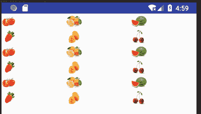

# Android GridView：网格视图

> 原文：[`c.biancheng.net/view/3029.html`](http://c.biancheng.net/view/3029.html)

GridView 提供了一个二维的可滚动的网格，按照行列的方式来显示内容，一般适合显示图标、图片等，适合浏览。

下面通过一个实例来了解一下 GridView 组件的使用方法。在工程 WidgetDemo 的布局文件 main.xml 中添加一个名为 GridViewDemo 的 Button，用以启动 GridViewActivity。

在 main.xml 中添加代码如下：

```

<Button
    android:id="@+id/button12"
    android:layout_width="wrap_content"
    android:layout_height="wrap_content"
    android:text="GridViewDemo"/>
```

单击 Button 并启动 GridViewActivity 的代码如下：

```

Button gridviewbtn = (Button)this.findViewById(R.id.button12);
gridviewbtn.setOnClickListener(new View.OnClickListener(){
    @Override
    public void onClick(View v){
        Intent intent;
        intent = new Intent(MainActivity.this, GridViewActivity .class);
        startActivity(intent);
    }
});
```

同时在 AndroidManifest.xml 文件中声明该 Activity：

<activity android:name=".GridViewActivity"/>

GridViewActivity 的运行效果如图 1 所示。
图 1  GridViewActivity 的运行效果
GridViewActivity 使用的布局文件为 gridview.xml，其内容如下：

```

<?xml version="1.0" encoding="utf-8"?>
<LinearLayout xmlns:android="http://schemas.android.com/apk/res/android"
    android:layout_width="match_parent"
    android:layout_height="match_parent"
    android:orientation="vertical">

    <GridView
        android:id="@+id/gridView1"
        android:layout_width="match_parent"
        android:layout_height="match_parent"
        android:numColumns="3" />
</LinearLayout>

```

该视图采用 LinearLayout 的布局方式，其中放置了一个 GridView 组件，该组件由三列组成。

GridViewActivity.java 的代码如下：

```

package introduction.android.widgetdemo;

import android.app.Activity;
import android.content.Context;
import android.os.Bundle;
import android.util.Log;
import android.view.View;
import android.view.ViewGroup;
import android.widget.AdapterView;

import android.widget.AdapterView.OnItemClickListener;
import android.widget.BaseAdapter;
import android.widget.GridView;
import android.widget.ImageView;

public class GridViewActivity extends Activity {

    public void onCreate(Bundle savedInstanceState) {
        super.onCreate(savedInstanceState);
        setContentView(R.layout.gridview);

        GridView gridview = (GridView) findViewById(R.id.gridView1);
        gridview.setAdapter(new ImageAdapter(this));

        gridview.setOnItemClickListener(new OnItemClickListener() {
            public void onItemClick(AdapterView<?> parent, View v, int position, long id) {
                Log.i("gridview", "这是第" + position + "幅图像。");
            }
        });
    }

    public class ImageAdapter extends BaseAdapter {
        private Context mContext;

        public ImageAdapter(Context c) {
            mContext = c;
        }

        /*获取当前图片数量*/
        @Override
        public int getCount() {
            return mThumbIds.length;
        }

        /* 根据需要 position 获得在 GridView 中的对象*/
        @Override
        public Object getItem(int position) {
            return position;
        }

        /*获得在 GridView 中对象的 ID */
        @Override
        public long getItemId(int id) {
            return id;
        }

        @Override
        public View getView(int position, View convertView, ViewGroup parent) {
            ImageView imageView;
            if (convertView == null) {
                    /*实例化 ImageView 对象*/
                imageView = new ImageView(mContext);
                    /* 设置 ImageView 对象布局，设置 View 的 height 和 width */
                imageView.setLayoutParams(new GridView.LayoutParams(85, 85));
                    /* 设置边界对齐*/
                imageView.setAdjustViewBounds(false);
                    /* 按比例同意缩放图片（保持图片的尺寸比例）*/
                imageView.setScaleType(ImageView.ScaleType.CENTER_CROP);
                    /* 设置间距*/
                imageView.setPadding(8, 8, 8, 8);
            } else {
                imageView = (ImageView) convertView;
            }
            imageView.setImageResource(mThumbIds[position]);
            return imageView;
        }

        // references to our images
        private Integer[] mThumbIds = {R.drawable.img_1, R.drawable.img_2,
                R.drawable.img_3, R.drawable.img_4, R.drawable.img_5,
                R.drawable.img_6, R.drawable.img_1, R.drawable.img_2,
                R.drawable.img_3, R.drawable.img_4, R.drawable.img_5,
                R.drawable.img_6, R.drawable.img_1, R.drawable.img_2,
                R.drawable.img_3, R.drawable.img_4, R.drawable.img_5,
                R.drawable.img_6};
    }
}
```

在主程序 GridViewActivity 中，为 GridView 设置了一个数据适配器，并处理了 GridView 的单击事件。适配器继承自 BaseAdapter 类，与图片切换器和图库中用到的适配器高度相似，在此不再重复（网址：[`c-local.biancheng.net/view/3027.html?1554716644`](http://c-local.biancheng.net/view/3027.html?1554716644)）。