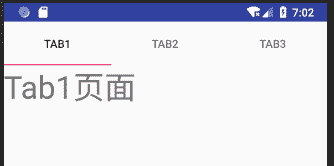

# Android Tab：面板标签控件

> 原文：[`c.biancheng.net/view/3033.html`](http://c.biancheng.net/view/3033.html)

在有限的手机屏幕空间内，当要浏览的内容较多，无法在一个屏幕空间内全部显示时，可以使用滚动视图来延长屏幕的空间。

当浏览的内容具有很强的类别性质时，更合适的方法是将不同类别的内容集中到各自的面板中，这时就需要使用面板标签（Tab）组件了。

Tab 组件利用面板标签把不同的面板内容切换到屏幕上，以显示不同类别的内容。

下面通过一个实例来了解一下 Tab 组件的使用方法。在工程 WidgetDemo 的布局文件 main.xml 中添加一个名为 TabDemo 的 Button，用以启动 TabActivity。

在 main.xml 中添加代码如下：

```

<Button
    android:id="@+id/button13"
    android:layout_width="wrap_content"
    android:layout_height="wrap_content"
    android:text="TabDemo"/>
```

单击 Button 并启动 GridViewActivity 的代码如下：

```

Button tabbtn = (Button)this.findViewById(R.id.button13);
tabbtn.setOnClickListener(new View.OnClickListener(){
    @Override
    public void onClick(View v){
        Intent intent;
        intent = new Intent(MainActivity.this,TabActivity .class);
        startActivity(intent);
    }
});
```

同时在 AndroidManifest.xml 文件中声明该 Activity：

<activity android:name=".TabActivity"/>

TabActivity 的运行效果如图 1 所示。
图 1  TabActivity 的运行结果
要使用 Tab 必然涉及它的容器 TabHost，TabHost 包括 TabWigget 和 FrameLayout 两部分。TabWidget 就是每个 Tab 的标签，FrameLayout 是 Tab 的内容。

TabActivity 使用的布局文件是 tab.xml。在 tab.xml 中定义了每个 Tab 中要显示的内容，代码如下：

```

<?xml version="1.0" encoding="utf-8"?>
<TabHost xmlns:android="http://schemas.android.com/apk/res/android"
    android:id="@+id/tabhost"
    android:layout_width="fill_parent"
    android:layout_height="fill_parent">

    <LinearLayout
        android:layout_width="fill_parent"
        android:layout_height="fill_parent"
        android:orientation="vertical">

        <TabWidget
            android:id="@android:id/tabs"
            android:layout_width="fill_parent"
            android:layout_height="wrap_content" />

        <FrameLayout
            android:id="@android:id/tabcontent"
            android:layout_width="fill_parent"
            android:layout_height="fill_parent">

            <TextView
                android:id="@+id/tab1"
                android:layout_width="wrap_content"
                android:layout_height="wrap_content"
                android:text="Tab1 页面"
                android:textSize="40dp" />

            <TextView
                android:id="@+id/tab2"
                android:layout_width="wrap_content"
                android:layout_height="wrap_content"
                android:text="Tab2 页面"
                android:textSize="40dp" />

            <TextView
                android:id="@+id/tab3"
                android:layout_width="wrap_content"
                android:layout_height="wrap_content"
                android:text="Tab3 页面"
                android:textSize="40dp" />
        </FrameLayout>
    </LinearLayout>
</TabHost>

```

在 FrameLayout 中我们放置了三个 TextView 组件，分别对应三个 Tab 所显示的内容，当切换不同的 Tab 时会自动显示不同的 TextView 内容。

在主程序 TabActivity 的 OnCreate() 方法中，首先获得 TabHost 的对象，并调用 setup() 方法进行初始化，然后通过 TabHost.TabSpec 增加 Tab 页，通过 setContent() 增加当前 Tab 页显示的内容，通过 setIndicator 增加页的标签，最后设定当前要显示的 Tab 页。

TabActivity 的代码如下：

```

package introduction.android.widgetdemo;

import android.app.Activity;
import android.os.Bundle;
import android.widget.TabHost;

public class TabActivity extends Activity {

    public void onCreate(Bundle savedInstanceState) {
        super.onCreate(savedInstanceState);
        setContentView(R.layout.tab);
        // 步骤 1：获得 TabHost 的对象，并进行初始化 setup()
        TabHost tabs = (TabHost) findViewById(R.id.tabhost);
        tabs.setup();
        //步骤 2：获得 TabHost.TabSpec 增加 tab 的一页，通过 setContent()增加内容，通过 setIndicator 增加页的标签
        /*增加第一个 Tab */
        TabHost.TabSpec spec = tabs.newTabSpec("Tag1");
        //单击 Tab 要显示的内容
        spec.setContent(R.id.tab1);
        /* 显示 Tabl 内容*/
        spec.setIndicator("Tab1");
        tabs.addTab(spec);
        /* 增加第二个 Tab*/
        spec = tabs.newTabSpec("Tag2");
        spec.setContent(R.id.tab2);//单击 Tab 要显示的内容
        /* 显示 Tab2 内容 */
        spec.setIndicator("Tab2");
        tabs.addTab(spec);
        /*增加第三个 Tab */
        spec = tabs.newTabSpec("Tag3");
        spec.setContent(R.id.tab3);//单击 Tab 要显示的内容
        /* 显示 Tab3 内容*/
        spec.setIndicator("Tab3");
        tabs.addTab(spec);
        /* 步骤 3：可通过 setCurrentTab(index)指定显示的页，从 0 开始计算*/
        tabs.setCurrentTab(0);
    }
}
```

除了使用上述方法设置 Tab 页面的显示内容外，还可以使用 setContent（Intent）方法启动某个 Activity，并将该 Activity 的视图作为 Tab 页面的内容。

例如：

```

Intent intent = new Intent().setClass(this,AlbumsActivity .class);
spec = tabHost.newTabSpec("albums")
    .setIndicator("Albums",res.getDrawable(R.drawable.ic_tab_albums)).setContent(intent);
tabHost.addTab(spec);
```