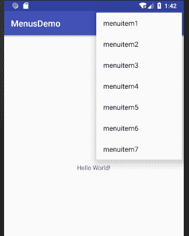
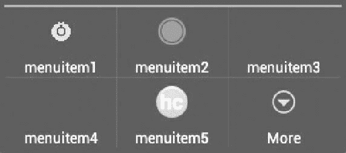
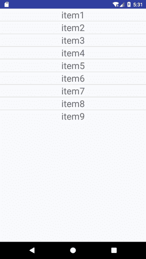
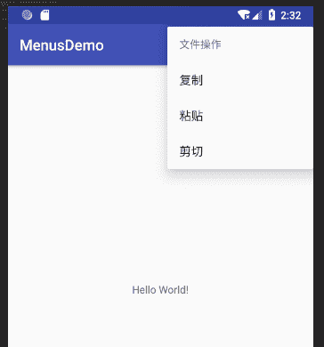

# Android 菜单：选项菜单+上下文菜单+子菜单

> 原文：[`c.biancheng.net/view/3035.html`](http://c.biancheng.net/view/3035.html)

菜单是人机交互的重要接口，在 Android SDK 中，提供了菜单类 android.view.Menu，以完成与菜单有关的操作。

Android SDK 提供三种菜单，分别如下。

**1）Options Menu：选项菜单。**
是 Activity 的主要菜单项的集合，当用户单击 Menu 按钮时出现。

在 Android 2.3 以下的版本中，这种菜单最多显示 6 个带图标的菜单项。当菜单中含有 6 个以上的菜单项时，弹出菜单将只显示前 5 个菜单项，第 6 个菜单项会变为 More，单击 More 菜单项后会出现扩展菜单。

扩展菜单不支持图标，但支持单选框和复选框。在 Android 3.0（API Level 11）及以上版本中，默认情况下直接弹出的选项菜单不再显示图标。

**2）Context Menu：上下文菜单。**
是一个悬浮的菜单项列表，当用户单击注册了上下文菜单的组件时出现。上下文菜单不支持菜单图标和快捷键。

**3）Submenu：子菜单。**
是某个菜单项的扩展，是一个悬浮的菜单项列表。子菜单不支持菜单图标或者嵌套子菜单。

## Options Menu

要实现选项菜单的功能，首先需要重载 OnCreatOptionsMenu() 方法创建菜单，然后通过 onOptionsItemSelected() 方法对菜单被单击事件进行监听和处理。

创建一个名为 MenusDemo 的 Android Project，在该工程中对菜单的相关知识进行学习。

在工程的 res 目录下创建一个 menu 目录，用于存放菜单相关的 XML 文件。在该目录下创建 mymenu.xml，代码如下：

```

<?xml version="1.0" encoding="utf-8"?>
<menu xmlns:android="http://schemas.android.com/apk/res/android"
    android:layout_width="wrap_content"
    android:layout_height="wrap_content">

    <item
        android:id="@+id/item1"
        android:icon="@drawable/icon01"
        android:title="@string/menuitem1" />

    <item
        android:id="@+id/item2"
        android:icon="@drawable/icon02"
        android:title="@string/menuitem2" />

    <item
        android:id="@+id/item3"
        android:icon="@drawable/icon03"
        android:title="@string/menuitem3" />

    <item
        android:id="@+id/item4"
        android:icon="@drawable/icon04"
        android:title="@string/menuitem4" />

    <item
        android:id="@+id/item5"
        android:icon="@drawable/icon05"
        android:title="@string/menuitem5" />

    <item
        android:id="@+id/item6"
        android:icon="@drawable/icon06"
        android:title="@string/menuitem6" />

    <item
        android:id="@+id/item7"
        android:icon="@drawable/icon07"
        android:title="@string/menuitem7" />
</menu>
```

mymenu.xml 创建了一个具有 7 个菜单项的菜单。
1）通过 android:id 属性为每个菜单项指定 ID。
2）通过 android:title 属性为每个菜单项指定显示的菜单项内容。
3）通过 android:icon 属性指定每个菜单项的图标。对应的图标文件放置到 res/drawable 目录下。

为工程 MenusDemo 创建名为 MenusActivity 的 Activity，将 mymenu.xml 中定义的菜单设置为 MenusActivity 的菜单，重载 OnCreatOptionsMenu() 方法。

MenusActivity.java 的代码如下：

```

package introduction.android.menusdemo;

import android.support.v7.app.AppCompatActivity;
import android.os.Bundle;
import android.view.Menu;
import android.view.MenuInflater;
import android.view.MenuItem;
import android.widget.TextView;

public class MainActivity extends AppCompatActivity {
    private TextView textview;

    /**
     * Called when the activity is first created.
     */
    @Override
    public void onCreate(Bundle savedInstanceState) {
        super.onCreate(savedInstanceState);
        setContentView(R.layout.activity_main);
        textview = (TextView) findViewById(R.id.text);
    }

    @Override
    public boolean onOptionsItemSelected(MenuItem item) {
        // TODO Auto-generated method stub
        switch (item.getItemId()) {
            case R.id.item1:
                textview.setText("iteml selected!");
                break;
            case R.id.item2:
                textview.setText("item2 selected!");
                break;
            case R.id.item3:
                textview.setText("item3 selected!");
                break;
            default:
                break;
        }
        return super.onOptionsItemSelected(item);
    }

    @Override
    public boolean onCreateOptionsMenu(Menu menu) {
        MenuInflater inflater = getMenuInflater();
        inflater.inflate(R.menu.mymenu, menu);
        return true;
    }
}
```

其中：

```

public boolean onCreateOptionsMenu(Menu menu) {
    MenuInflater inflater = getMenuInflater();
    inflater.inflate(R.menu.mymenu, menu);
    return true;
}
```

这几行代码通过 MenuInflater.Inflate() 方法将 menu.xml 中定义的菜单项内容填充到了菜单中。

在 OnCreatOptionsMenu() 方法中创建菜单时也支持 Menu.add() 方法，也能达到同样目的。例如：

menu.add(0,itemid,0,item_title);

表示在菜单中添加一个菜单项，该菜单项的 ID 为 itemid，菜单项显示的内容为 item_title 的内容。但是不鼓励使用这种方式，而应该使用 XML 文件来创建菜单。

运行 MenusDemo 实例，单击手机的 Menu 按钮，得到的效果如图 1 所示。


图 1“Menu”按钮运行效果
由运行效果可见，MenusActivity 已经根据 mymenu.xml 文件创建了一个具有 7 个菜单项的菜单。但是虽然在 mymenu.xml 文件中为每个菜单项指定了一个图标，但是生成的选项菜单中却并没有图标被显示出来，这是为什么呢？

实例 MenusDemo 当前的运行环境是 Android 4.0，其 API Level 为 14。我们先看一下，同样的代码，在 API Level 11 之前的运行效果。

双击打开 AndroidManifest.xml 文件，将其中的代码：

<uses-sdk android:minSdkVersion="14" />

改为：

<uses-sdk android:minSdkVersion="9" />

再次运行 MenusDemo 实例，单击 Menu 按钮，得到的效果如图 2 所示。


图 2  API Level 11 之前 Menu 按钮的运行效果
可见运行在早期的 API 之上的选项菜单效果要更好一些。为什么会出现这种现象呢？

其实在 Android SDK 3.0 之后，就不再鼓励直接使用选项菜单，而是将选项菜单和 ActionBar 结合使用。

ActionBar 又称活动栏，位于 Activity 的顶部，取代了原来标题的位置。

ActionBar 中包含很多 ActionItem，相当于选项菜单的菜单项。将选项菜单与 ActionBar 结合的方法很简单，只要在 XML 文件中添加一个 android:showAsAction="ifRoom" 属性即可。该属性表现如果标题栏有空间的话，就将相关的菜单项放置到 ActionBar 中。如果标题栏空间不足，未能放置到其中的菜单项仍然会以选项菜单的形式出现。

## Context Menu

上下文菜单注册到 View 对象上后，用户长按该 View 对象可呼出上下文菜单。

上下文菜单悬浮于主界面之上，不支持图标显示和快捷键。其使用方法和选项菜单高度相似，只不过创建上下文菜单的方法为 onCreateContextMenu()，响应上下文菜单单击事件的方法为 onContextItemSelected()。

仍以工程 MenusDemo 为例，为 MenusActivity 的视图中的 TextView 对象添加一个具有两个菜单项的上下文菜单，运行效果如图 3 所示。


图 3  上下文菜单的运行结果
为 TextView 对象注册上下文菜单的代码如下：

textview = (TextView)findViewById(R.id.textview1);
registerForContextMenu(textview);

创建并处理上下文菜单单击事件的代码如下：

```

public boolean onContextItemSelected(MenuItem item) {
        switch (item.getItemId()) {
            case R.id.item1:
                Log.i("menu", "item1!");
                break;
            case R.id.item2:
                Log.i("menu", "item2!");
                break;
            case R.id.item3:
                Log.i("menu", "item3!");
                break;
            case R.id.item4:
                Log.i("menu", "item4!");
                break;
            case R.id.item5:
                Log.i("menu", "item5!");
                break;
            case R.id.item6:
                Log.i("menu", "item6!");
                break;
            case R.id.item7:
                Log.i("menu", "item7!");
                break;
            default:
                break;
        }
        return super.onContextItemSelected(item);
    }

    @Override
    public void onCreateContextMenu(ContextMenu menu, View v, ContextMenu.ContextMenuInfo menuInfo) {
        menu.add(0, R.id.item1, 0, "item1");
        menu.add(0, R.id.item2, 0, "item2");
        menu.add(0, R.id.item3, 0, "item3");
        menu.add(0, R.id.item4, 0, "item4");
        menu.add(0, R.id.item5, 0, "item5");
        menu.add(0, R.id.item6, 0, "item6");
        menu.add(0, R.id.item7, 0, "item7");
        super.onCreateContextMenu(menu, v, menuInfo);
    }
```

## SubMenu

子菜单可以被添加到其他菜单上，但是子菜单本身不能再有子菜单。

使用 addSubMenu() 方法为 MenusActivity 的选项菜单添加一个子菜单，运行效果如图 4 所示。


图 4  添加子菜单运行结果创建并处理子菜单的代码为：

```

package introduction.android.menusdemo;

import android.app.Activity;
import android.os.Bundle;
import android.support.v7.app.AppCompatActivity;
import android.view.Menu;
import android.view.MenuItem;
import android.view.SubMenu;
import android.widget.Toast;

public class MainActivity extends AppCompatActivity {
    @Override
    protected void onCreate(Bundle savedInstanceState) {
        super.onCreate(savedInstanceState);
        setContentView(R.layout.activity_main);

    }

    @Override
    public boolean onCreateOptionsMenu(Menu menu) {
        SubMenu file = menu.addSubMenu("文件");
        SubMenu edit = menu.addSubMenu("编辑");
        file.add(1, 1, 1, "新建");
        file.add(1, 2, 1, "打开");
        file.add(1, 3, 1, "保存");
        file.setHeaderTitle("文件操作");
        file.setHeaderIcon(R.drawable.icon1);
        edit.add(2, 1, 1, "复制");
        edit.add(2, 2, 1, "粘贴");
        edit.add(2, 3, 1, "剪切");
        edit.setHeaderTitle("文件操作");
        edit.setHeaderIcon(R.drawable.icon1);
        return true;

    }

    @Override
    public boolean onOptionsItemSelected(MenuItem item) {
        if (item.getGroupId() == 1) {
            switch (item.getItemId()) {
                case 1:
                    Toast.makeText(MainActivity.this, "点击了新建", Toast.LENGTH_SHORT).show();
                    break;
                case 2:
                    Toast.makeText(MainActivity.this, "点击了打开", Toast.LENGTH_SHORT).show();
                    break;
                case 3:
                    Toast.makeText(MainActivity.this, "点击了保存", Toast.LENGTH_SHORT).show();
                    break;
            }
        } else if (item.getGroupId() == 2) {
            switch (item.getItemId()) {
                case 1:
                    Toast.makeText(MainActivity.this, "点击了复制", Toast.LENGTH_SHORT).show();
                    break;
                case 2:
                    Toast.makeText(MainActivity.this, "点击了粘贴", Toast.LENGTH_SHORT).show();
                    break;
                case 3:
                    Toast.makeText(MainActivity.this, "点击了剪切", Toast.LENGTH_SHORT).show();
                    break;
            }
        }
        return super.onOptionsItemSelected(item);
    }
}
```