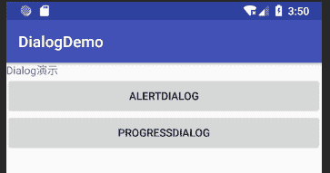
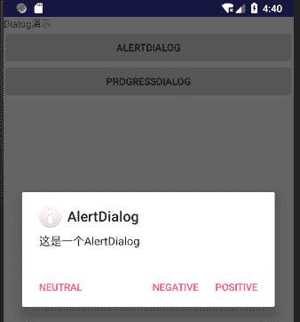
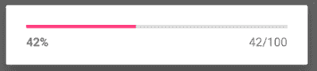

# Android 对话框（AlertDialog+ProgressDialog）

> 原文：[`c.biancheng.net/view/3041.html`](http://c.biancheng.net/view/3041.html)

对话框是人机交互过程中十分常见的组件，一般用于在特定条件下对用户显示一些信息，可以增强应用的友好性。

Dialog 类是对话框的基类。对话框虽然可以在界面上显示，但是 Dialog 不是 View 类的子类，而是直接继承自 java.lang.Object 类。

Dialog 对象也有自己的生命周期，其生命周期由创建它的 Activity 进行管理。

Activity 可以调用 showDialog(int id) 将不同 ID 的对话框显示出来，也可以调用 dismissDialog(int id)方法将 ID 标识的对话框从用户界面中关闭掉。

当 Activity 调用了 showDialog(ID)方法，对应 ID 的对话框没有被创建时，Android 系统会回调 OnCreateDialog(ID) 方法来创建具有该 ID 的对话框。

在 Activity 中创建的对话框都会被 Activity 保存，下次 showDialog(ID) 方法被调用时，若该 ID 的对话框已经被创建，则系统不会再次调用 OnCreateDialog(ID) 方法创建该对话框，而是会回调 onPrepareDialog(int id, Dialog dialog) 方法，该方法允许对话框在被显示之前做一些修改。

常用的对话框有 AlertDialog 和 ProgressDialog，下面将通过实例讲解这两种对话框的使用方法。

## AlertDialog

AlertDialog 对话框是十分常用的用于显示信息的方式，最多可提供三个按钮。

AlertDialog 不能直接通过构造方法构建，而要由 AlertDialog.Builder 类来创建。

AlertDialog 对话框的标题、按钮以及按钮要响应的事件也由 AlertDialog.Builder 设置。

在使用 AlertDialog. Builder 创建对话框时常用的几个方法如下：

| 名称 | 作用 |
| --- | --- |
| setTitle() | 设置对话框中的标题 |
| setIcon() | 设置对话框中的图标 |
| setMessage() | 设置对话框的提示信息 |
| setPositiveButton() | 为对话框添加 yes 按钮 |
| setNegativeButton() | 为对话框添加 no 按钮 |
| setNeutralButton() | 为对话框添加第三个按钮 |

下面通过实例来学习创建 AlertDialog 的方法。

创建 Android 工程 DialogDemo，并在 main.xml 中添加两个按钮，分别为 AlertDialog 和 ProcessDialog。

其 main.xml 代码如下：

```

<?xml version="1.0" encoding="utf-8"?>
<LinearLayout xmlns:android="http://schemas.android.com/apk/res/android"
    android:layout_width="fill_parent"
    android:layout_height="fill_parent"
    android:orientation="vertical">

    <TextView
        android:layout_width="fill_parent"
        android:layout_height="wrap_content"
        android:text="Dialog 演示" />

    <Button
        android:id="@+id/button1"
        android:layout_width="match_parent"
        android:layout_height="wrap_content"
        android:text="AlertDialog" />

   <Button
    android:id="@+id/button2"
    android:layout_width="match_parent"
    android:layout_height="wrap_content"
    android:text="ProgressDialog" />
</LinearLayout>
```

其运行效果如图 1 所示。
图 1  AlertDialog 的运行效果
处理 AlertDialog 按钮单击事件的代码为：

```

    btn = (Button) findViewById(R.id.button1);
    btn.setOnClickListener(new View.OnClickListener() {
    @Override
    public void onClick(View v) {
        showDialog(Alert_DLG);
    }
});

```

单击 AlertDialog 按钮，调用 showDialog(ALERT_DLG)，系统回调 onCreateDialog(int id) 方法，创建并弹出 AlertDialog 对话框，如图 2 所示。


图 2  单击 AlertDialog 按钮的效果
相关代码为：

```

protected Dialog onCreateDialog(int id) {
    // TODO Auto-generated method stub
    Dialog dialog = null;
    switch (id) {
        case ALERT_DLG:
            AlertDialog.Builder builder = new AlertDialog.Builder(DialogDemoActivity.this);
            builder.setIcon(android.R.drawable.ic_dialog_info);
            builder.setTitle("AlertDialog");
            builder.setMessage("这是一个 AlertDialog");
            builder.setPositiveButton("Positive", new DialogInterface.OnClickListener() {
                @Override
                public void onClick(DialogInterface dialog, int which) {
                    // TODO Auto-generated method stub
                    Log.i("DialogDemo", "OK ! ");
                    }
                });
                builder.setNegativeButton("Negative", new DialogInterface.OnClickListener() {
                    @Override
                    public void onClick(DialogInterface dialog, int which) {
                        // TODO Auto-generated method stub
                        Log.i("DialogDemo", "Cancel 按钮被单击! ");
                    }
                });

                builder.setNeutralButton("Neutral", new DialogInterface.OnClickListener() {
                    @Override
                    public void onClick(DialogInterface dialog, int which) {
                        // TODO Auto-generated method stub
                        Log.i("DialogDemo", "Neutral 按钮被单击!");
                    }
                });
                dialog = builder.create();
                break;
            default:
                break;
        }
    return dialog;
}
```

onCreateDialog() 方法中创建了带有三个按钮的 AlertDialog，并且为每个按钮添加了事件处理方法，以便获知用户单击了哪个按钮。

## ProgressDialog

ProgressDialog 是一个带有进度条的对话框，当应用程序在完成比较耗时的工作时，使用该对话框可以为用户提供一个总进度上的提示。

为 main.xml 布局中的 ProgressDialog 按钮添加事件处理代码：

```

Button progressbtn = (Button)findViewById(R.id.button2);
progressbtn.setOnClickListener(new View.OnClickListener() {
    @Override
    public void onClick(View view) {
        showDialog(PROGRESS_DLG);
    }
});
```

单击 ProgressDialog 按钮，调用 showDialog(PROGRESS_DLG) ，系统回调 onCreateDialog(int id) 方法，创建并弹出 ProgressDialog 对话框，如图 3 所示。


图 3  单击 ProgressDialog 按钮的效果
onCreateDialog() 方法中的相关代码如下：

```

case PROGRESS_DLG:
    final ProgressDialog progressDialog;
    progressDialog = new ProgressDialog(this);
    //设置水平进度条
    progressDialog.setProgressStyle(progressDialog.STYLE_HORIZONTAL);
    //设置进度条最大值为 100
    progressDialog.setMax(100);
    //设置进度条当前值为 0
    progressDialog.setProgress(0);
    dialog = progressDialog;
    new Thread(new Runnable() {
        int count = 0;

        @Override
        public void run() {
            // TODO Auto-generated method stub
            while (progressDialog.getProgress() < 100) {
                count += 3;
                progressDialog.setProgress(count);
                    try {
                        Thread.sleep(1000);
                    } catch (InterruptedException e) {
                        // TODO Auto-generated catch block
                        e.printStackTrace();
                    }
                }
        }
    }).start();
    break;
```