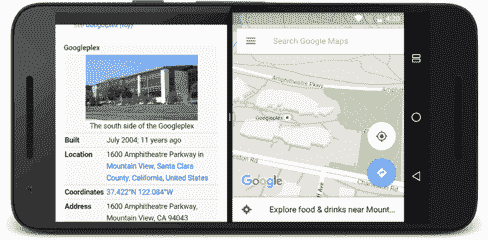
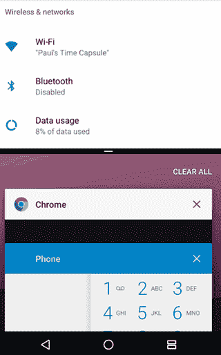
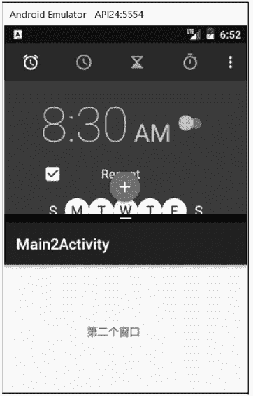
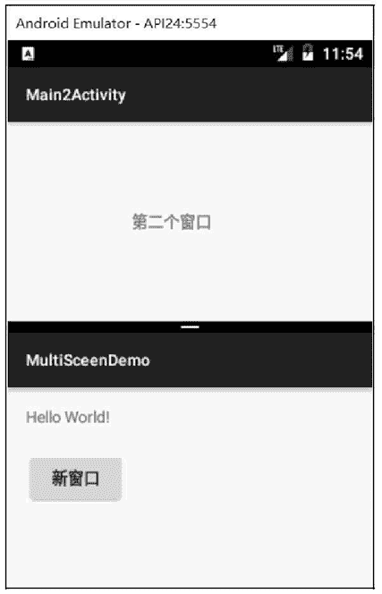

# Android 多窗口模式（分屏模式）

> 原文：[`c.biancheng.net/view/3055.html`](http://c.biancheng.net/view/3055.html)

Android N 支持多窗口模式，或者叫分屏模式，即在屏幕上可以同时显示多个窗口。

在手机模式下，两个应用可以并排或者上下同时显示，如图 1 所示，屏幕上半部分的窗口是系统的 CLOCK 应用，下半部分是系统设置功能。用户可以拖动两个应用之间的分界线改变两个窗口的大小，放大其中一个应用，同时缩小另一个应用。


图 1  分屏模式
在分屏模式下，各个窗口的应用都可以正常运行，但是只能有一个窗口获得焦点，而另外的窗口则属于暂停状态。

Android N 用户可以通过以下方式切换到多窗口模式：

*   用户打开 Overview 屏幕并长按 Activity 标题，可以拖动该 Activity 至屏幕突出显示的区域，使 Activity 进入多窗口模式。
*   用户长按 Overview 按钮，设备上当前的 Activity 将进入多窗口模式，同时将打开 Overview 屏幕，用户可在该屏幕中选择要共享屏幕的另一个 Activity。

用户可以在两个 Activity 共享屏幕的同时在这两个 Activity 之间拖放数据。

默认情况下，Android N 的 Activity 都是开启多窗口模式的。在 Nexus 6P 手机上，分屏模式的启动和退出是长按多任务虚拟按键。

图 2 在 Nexus 6P 上启动分屏模式的样子：
图 2  Nexus 6P 分屏模式
首先我们在 MainActivity 上添加一个按钮，并实现点击打开第二个 Activity 的功能，代码如下：

```

public class MainActivity extends Activity {
    @Override
    protected void onCreate(Bundle savedInstanceState) {
        super.onCreate(savedInstanceState);
        setContentView(R.layout.activity_main);
        Button btn = findViewById(R.id.button);
        btn.setOnClickListener(new View.OnClickListener() {
            @Override
            public void onClick(View view) {
                Intent intent = new Intent(MainActivity.this, Main2Activity.class);
                startActivity(intent);
            }
        });
    }
}
```

点击“新窗口”按钮后，第二个窗口会被创建，并覆盖掉第一个窗口，如图 3 所示。


图 3  新窗口
默认情况下，同一个应用的多个 Activity 会共用同一个窗口，且无法分配到不同窗口中。

若希望同一个应用的不同窗体可以被分配到不同窗口中，需要在启动新窗体时给 Intent 设置一个 FLAG_ACTIVITY_LAUNCH_ADJACENT 标志，这样新 Activity 就会在新的栈中被启动，独立于原来的 Activity，进而实现两个 Activity 被放置于不同的窗口中，如图 4 所示。
图 4  同一个应用的两个窗口关键代码如下：

```

Intent intent = new Intent(MainActivity.this, Main2Activity.class);
intent.setFlags(Intent.FLAG_ACTIVITY_LAUNGH_ADJACENT|Intent.FLAG_ACTIVITY_NEW_TASK)；
startActivity(intent);
```

Android N 系统为 Activity 增添了<layout> 清单元素对 Activity 在多窗口模式中的行为进行支持，包括以下几种属性：

| 属性 | 作用 |
| --- | --- |
| android:defaultWidth | 以自由形状模式启动时 Activity 的默认宽度 |
| android:defaultHeight | 以自由形状模式启动时 Activity 的默认高度 |
| android:gravity | 以自由形状模式启动时 Activity 的初始位置 gravity 的值：center（居中），bottom（下），top（上），right（右），left（左） |
| android:minimalHeight、android:minimalWidth | 分屏和自由形状模式中 Activity 的最小高度和最小宽度。如果用户在分屏模式中移动分界线，使 Activity 尺寸低于指定的最小值，系统会将 Activity 裁剪为用户请求的尺寸。 |

例如，以下代码显示了如何指定 Activity 在自由形状模式显示时 Activity 的默认大小、位置和最小尺寸：

```

<activity android:name=".MyActivity">
    <layout android:defaultWidth="600dp"
        android:defaultHeight="500dp"
        android:gravity="top|end"
        android:minmalHeight="450dp"
        android:minimalWidth="300dp"/>
</activity>
```

如果不想让 Activity 使用多窗口模式，只需要在清单文件中为 Activity 节点设置：

android:resizeableActivity="false"

此属性设置为 false，Activity 将不支持多窗口模式。在该值为 false 的情况下，如果用户尝试在多窗口模式下启动 Activity，该 Activity 将全屏显示。可自行尝试。