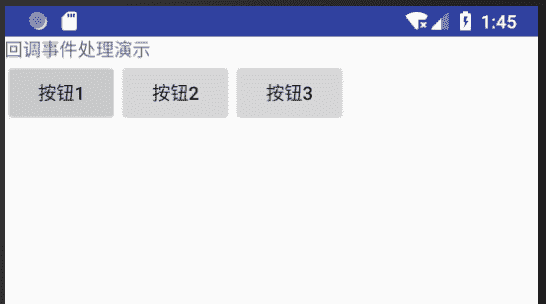
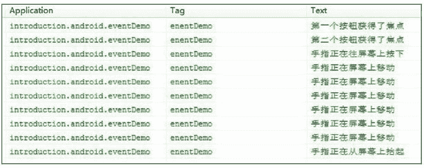

# Android 事件监听器和回调方法

> 原文：[`c.biancheng.net/view/3057.html`](http://c.biancheng.net/view/3057.html)

事件是 Android 平台与用户交互的手段。当用户对手机进行操作时，会产生各种各样的输入事件，Android 框架捕获到这些事件，进而进行处理。

Android 平台提供了多种用于获取用户输入事件的方式，考虑到用户事件都是在特定的用户界面中产生的，因此 Android 选用特定 View 组件来获取用户输入事件的方式，由 View 组件提供事件的处理方法。这就是为什么 View 类内部带有处理特定事件的监听器。

## 事件监听器

监听器用于对特定事件进行监听，一旦监听到特定事件，则由监听器截获该事件，并回调自身的特定方法对事件进行处理。

在教程之前的实例中，我们使用的事件处理方式都是监听器。根据用户输入方式的不同，View 组件将截获的事件分为 6 种，对应以下 6 种事件监听器接口。

#### 1) OnClickListener 接口

此接口处理的是单击事件，例如，在 View 上进行单击动作，在 View 获得焦点的情况下单击“确定”按钮或者单击轨迹球都会触发该事件。

当单击事件发生时，OnClickListener 接口会回调 public void onClick(View v) 方法对事件进行处理。其中参数 v 指的是发生单击事件的 View 组件。

#### 2) OnLongClickListener 接口

此接口处理的是长按事件，当长时间按住某个 View 组件时触发该事件。

其对应的回调方法为 public boolean onLongClick(View v)，当返回 true 时，表示已经处理完此事件，若事件未处理完，则返回 false，该事件还可以继续被其他监听器捕获并处理。

#### 3) OnFocusChangeListener 接口

此接口用于处理 View 组件焦点改变事件。当 View 组件失去或获得焦点时会触发该事件。

其对应的回调方法为 public void onFocusChange(View v, Boolean hasFocus)，其中参数 v 表示产生事件的事件源，hasFocus 表示事件源的状态，即是否获得焦点。

#### 4) OnKeyListener 接口

此接口用于对手机键盘事件进行监听，当 View 获得焦点并且键盘被敲击时会触发该事件。

其对应的回调方法为 public boolean onKey(View v, int keyCode, KeyEvent event)。

方法参数说明：

*   keyCode 为键盘码。
*   event 为键盘事件封装类的对象。

#### 5) OnTouchListener 接口

此接口用来处理手机屏幕事件，当在 View 的范围内有触摸、按下、抬起、滑动等动作时都会触发该事件，并触发该接口中的回调方法。

其对应的回调方法为 public boolean onTouch(View v, MotionEvent event)，对应的参数同上。

#### 6) OnCreateContextMenuListener 接口

此接口用于处理上下文菜单被创建的事件。

其对应的回调方法为 public void onCreateContextMenu(ContextMenu menu, View v, ContextMenuInfo info)，其中参数 menu 为事件的上下文菜单，参数 info 是该对象中封装了有关上下文菜单的其他信息。

在之前 Android 菜单教程实例 MenusDemo 中（网址：[`c.biancheng.net/view/3035.html`](http://c.biancheng.net/view/3035.html)），创建上下文菜单使用的是 registerForContextMenu(View v)方法，其本质是为 View 组件 v 注册该接口，并实现了相应的回调方法。

## 回调事件响应

在 Android 框架中，除了可以使用监听器进行事件处理之外，还可以通过回调机制进行事件处理。

Android SDK 为 View 组件提供了 5 个默认的回调方法，如果某个事件没有被任意一个 View 处理，就会在 Activity 中调用响应的回调方法，这些方法分别说明如下。

| 名称 | 说明/作用 | 调用时间 | 参数说明 | 返回值说明 |
| --- | --- | --- | --- | --- |
| public boolean onKeyDown(int keyCode, KeyEvent event) | 接口 KeyEvent.Callback 中的抽象方法 | 键盘按键被按下时由系统调用 | keyCode 即键盘码，系统根据键盘码得知按下的是哪个按钮。event 为按钮事件的对象，包含触发事件的详细信息。例如事件的类型、状态等 | true 已完成处理此事件 false 表示该事件还可以被其他监听器处理 |
| public boolean onKeyUp(int keyCode, KeyEvent event) | 接口 KeyEvent.Callback 中的抽象方法 | 按钮向上弹起时被调用 | keyCode 即键盘码，系统根据键盘码得知按下的是哪个按钮。event 为按钮事件的对象，包含触发事件的详细信息。例如事件的类型、状态等 | true 代表已完成处理此事件 false 表示该事件还可以被其他监听器处理 |
| public boolean onTouchEvent(MotionEvent event) | 方法在 View 中定义 | 用户触摸屏幕时被自动调用 | event 为触摸事件封装类的对象，封装了该事件的相关信息 
当用户触摸到屏幕，屏幕被按下时，MotionEvent.getAction()的值为 MotionEvent.ACTION_ DOWN；当用户将触控物体离开屏幕时，MotionEvent.getAction() 的值为 MotionEvent.ACTION_UP；当触控物体在屏幕上滑动时，MotionEvent.getAction() 的值为 MotionEvent.ACTION_MOVE。 | true 表示事件处理完成 false 表示未完成 |
| public boolean onTrackballEvent(MotionEvent event) | 处理手机中轨迹球的相关事件。 在 Activity 中重写，也可以在 View 中重写 |   | event 为手机轨迹球事件封装类的对象。 | true 表示事件处理完成 false 表示未完成 |
| protected void onFocusChanged(boolean gainFocus, int direction, Rect previouslyFocusedRect) | 只能在 View 中重写，当 View 组件焦点改变时被自动调用 |   | gainFocus 表示触发该事件的 View 是否获得了焦点，获得焦点为 true。 参数 direction 表示焦点移动的方向。
参数 previouslyFocusedRect 是在触发事件的 View 的坐标系中前一个获得焦点的矩形区域 | 无 |

## 界面事件响应实例

在之前的教程中，多次使用监听器对事件进行处理，应该此已经很熟悉了。

接下来我们将通过一个实例来演示回调事件响应的处理过程，该实例 EventDemo 的运行效果如图 1 所示。


图 1  实例 EventDemo 的运行效果其布局文件 main.xml 内容如下：

```

<?xml version="l.0" encoding="utf-8"?>
<LinearLayout xmlns:android="http://schemas.android.com/apk/res/android"
    android:layout_width="fill_parent"
    android:layout_height="fill_parent"
    android:orientation="vertical">

    <TextView
        android:layout_width="fill_parent"
        android:layout_height="wrap_content"
        android:text="回调事件处理演示" />

    <LinearLayout
            android:layout_width="wrap_content"
            android:layout_height="wrap_content"
            android:orientation="horizontal">

        <Button
                    android:id="@+id/button1"
                    android:layout_width="wrap_content"
                    android:layout_height="wrap_content"
                    android:focusableInTouchMode="true"
                    android:text="按钮 1" />

        <Button
                    android:id="@+id/button2"
                    android:layout_width="wrap_content"
                    android:layout_height="wrap_content"
                    android:focusableInTouchMode="true"
                    android:text="按钮 2" />

        <Button
                    android:id="@+id/button3"
                    android:layout_width="wrap_content"
                    android:layout_height="wrap_content"
                    android:focusableInTouchMode="true"
                    android:text="按钮 3" />
    </LinearLayout>
</LinearLayout>
```

当用户在屏幕上做移动触摸、单击按钮等操作时，主 Activity MainActivity 会捕获相应事件并进行处理，在 LogCat 中打印相关内容，运行效果如图 2 所示。


图 2  Activity EventDemo 捕获事件 EventDemo.java 代码如下：

```

package introduction.android.notidemo;

import android.app.Activity;
import android.content.Context;
import android.graphics.Rect;
import android.os.Bundle;
import android.util.Log;
import android.view.KeyEvent;
import android.view.MotionEvent;
import android.view.View;

import android.view.View.OnFocusChangeListener;
import android.widget.Button;
import android.widget.Toast;

public class MainActivity extends Activity implements OnFocusChangeListener {
    Button[] buttons = new Button[3];

    @Override
    public void onCreate(Bundle savedInstanceState) {
        super.onCreate(savedInstanceState);
        setContentView(R.layout.activity_main);

        buttons[0] = (Button) findViewById(R.id.button1);
        buttons[1] = (Button) findViewById(R.id.button2);
        buttons[2] = (Button) findViewById(R.id.button3);
        for (Button button : buttons) {
            button.setOnFocusChangeListener(this);
        }
    }

    //按钮按下触发的事件
    public boolean onKeyDown(int keyCode, KeyEvent event) {
        switch (keyCode) {

            case KeyEvent.KEYCODE_DPAD_UP:
                DisplayInformation("按上下方向键，KEYCODE_DPAD_UP");
                break;
            case KeyEvent.KEYCODE_DPAD_DOWN:
                DisplayInformation("按上下方向键,KEYCODE__DPAD_UP");
                break;
        }
        return false;
    }

    //按钮弹起触发的案件
    public boolean onKeyUp(int keyCode, KeyEvent event) {
        switch (keyCode) {

            case KeyEvent.KEYCODE_DPAD_UP:
                DisplayInformation("松开上方向键,KEYCODE_DPAD_UP");
                break;
            case KeyEvent.KEYCODE_DPAD_DOWN:
                DisplayInformation("松开下方向键,KEYCODE_DPAD_UP");
                break;
        }
        return false;
    }

    //触摸事件
    public boolean onTouchEvent(MotionEvent event) {
        switch (event.getAction()) {
            case MotionEvent.ACTION_DOWN:
                DisplayInformation("手指正在往屏幕上按下");
                break;

            case MotionEvent.ACTION_MOVE:
                DisplayInformation("手指正在往屏幕上移动");
                break;
            case MotionEvent.ACTION_UP:
                DisplayInformation("手指正在往屏幕上按抬起");
                break;
        }
        return false;

    }

    //焦点事件
    @Override
    public void onFocusChange(View view, boolean arg1) {
        switch (view.getId()) {
            case R.id.button1:
                DisplayInformation("第一个按钮获得了焦点");
                break;
            case R.id.button2:
                DisplayInformation("第二个按钮获得了焦点");
                break;
            case R.id.button3:
                DisplayInformation("第三个按钮获得了焦点");
                break;
        }
    }

    //显示 Toast
    public void DisplayInformation(String string) {
        //Toast.makeText (EventDemo.this,string,Toast.LENGTH_SHORT).show();
        Log.i("enentDemo", string);
    }
}
```