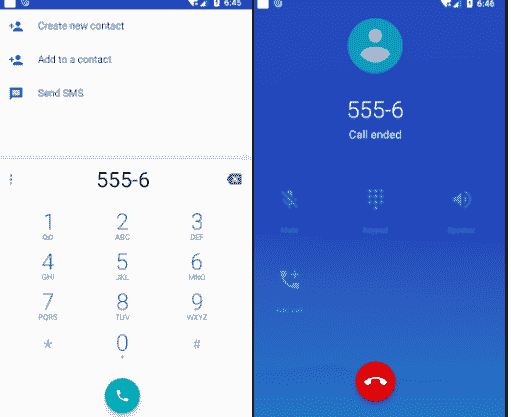

# Android 实现拨打电话功能

> 原文：[`c.biancheng.net/view/3063.html`](http://c.biancheng.net/view/3063.html)

借助于 Intent 可以轻松实现拨打电话的应用程序。只需声明一个拨号的 Intent 对象，并使用 startActivity() 方法启动即可。

创建 Intent 对象的代码为 Intent intent = new Intent(action,uri)，其中 URI 是要拨叫的号码数据，通过 Uri.parse() 方法把“tel:1234”格式的字符串转换为 URI。

而 Action 有两种使用方式：

*   Intent.Action_CALL。是直接进行呼叫的方式，这种方式需要应用程序具有 android.permission.CALL_PHONE 权限。
*   Intent.Action_DIAL。不是不直接进行呼叫，而是启动 Android 系统的拨号应用程序，然后由用户进行拨号。这种方式不需要任何权限的设置。

实例 phoneDemo 演示了使用 Intent.Action_CALL 方式进行拨号的过程，运行效果如图 1 所示。


图 1  使用 Intent.Action_CALL 方式拨号
实例 phoneDemo 中 main.xml 的代码如下:

```

<?xml version="1.0" encoding="utf-8"?>
<LinearLayout xmlns:android="http://schemas.android.com/apk/res/android"
    android:layout_width="fill_parent"
    android:layout_height="fill_parent"
    android:orientation="vertical">

    <EditText
        android:id="@+id/edittext"
        android:layout_width="fill_parent"
        android:layout_height="wrap_content"
        android:layout_marginLeft="40dp"
        android:layout_marginTop="30dp" />

    <Button
        android:id="@+id/button"
        android:layout_width="wrap_content"
        android:layout_height="wrap_content"
        android:layout_marginLeft="80dp"
        android:layout_marginTop="40dp"
        android:text="拨打电话" />

</LinearLayout>
```

实例 phoneDemo 中 AndroidManifest.xml 的代码如下：

```

<?xml version="1.0" encoding="utf-8"?>
<manifest xmlns:android="http://schemas.android.com/apk/res/android"
    package="introduction.android.phonedemo">

    <uses-permission android:name="android.permission.CALL_PHONE" />
    <application
        android:allowBackup="true"
        android:icon="@mipmap/ic_launcher"
        android:label="@string/app_name"
        android:roundIcon="@mipmap/ic_launcher_round"
        android:supportsRtl="true"
        android:theme="@style/AppTheme">
        <activity android:name=".MainActivity">
            <intent-filter>
                <action android:name="android.intent.action.MAIN" />
                <category android:name="android.intent.category.LAUNCHER" />
            </intent-filter>
        </activity>
    </application>
</manifest>
```

实例 phoneDemo 中 PhoneDemoActivity.java 的具体实现代码如下：

```

package introduction.android.phonedemo;

import android.app.Activity;
import android.content.Intent;
import android.net.Uri;
import android.os.Bundle;
import android.view.View;

import android.view.View.OnClickListener;
import android.widget.Button;
import android.widget.EditText;

public class MainActivity extends Activity {

    /**
     * Called when the activity is first created.
     */
    private Button button;
    private EditText edittext;

    @Override
    public void onCreate(Bundle savedInstanceState) {
        super.onCreate(savedInstanceState);
        setContentView(R.layout.activity_main);
        button = (Button) findViewById(R.id.button);
        button.setOnClickListener(new buttonListener());
    }

    class buttonListener implements OnClickListener {
        @Override
        public void onClick(View v) {
            // TODO Auto-generated method stub
            edittext = (EditText) findViewById(R.id.edittext);
            String number = edittext.getText().toString();
            Intent intent = new Intent(Intent.ACTION_CALL, Uri.parse("tel:" + number));
            //startActivity(intent);
        }

    }

}
```

其中：

Intent intent = new Intent(Intent.ACTION_CALL, Uri.parse("tel:" + number));
startActivity(intent);

通过 Intent.ACTION_CALL 建立了一个进行拨号的 Intent 请求，并使用 startActivity 直接启动 Android 系统的拨号程序进行呼叫。

若在实例 PhoneDemo 中，将 PhoneDemoActivity.java 中的代码：

Intent intent=new Intent(Intent.ACTION_CALL,Uri.parse("tel:"+number));

修改为：

Intent intent=new Intent(Intent.ACTION_DIAL,Uri.parse("tel:"+number));

最后，单击“拨打电话”按钮后不再直接呼叫，而是只运行 Android 系统默认的拨号程序，用户还拥有进一步决定下一步操作的权限，运行效果如图 2 所示。
图 2  拨打电话