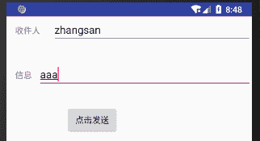
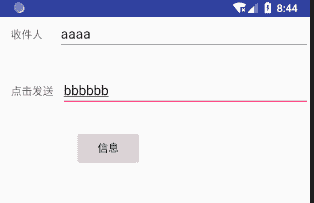

# Android 实现接收短信和发送短信功能

> 原文：[`c.biancheng.net/view/3065.html`](http://c.biancheng.net/view/3065.html)

在学接收短信和发送短信之前，先简单介绍一下 SMS 短消息服务。

SMS（Short Message Service，短信息服务）是一种存储和转发服务。也就是说，短信息并不是直接从发信人发送到接收人，而是始终通过 SMS 中心进行转发。如果接收人处于未连接状态（可能电话已关闭），那么信息将在接收人再次连接时发送。

## 接收短信

要使 Android 应用程序能够接收短信息，需要以下三个步骤：

1）Android 应用程序必须具有接收 SMS 短信息的权限，在 AndroidManifest.xml 文件中配置如下：

<uses-permission android:name="android.permission.RECEIVE_SMS"/>

2）Android 应用程序需要定义一个 BroadcastReceiver 的子类，并通过重载其 public void onReceive(Context arg0, Intent arg1) 方法来处理接收到短信息的事件。

3）在 AndroidManifest.xml 文件中对 BroadcastReceiver 子类的 <intent-filter> 属性进行配置，使其能够获取短信息接收 Action。配置如下：

<intent-filter>
    <action android:name="android.provider.Telephony.SMS_RECEIVED"
</intent-filter>

## 接收短信实例

实例 receiveMessageDemo 演示了接收短信并提示的过程，运行效果如图 1 所示。


图 1  receiveMessageDemo 实例
其 layout 文件 main.xml 的代码如下：

```

<?xml version="1.0" encoding="utf-8"?>
<LinearLayout xmlns:android="http://schemas.android.com/apk/res/android"
    android:layout_width="fill_parent"
    android:layout_height="fill_parent"
    android:orientation="vertical">

    <EditText
        android:id="@+id/editText1"
        android:layout_width="match_parent"
        android:layout_height="wrap_content" />

    <requestFocus />
</LinearLayout>
```

AndroidManifest.xml 文件的代码如下：

```

<?xml version="1.0" encoding="utf-8"?>
<manifest xmlns:android="http://schemas.android.com/apk/res/android"
    package="introduction.android.receivemessagedemo"
    android:versionCode="1"
    android:versionName="1.0">

    <uses-sdk android:minSdkVersion="14" />
    <uses-permission android:name="android.permission.RECEIVE_SMS" />
    <application
        android:allowBackup="true"
        android:icon="@mipmap/ic_launcher"
        android:label="@string/app_name"
        android:roundIcon="@mipmap/ic_launcher_round"
        android:supportsRtl="true"
        android:theme="@style/AppTheme">
        <activity android:name=".MainActivity">
            <intent-filter>
                <action android:name="android.intent.action.MAIN" />
                <category android:name="android.intent.category.LAUNCHER" />
            </intent-filter>
        </activity>
        <receiver android:name="SmsReceiver">
            <intent-filter>
                <action android:name="android.provider.Telephony.SMS_RECEIVED" />
            </intent-filter>
        </receiver>
    </application>

</manifest>
```

MainActivity.java 的代码如下：

```

package introduction.android.receivemessagedemo;

import android.support.v7.app.AppCompatActivity;
import android.os.Bundle;
import android.widget.EditText;

public class MainActivity extends AppCompatActivity {

    @Override
    protected void onCreate(Bundle savedInstanceState) {
        super.onCreate(savedInstanceState);
        setContentView(R.layout.activity_main);
        EditText text = (EditText) this.findViewById(R.id.editText1);
        text.setText("waiting.....");
    }
}
```

Intent 广播接收器定义为 SmsReceiver，用于对接收到短信息的事件进行处理。

SmsReceiver. Java 的代码如下：

```

package introduction.android.receivemessagedemo;

import android.content.BroadcastReceiver;
import android.content.Context;
import android.content.Intent;
import android.os.Bundle;
import android.telephony.SmsMessage;
import android.widget.Toast;

/**
* Created by leovo on 2019/4/10.
*/

public class SmsReceiver extends BroadcastReceiver {
    StringBuilder strb = new StringBuilder();

    @Override
    public void onReceive(Context arg0, Intent arg1) {
        Bundle bundle = arg1.getExtras();
        Object[] pdus = (Object[]) bundle.get("pdus");
        SmsMessage[] msgs = new SmsMessage[pdus.length];
        for (int i = 0; i < pdus.length; i++) {
            msgs[i] = SmsMessage.createFromPdu((byte[]) pdus[i]);
        }
        for (SmsMessage msg : msgs) {
            strb.append("发信人：\n");
            strb.append(msg.getDisplayOriginatingAddress());
            strb.append("\n 信息内容\n");
            strb.append(msg.getDisplayMessageBody());
        }
        Toast.makeText(arg0, strb.toString(), Toast.LENGTH_LONG).show();
    }
}
```

当接收到短信息后，onReceive 方法被调用。由于 Android 设备接收到的 SMS 短信息是 PDU(Protocol Description Unit) 形式的，因此通过 Bundle 类对象获取到 PDUS，并创建 SmsMessage 对象。然后从 SmsMessage 对象中提取出短信息的相关信息，并存储到 StringBuilder 类的对象中，最后使用 Toast 显示出来。

测试该实例时，可通过 AVD Mananger，再启动一个 AVD，通过 AVD 的短信程序向当前 AVD 号码发送短信，就可使该实例被触发运行。

## 发送短信

要实现发送短信功能，需要在 AndroidManifest.xml 文件中注册发送短信的权限，然后才可以使用发送短信功能。代码如下：

<uses-permission android:name="android.permission.SEND_SMS"/>

发送短信使用的是 android.telephony.SmsManager 类的 sendTextMessage 方法，该方法定义如下：

public void sendTextMessage(String destinationAddress, String scAddress, String text, PendingIntent sentIntent, PendingIntent deliveryIntent)

其中，各个参数的意义如下。

*   destinationAddress：表示接收短信的手机号码。
*   scAddress：短信服务中心号码，设置为 null 表示使用手机默认的短信服务中心。
*   text：要发送的短信内容。
*   sentIntent：当消息被成功发送给接收者时，广播该 PendingIntent。
*   deliveryIntent：当消息被成功发送时，广播该 PendingIntent。

## 短信发送实例

实例 sendMessageDemo 演示了发送短信的过程，其运行效果如图 1 所示。
图 1  sendMessageDemo 实例
在实例 sendMessageDemo 中，main.xml 的代码如下：

```

<?xml version="1.0" encoding="utf-8"?>
<LinearLayout xmlns:android="http://schemas.android.com/apk/res/android"
    android:layout_width="fill_parent"
    android:layout_height="fill_parent"
    android:orientation="vertical">

    <LinearLayout
        android:layout_width="fill_parent"
        android:layout_height="wrap_content"
        android:orientation="horizontal">

        <TextView
            android:id="@+id/textview01"
            android:layout_width="wrap_content"
            android:layout_height="wrap_content"
            android:layout_marginLeft="15dp"
            android:text="收件人" />

        <EditText
            android:id="@+id/edittext01"
            android:layout_width="fill_parent"
            android:layout_height="wrap_content"
            android:layout_marginLeft="20dp" />

    </LinearLayout>

    <LinearLayout
        android:layout_width="fill_parent"
        android:layout_height="wrap_content"
        android:layout_marginTop="30dp"
        android:orientation="horizontal">

        <TextView
            android:id="@+id/textview02"
            android:layout_width="wrap_content"
            android:layout_height="wrap_content"
            android:layout_marginLeft="15dp"
            android:text="@string/receiver" />

        <EditText
            android:id="@+id/edittext02"
            android:layout_width="fill_parent"
            android:layout_height="wrap_content"
            android:layout_marginLeft="10dp" />
    </LinearLayout>

    <Button
        android:id="@+id/button"
        android:layout_width="wrap_content"
        android:layout_height="wrap_content"
        android:layout_marginLeft="100dp"
        android:layout_marginTop="30dp"
        android:text="@string/msg" />
</LinearLayout>
```

在实例 sendMessageDemo 中，AndroidManifest.xml 的代码如下：

```

<?xml version="1.0" encoding="utf-8"?>
<manifest xmlns:android="http://schemas.android.com/apk/res/android"
    package="introduction.android.receivemessagedemo"
    android:versionCode="1"
    android:versionName="1.0">

    <uses-sdk android:minSdkVersion="14" />
    <uses-permission android:name="android.permission.SEND_SMS" />
    <application
        android:allowBackup="true"
        android:icon="@mipmap/ic_launcher"
        android:label="@string/app_name"
        android:roundIcon="@mipmap/ic_launcher_round"
        android:supportsRtl="true"
        android:theme="@style/AppTheme">
        <activity android:name=".MainActivity">
            <intent-filter>
                <action android:name="android.intent.action.MAIN" />
                <category android:name="android.intent.category.LAUNCHER" />
            </intent-filter>
        </activity>
        <receiver android:name="SmsReceiver">
            <intent-filter>
                <action android:name="android.provider.Telephony.SMS_RECEIVED" />
            </intent-filter>
        </receiver>
    </application>

</manifest>
```

在实例 sendMessageDemo 中，MainActivity.java 实现了发送短信的功能，其代码如下：

```

package introduction.android.receivemessagedemo;

import android.app.Activity;
import android.os.Bundle;
import android.telephony.SmsManager;
import android.view.View;

import android.view.View.OnClickListener;
import android.widget.Button;
import android.widget.EditText;
import android.widget.Toast;

public class MainActivity extends Activity {
    /**
     * Called when the activity is first created.
     */
    private Button button;
    private EditText edittext01, edittext02;

    @Override
    public void onCreate(Bundle savedInstanceState) {
        super.onCreate(savedInstanceState);
        setContentView(R.layout.activity_main);
        button = (Button) findViewById(R.id.button);
        button.setOnClickListener(new buttonListener());
    }

    class buttonListener implements OnClickListener {
        @Override
        public void onClick(View v) {
            // TODO Auto-generated method stub
            edittext01 = (EditText) findViewById(R.id.edittext01);
            edittext02 = (EditText) findViewById(R.id.edittext02);
            String number = edittext01.getText().toString();
            //获取手机号码
            String messageOl = edittext02.getText().toString();
            //获取短信内容
            if (number.equals("") || messageOl.equals(""))
            //判断输入是否有空格
            {
                Toast.makeText(MainActivity.this, "输入有误，请检查输入",
                        Toast.LENGTH_LONG).show();
            } else {
                SmsManager massage = SmsManager.getDefault();
                massage.sendTextMessage(number, null, messageOl, null, null);
                //调用 senfTextMassage 方法来发送短信
                Toast.makeText(MainActivity.this, "短信发送成功",
                        Toast.LENGTH_LONG).show();
            }
        }
    }
}
```

在实际应用该短信发送程序时，要注意一些限制问题，比如接收手机号码的格式、短信内容超过预定字符的提示等。

一般情况下，手机号码格式可以使用 Pattern 来设置，此外 Android SDK 提供了 PhoneNumberUtils 类来对电话号码格式进行处理，而短信内容超过 70 个字符会被自动分解为多条短信发送，在此不做具体描述。