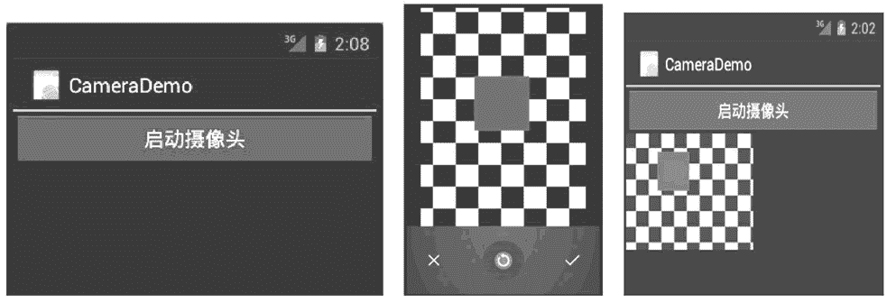

# Android 调用相机进行拍照

> 原文：[`c.biancheng.net/view/3069.html`](http://c.biancheng.net/view/3069.html)

借助于 Intent，可以方便地调用 Android 系统的照相机程序进行拍照。但是需要声明摄像头的使用权限，即在 AndroidManifest.xml 文件中添加如下代码：

<uses-permission android:name="android.permission.CAMERA"/>
<uses-feature android:name="android.hardware.camera"/>

实例 CameraDemo 演示了通过 Intent 调用系统的拍照程序并返回照片的过程，该实例运行效果如图 1 所示。


图 1  CameraDemo 实例运行效果
当单击“启动摄像头”按钮时，启动 Android 系统自带的照相机应用程序进行拍照，并将拍摄的照片显示到 ImageView 组件中。

实例 CameraDemo 中的 main.xml 代码如下：

```

<?xml version="1.0" encoding="utf-8"?>
<LinearLayout xmlns:android="http://schemas.android.com/apk/res/android"
    android:layout_width="fill_parent"
    android:layout_height="fill_parent"
    android:orientation="vertical">

    <Button
        android:id="@+id/button1"
        android:layout_width="wrap_content"
        android:layout_height="wrap_content"
        android:text="@string/camera" />

    <ImageView
        android:id="@+id/imageview"
        android:layout_width="wrap_content"
        android:layout_height="wrap_content" />
</LinearLayout>
```

在实例 CameraDemo 中的 AndroidManifest.xml 代码如下：

```

<?xml version="1.0" encoding="utf-8"?>
<manifest xmlns:android="http://schemas.android.com/apk/res/android"
    package="introduction.android.receivemessagedemo"
    android:versionCode="1"
    android:versionName="1.0">

    <uses-sdk android:minSdkVersion="14" />

    <uses-permission android:name="android.permission.CAMERA" />
    <uses-feature android:name="android.hardware.camera" />
    <application
        android:allowBackup="true"
        android:icon="@mipmap/ic_launcher"
        android:label="@string/app_name"
        android:roundIcon="@mipmap/ic_launcher_round"
        android:supportsRtl="true"
        android:theme="@style/AppTheme">
        <activity android:name=".MainActivity">
            <intent-filter>
                <action android:name="android.intent.action.MAIN" />
                <category android:name="android.intent.category.LAUNCHER" />
            </intent-filter>
        </activity>
    </application>

</manifest>
```

在实例 CameraDemo 中的 CameraDemoActivity.java 代码如下：

```

import android.app.Activity;
import android.content.Intent;
import android.graphics.Bitmap;
import android.os.Bundle;
import android.provider.MediaStore;
import android.util.Log;
import android.view.View;
import android.view.View.OnClickListener;
import android.widget.Button;
import android.widget.ImageView;

public class MainActivity extends Activity {
    /**
     * Called when the activity is first created.
     */
    private ImageView imageview;
    private Button btn;

    @Override
    public void onCreate(Bundle savedInstanceState) {
        super.onCreate(savedInstanceState);
        setContentView(R.layout.activity_main);
        imageview = (ImageView) findViewById(R.id.imageview);
        btn = (Button) findViewById(R.id.button1);
        btn.setOnClickListener(new OnClickListener() {
            public void onClick(View v) {
                // TODO Auto-generated method stub
                try {
                    Intent i = new Intent(MediaStore.ACTION_IMAGE_CAPTURE);
                    startActivityForResult(i, 1);
                } catch (Exception e) {
                    Log.d("cameraDemo", e.toString());
                }
            }
        });
    }

    protected void onActivityResult(int requestcode, int resultCode, Intent data) {
        try {
            if (requestcode != 1) {
                return;
            }
            super.onActivityResult(requestcode, resultCode, data);
            Bundle extras = data.getExtras();
            Bitmap bitmap = (Bitmap) extras.get("data");
            imageview.setImageBitmap(bitmap);
        } catch (Exception e) {
            Log.d("cameraDemo", e.toString());
        }
    }
}
```

在启动摄像头程序时，因为要传回拍摄的图像，所以调用了 Activity.startActivityForResult(Intent intent, int requestCode) 方法。

当 startActivityForResult() 方法启动的 Activity 正常结束时，会自动返回发出请求的 Activity，并且该方法会返回对应的 requestCode 值给 onActivityResult(int requestcode, int resultCode,Intent data) 方法，借此可以在请求 Activity 和发出请求的 Activity 之间进行数据传递。本实例借助于这一特点传回了 Android 系统照相机程序拍摄的照片。