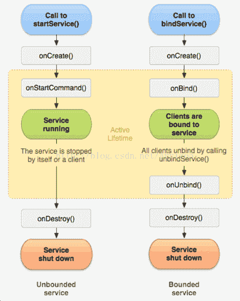

# Android Service 生命周期和使用方法

> 原文：[`c.biancheng.net/view/3072.html`](http://c.biancheng.net/view/3072.html)

在 Android 系统中，Service 不是一个单独的进程，除非特殊设定，否则它不会单独运行在自己的进程中，通常情况下它是作为启动应用程序的一部分与当前应用程序运行在同一个进程中。

## Service 的作用

服务程序 Service 是一种可以在后台长时间运行并且不提供用户 UI 的程序。即使启动 Service 的应用程序被切换掉，其启动的 Service 也可以在后台正常运行。

Service 经常被用来处理一些耗时比较长的程序，例如进行网络传输或播放音乐等。

## Service 的生命周期

Android 开发中，当需要创建在后台运行的程序的时候，就要用到 Service。

Service 可以分为有无限生命和有限生命两种。

Service 跟 Activity 是不同的。简单来说，可以理解为后台与前台的区别，Activity 拥有 UI，可以与用户交互，而 Service 则不能。当系统资源不足时，Activity 可能会被系统销毁以释放资源，而 Service 不会。

Service 类中定义了一系列和自身生命周期相关的方法，在此不一一介绍，最经常使用的有以下三个方法：

*   onCreate()：当 Service 第一次被创建时，系统调用该方法。
*   onStartCommand(Intent intent,int flags,int startId)：当通过 startService() 方法启动 Service 时，该方法被调用。
*   onDestroy()：当 Service 不再使用时，系统调用该方法。

## 启动 Service

要启动服务程序 Service，要先在应用程序的 AndroidManifest.XML 配置文件内声明 <service> 标签。例如，如果建立了一个 ExampleService 的 Service，就要在配置文件中添加如下代码：

<service android:name=".ExampleService"/>

此外，<service> 标签可用含有 <intent-filter> 的标签对该 Service 进行必要的说明。

启动 Service 两种方式的不同

| 名称 | 方法 | 参数 | 其他 |
| --- | --- | --- | --- |
| Context.startService() | public abstract void startService(Intent service) |  service 是要启动的服务程序的名称 | 该方法会调用 Service 中的 onCreate() 和 onStartCommand() 方法来启动一个后台 Service，当 Service 销毁时直接调用 onDestroy() 方法。 |
| Context.bindService() | public abstract boolean bindService(Intent service,ServiceConnection conn,int flags) | service 是定义要绑定的服务程序的名称。 conn 是当服务程序启动和停止时，负责接收信息的接口程序。
flags 是设置绑定作业的选项，可以是 0、BIND_AUTO_ CREATE、BIND_DEBUG_UNBIND、BIND_NOT_FOREGROUND、BIND_ABOVE_ CLIENT、BIND_ ALLOW_OOM_MANAGEMENT 或者 BIND_WAIVE_PRIORITY。 | 通过 bindService() 方法启动 Service，则其生命周期受其绑定对象控制。一个 Service 可以同时绑定到多个对象上，当没有任何对象绑定到 Service 上时，该 Service 会被系统销毁 |

两种方式对 Service 生命周期的影响如图 1 所示。

图 1  两种方式的比较
通过图 1 不难看出，通过 bindService() 方法启动时和 startService() 方法一样，都会调用 onCreate() 方法来创建 Service，但它不会调用 onStartCommand() 方法，而是调用 onBind() 方法返回客户端一个 IBinder 接口。这个 IBinder 就是在 Service 的生命周期回调方法 onBind() 中的返回值。

服务运行后，与前者不同的是，不是服务终止，而是使用 Context.unbindService() 方法之后，Service 的生命周期回调 onUnbind() 会被调用。如果所有 bind 过 Service 的组件都调用 unbindService() 方法，那么之后 Service 会被停止，其 onDestroy() 回调会被调用。