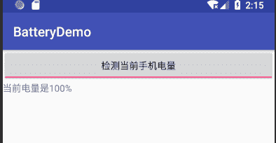

# Android BroadcastReceiver：接收广播

> 原文：[`c.biancheng.net/view/3074.html`](http://c.biancheng.net/view/3074.html)

广播（Broadcast）是 Android 系统中应用程序间通信的手段。

当有特定事件发生时，例如有来电、有短信、电池电量变化等事件发生时，Android 系统都会产生特定的 Intent 对象并且自动进行广播，而针对特定事件注册的 BroadcastReceiver 会接收到这些广播，并获取 Intent 对象中的数据进行处理。

在广播 Intent 对象时可以指定用户权限，以此限制仅有获得了相应权限的 BroadcastReceiver 才能接收并处理对应的广播。

BroadcastReceiver 有动态和静态两种注册方法。

*   动态注册方法即使用 Context. registerReceiver() 方法进行注册，需要特别注意的是，动态注册方法在退出程序前要使用 Context.unregisterReceiver() 方法撤销注册。
*   静态注册方法即在 AndroidManifest.xml 文件中通过 <receiver> 标签进行注册。

一个 BroadcastReceiver 对象只有在被调用 onReceive(Context, Intent) 时才有效，当从该函数返回后，该对象就已无效了，其生命周期结束。

下面介绍如何使用动态注册来实现监听电池剩余电量。

实例 BatteryDemo 演示了使用动态注册 BroadcastReceiver 对象并且接收系统电量改变事件并加以处理的过程，运行效果如图 1 所示。

图 1  BatteryDemo 的运行效果
实例 BatteryDemo 中 main.xml 的代码如下：

```

<?xml version="1.0" encoding="utf-8"?>
<LinearLayout xmlns:android="http://schemas.android.com/apk/res/android"
    android:layout_width="fill_parent"
    android:layout_height="fill_parent"
    android:orientation="vertical">

    <ToggleButton
        android:id="@+id/button"
        android:layout_width="fill_parent"
        android:layout_height="wrap_content"
        android:textOff="停止检测"
        android:textOn="检测当前手机电量" />

    <TextView
        android:id="@+id/text"
        android:layout_width="fill_parent"
        android:layout_height="wrap_content" />
</LinearLayout>
```

实例 BatteryDemo 中 AndroidManifest.xml 的代码如下：

```

<?xml version="1.0" encoding="utf-8"?>
<manifest xmlns:android="http://schemas.android.com/apk/res/android"
    package="introduction.android.batterydemo"
    android:versionCode="1"
    android:versionName="1.0">

    <uses-sdk android:minSdkVersion="14" />
    <application
        android:allowBackup="true"
        android:icon="@mipmap/ic_launcher"
        android:label="@string/app_name"
        android:roundIcon="@mipmap/ic_launcher_round"
        android:supportsRtl="true"
        android:theme="@style/AppTheme">
        <activity android:name=".MainActivity">
            <intent-filter>
                <action android:name="android.intent.action.MAIN" />
                <category android:name="android.intent.category.LAUNCHER" />
            </intent-filter>
        </activity>
    </application>

</manifest>
```

实例 BatteryDemo 中 MainActivity.java 的具体实现代码如下：

```

package introduction.android.batterydemo;

import android.content.BroadcastReceiver;
import android.content.Context;
import android.content.Intent;
import android.content.IntentFilter;
import android.support.v7.app.AppCompatActivity;
import android.os.Bundle;
import android.widget.CompoundButton;
import android.widget.TextView;
import android.widget.ToggleButton;

import org.w3c.dom.Text;

public class MainActivity extends AppCompatActivity {
    private ToggleButton button;
    private TextView text;
    BroadcastReceiver receiver = null;

    @Override
    protected void onCreate(Bundle savedInstanceState) {
        super.onCreate(savedInstanceState);
        setContentView(R.layout.activity_main);
        button = (ToggleButton) findViewById(R.id.button);
        text = (TextView) findViewById(R.id.text);

        final BroadcastReceiver receiver = new BroadcastReceiver() {
            @Override
            public void onReceive(Context context, Intent intent) {
                String action = intent.getAction();
                if (Intent.ACTION_BATTERY_CHANGED.equals(action)) {
                    int current = intent.getExtras().getInt("level");
                    int total = intent.getExtras().getInt("scale");
                    int value = current * 100 / total;
                    text.setText("当前电量是" + value + "%" + "");
                }
            }
        };
        button.setOnCheckedChangeListener(new CompoundButton.OnCheckedChangeListener() {
            @Override
            public void onCheckedChanged(CompoundButton buttonView, boolean isChecked) {
                if (isChecked) {
                    IntentFilter filter = new IntentFilter(Intent.ACTION_BATTERY_CHANGED);
                    registerReceiver(receiver, filter);
                } else {
                    unregisterReceiver(receiver);
                    text.setText("");

                }
            }
        });
    }
}
```

其中，Intent.ACTION_BATTERY_CHANGED 为当电池电量变化时产生的 Intent 对象中携带的 Action 信息。

IntentFilter filter = new IntentFilter(Intent.ACTION_BATTERY_CHANGED) ;

用于确定当前 BroadcastReceiver 对象接收的 Intent 对象的类型。

下面是常用的方法：

*   registerReceiver(receiver, filter)： 动态注册 receiver。
*   int current = intent.getExtras().getInt("level")： 获取当前电池的电量。
*   int total=intent.getExtras().getInt("scale")： 获取总电量。
*   unregisterReceiver(receiver)：注销 receiver 注册。

该应用程序若要使用静态注册，则需要在 AndroidManifest.xml 文件中添加如下代码：

```

<receiver android:name="receiver">
    <intent-filter>
            <action android:name="android.intent.action.BATTERY_CHANGED"/>
    </intent-filter>
</receiver>
```