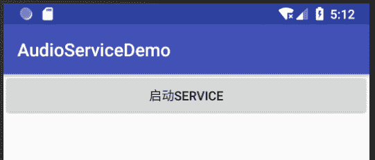

# Android 音频以及音频播放器开发实例

> 原文：[`c.biancheng.net/view/3076.html`](http://c.biancheng.net/view/3076.html)

Android 系统支持三种不同来源的音频播放：
**1）本地资源**

存储在应用程序中的资源，例如存储在 RAW 文件夹下的媒体文件，只能被当前应用程序访问。

**2）外部资源**

存储在文件系统中的标准媒体文件，例如存储在 SD 卡中的文件，可以被所有应用程序访问。

**3）网络资源**

通过网络地址取得的数据流（URL），例如“http://www.musiconline.com/classic/007\. mp3”，可以被所有应用程序访问。

## Android N 支持的音频格式

Android N 支持的音频格式如表 1 所示。

| 格式/编码 | 支持的文件类型 |
| --- | --- |
| AACLC/LTP | 3GPP(.3gp) MPEG-4(.mp4,.m4a)
ADTS raw AAC
MPEG-TS(.ts,not seekable,Android3.0+) |
| HE-AACv1(AAC+) |
| HE-AACv2(enhanced AAC+) |
| AMB-NB | 3GPP(.3gp) |
| AMR-WB | 3GPP(.3gp) |
| FLAC | FLAC(.flac)only |
| MP3 | MP3(.mp3) |
| MIDI | Type 0 and 1(.mid,.xmf,.mxmf) RTTTL/RTX(.rtttl,rtx)
OTA(.ota)
iMelody(.imy) |
| Vorbis | Ogg(.ogg) Matroska |
| PCM/WAVE | WAVE(.wav) |

## 音频播放器

实例 MediaPlayerAudioDemo 演示了分别播放三种类型的资源的方法。

该实例中 MediaPlayerAudioActivity 向 Intent 对象中传入要载入的资源类型，并通过该 Intent 启动用于播放音乐的 Activity：PlayAudio。PlayAudio 根据传入的参数分别获取对应的音乐资源并且播放。

实例 MediaPlayerAudioDemo 的运行效果如图 1 所示。
图 1  MediaPlayerAudioDemo 的运行效果
实例 MediaPlayerAudioDemo 中的 main.xml 代码如下：

```

<?xml version="1.0" encoding="utf-8"?>
<LinearLayout xmlns:android="http://schemas.android.com/apk/res/android"
    android:layout_width="fill_parent"
    android:layout_height="fill_parent"
    android:orientation="vertical">

    <Button
        android:id="@+id/button01"
        android:layout_width="fill_parent"
        android:layout_height="wrap_content"
        android:text="播放存储在文件系统的音乐" />

    <Button
        android:id="@+id/button02"
        android:layout_width="fill_parent"
        android:layout_height="wrap_content"
        android:text="播放网络中的音乐" />

    <Button
        android:id="@+id/button03"
        android:layout_width="fill_parent"
        android:layout_height="wrap_content"
        android:text="播放本地资源的音乐" />
</LinearLayout>
```

实例 MediaPlayerAudioDemo 中 MainActivity.java 文件的代码如下：

```

package introduction.android.batterydemo;

import android.content.BroadcastReceiver;
import android.content.Context;
import android.content.Intent;
import android.content.IntentFilter;
import android.support.v7.app.AppCompatActivity;
import android.os.Bundle;
import android.view.View;
import android.widget.Button;
import android.widget.CompoundButton;
import android.widget.TextView;
import android.widget.ToggleButton;

import org.w3c.dom.Text;

public class MainActivity extends AppCompatActivity implements View.OnClickListener {
    private Button button01, button02, button03;
    private String PLAY = "play";
    private int Local = 1;
    private int Stream = 2;
    private int Resources = 3;

    @Override
    public void onCreate(Bundle saveInstanceState) {
        super.onCreate(saveInstanceState);
        setContentView(R.layout.activity_main);
        button01 = (Button) findViewById(R.id.button01);
        button02 = (Button) findViewById(R.id.button02);
        button03 = (Button) findViewById(R.id.button03);
        button01.setOnClickListener(this);
        button02.setOnClickListener(this);
        button03.setOnClickListener(this);
    }

    @Override
    public void onClick(View v) {
        Intent intent = new Intent(MainActivity.this, PlayAudio.class);
        if (v == button01) {
            intent.putExtra(PLAY, Local);
        }
        if (v == button02) {
            intent.putExtra(PLAY, Stream);
        }
        if (v == button03) {
            intent.putExtra(PLAY, Resources);
        }
        MainActivity.this.startActivity(intent);
    }
}
```

实例 MediaPlayerAudioDemo 中 PlayAudio 类实现播放音频的功能，根据 MediaPlayer-AudioActivity 类通过 Intent 传递过来的不同的值，而实现三种不同的播放音频的方式。

PlayAudio.java 文件的代码如下：

```

package introduction.android.batterydemo;

import android.app.Activity;
import android.media.MediaPlayer;
import android.os.Bundle;
import android.widget.TextView;
import android.widget.Toast;

public class PlayAudio extends Activity {
    private TextView textview;
    private String PLAY = "paly";
    private MediaPlayer mediaplayer;
    private String path;

    @Override
    public void onCreate(Bundle savedInstanceState) {
        super.onCreate(savedInstanceState);
        setContentView(R.layout.activity_main);
        textview = (TextView) findViewById(R.id.textview);
        Bundle extras = getIntent().getExtras();
        playAudio(extras.getInt(PLAY));
    }

    private void playAudio(int play) {
        // TODO Auto-generated method stub
        try {
            switch (play) {
                case 1:
                    path = "sdcard/music/white.mp3";
                    if (path == "") {
                        Toast.makeText(PlayAudio.this, "在 SD 未找到音频文件",
                                Toast.LENGTH_LONG);
                    }
                    mediaplayer = new MediaPlayer();
                    mediaplayer.setDataSource(path);
                    mediaplayer.prepare();
                    mediaplayer.start();
                    textview.setText("正在播放文件中的音乐");
                    break;
                case 2:
                    path = "http://www.musiconline.com/classic/007.mp3";
                    if (path == "") {
                        Toast.makeText(PlayAudio.this, "未找到您要播放的音乐",
                                Toast.LENGTH_LONG).show();
                    }
                    mediaplayer = new MediaPlayer();
                    mediaplayer.setDataSource(path);
                    mediaplayer.prepare();
                    mediaplayer.start();
                    textview.setText("正在播放网络中的音乐");
                    break;
                case 3:
                    mediaplayer = MediaPlayer.create(this, null);
                    mediaplayer.start();
                    textview.setText("正在播放本地资源中的音乐");
                    break;
            }
        } catch (Exception e) {
            System.out.println("出现异常");
        }
    }

    @Override
    protected void onDestroy() {
        // TODO Auto-generated method stub
        super.onDestroy();
        if (mediaplayer != null) {
            mediaplayer.release();
            mediaplayer = null;
        }
    }
}
```

其中，path 指向要播放的音频文件的位置。

本实例中，外部文件系统中的资源是放置在 SD 卡中的 music 目录下的 white.mp3；网络资源使用的是 http://www.musiconline.com/classic/007.mp3；本地资源使用的是 raw 目录下的 black.mp3 文件。

实例 MediaPlayerAudioDemo 中 AndroidManifest.xml 文件的代码如下：

```

<?xml version="1.0" encoding="utf-8"?>
<manifest xmlns:android="http://schemas.android.com/apk/res/android"
    package="introduction.android.batterydemo"
    android:versionCode="1"
    android:versionName="1.0">

    <uses-sdk android:minSdkVersion="10" />
    <application
        android:allowBackup="true"
        android:icon="@mipmap/ic_launcher"
        android:label="@string/app_name"
        android:roundIcon="@mipmap/ic_launcher_round"
        android:supportsRtl="true"
        android:theme="@style/AppTheme">
        <activity android:name=".MainActivity">
            <intent-filter>
                <action android:name="android.intent.action.MAIN" />
                <category android:name="android.intent.category.LAUNCHER" />
            </intent-filter>
        </activity>
        <activity android:name=".PlayAudio" />
    </application>

</manifest>
```

在该实例中，每次播放音频文件时都会从 MediaPlayerAudioActivity 跳转到一个新的 Activity，即 PlayAudio。

当返回 MediaPlayerAudioActivity 时，由于 PlayAudio 对象被释放掉，因此播放的音乐也随之停止，不再播放。若想在返回 MediaPlayerAudioActivity 时音乐不停止，则需要使用 Service 在后台播放音频文件。 

## 后台播放音频

实例 AudioServiceDemo 演示了如何在后台播放音频。该实例的运行效果如图 2 所示。当用户单击“启动 Service”按钮时，当前 Activity 结束，应用程序界面消失，返回 Android 应用程序列表，同时后台启动 Service，播放视频文件。


图 2  AudioServiceDemo 的运行效果
该实例界面简单，仅一个按钮。布局文件 main.xml 的代码如下：

```

<?xml version="1.0" encoding="utf-8"?>
<LinearLayout xmlns:android="http://schemas.android.com/apk/res/android"
    android:layout_width="fill_parent"
    android:layout_height="fill_parent"
    android:orientation="vertical">

    <Button
        android:id="@+id/button1"
        android:layout_width="fill_parent"
        android:layout_height="wrap_content"
        android:text="启动 Service" />
</LinearLayout>
```

实例 AudioServiceDemo 中 Activity 文件 AudioServiceDemoActivity.java 的代码如下：

```

package introduction.android.audioservicedemo;

import android.content.Intent;
import android.support.v7.app.AppCompatActivity;
import android.os.Bundle;
import android.view.View;
import android.widget.Button;

public class MainActivity extends AppCompatActivity {
    private Button btn;

    @Override
    protected void onCreate(Bundle savedInstanceState) {
        super.onCreate(savedInstanceState);
        setContentView(R.layout.activity_main);
        btn = (Button) findViewById(R.id.button1);
        btn.setOnClickListener(new View.OnClickListener() {
            @Override
            public void onClick(View view) {
                startService(new Intent("introduction.android.AudioServiceDemo.MY_AUDIO_SERVICE"));
                finish();
            }
        });
    }
}
```

AudioServiceDemoActivity 在按钮被单击后使用 startService() 方法启动了自定义的服务 MY_AUDIO_SERVICE，然后调用 finish() 方法关闭当前 Activity。该服务需要在 AndroidManifest. xml 文件中进行声明。

AndroidManifest.xml 的代码如下：

```

<?xml version="1.0" encoding="utf-8"?>

<manifest xmlns:android="http://schemas.android.com/apk/res/android"
    package="introduction.android.AudioServiceDemo"
    android:versionCode="1"
    android:versionName="1.0">

    <uses-sdk android:minSdkVersion="14" />
    <application
        android:icon="@drawable/ic_launcher"
        android:label="@string/app_name">
        <activity
            android:name=".AudioServiceDemoActivity"
            android:label="@string/app_name">
            <intent-filter>
                <action android:name="android.intent.action.MAIN" />
                <category android:name="android.intent.category.LAUNCHER" />
            </intent-filter>
        </activity>
        <service android:name="MyAudioService">
            <intent-filter>
                <action android:name="introduction.android.AudioServiceDemo.MY_AUDIO_SERVICE" />
                <category android:name="android.intent.category.DEFAULT" />
            </intent-filter>
        </service>
    </application>
</manifest>
```

其中：

```

<service android:name="MyAudioService">
    <intent-filter>
        <action android:name="introduction.android.AudioServiceDemo.MY_AUDIO_SERVICE" />
        <category android:name="android.intent.category.DEFAULT" />
    </intent-filter>
</service>
```

定义了名为 MyAudioService 的 Service，该 Service 对名为“introduction.android.AudioServiceDemo. MY_AUDIO_SERVICE”的动作进行处理。

实例 AudioServiceDemo 中 MyAudioService.java 的代码如下：

```

package introduction.android.audioservicedemo;

import android.app.Service;
import android.content.Intent;
import android.media.MediaPlayer;
import android.os.IBinder;

import java.io.IOException;

public class MyAudioService extends Service {
    private MediaPlayer mediaplayer;

    @Override
    public IBinder onBind(Intent argO) {
        // TODO Auto-generated method stub
        return null;
    }

    @Override
    public void onDestroy() {
        // TODO Auto-generated method stub
        super.onDestroy();
        if (mediaplayer != null) {
            mediaplayer.release();
            mediaplayer = null;
        }
    }

    @Override
    public void onStartCommand(Intent intent, int flags, int startId) {
        // TODO Auto-generated method stub
        super.onStartCommand(intent, flags, startId);
        String path = "sdcard/music/white.mp3";
        mediaplayer = new MediaPlayer();
        try {
            mediaplayer.setDataSource(path);
            mediaplayer.prepare();
            mediaplayer.start();
        } catch (IOException e) {
            // TODO Auto-generated catch block
            e.printStackTrace();
        }
    }
}
```

该服务启动 Mediaplayer，并播放存放于 SD 卡中的“sdcard/music/white.mp3”文件。