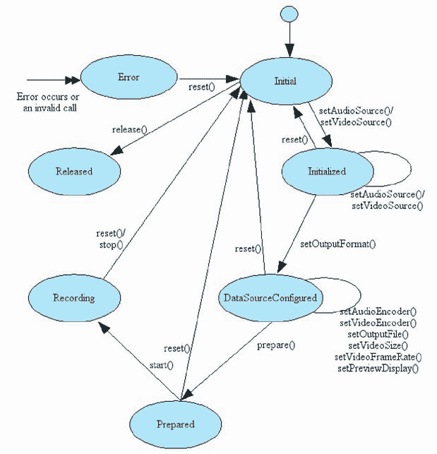
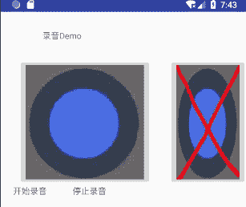

# Android MediaRecorder 录制音频

> 原文：[`c.biancheng.net/view/3085.html`](http://c.biancheng.net/view/3085.html)

Android SDK 提供了使用 MediaRecorder 类实现对音频和视频进行录制的功能。MediaRecorder 对象在运行过程中存在多种状态，其状态转化如图 1 所示。
图 1  MediaRecorder 对象状态转化图从图 1 中可以看到：

1）创建 MediaRecorder 对象后处于 Initial 状态。

MediaRecorder 对象会占用硬件资源，因此不再需要时，应该调用 release() 方法销毁。在其他状态调用 reset() 方法，可以使得 MediaRecorder 对象重新回到 Initial 状态，达到复用 MediaRecorder 对象的目的。

2）在 Initial 状态调用 setVideoSource() 或者 setAudioSource() 之后，MediaRecorder 将进入 Initialized 状态。

对于音频录制，目前 OPhone 平台支持从麦克风或者电话两个音频源录制数据。在 Initialized 状态的 MediaRecorder 还需要设置编码格式、文件数据路径、文件格式等信息，设置之后 MediaRecorder 进入 DataSourceConfigured 状态。

3）在 DataSourceConfigured 状态调用 prepare() 方法，MediaRecorder 对象将进入 Prepared 状态，录制前的状态准备就绪。

4）在 Prepared 状态调用 start() 方法，MediaRecorder 进入 Recording 状态，声音录制可能只需一段时间，这时 MediaRecorder 一直处于录制状态。

5）在 Recording 状态调用 stop() 方法，MediaRecorder 将停止录制，并将录制内容输出到指定文件。

MediaRecorder 定义了两个内部接口 OnErrorListener 和 OnInfoListener 来监听录制过程中的错误信息。

例如，当录制的时间长度达到了最大限制或者录制文件的大小达到了最大文件限制时，系统会回调已经注册的 OnInfoListener 接口的 onInfo() 方法。

使用 MediaRecorder 类进行音频录制的基本步骤如下：

**1）建立 MediaRecorder 类的对象。**

MediaRecorder recorder=new MediaRecorder();

**2）设置音频来源。**

recorder.setAudioSource(MediaRecorder.AudioSource.MIC);

**3）设置音频输出格式。**

recorder.setOutputFormat(MediaRecorder.OutputFormat.THREE_GPP);

**4）设置音频编码方式。**

recorder.setAudioEncoder(MediaRecorder.AudioEncoder.AMR_NB);

**5)设置音频文件的保存位置及文件名。**

recorder.setOutputFile(PATH_NAME);

**6）将录音器置于准备状态。**

recorder.prepare();

**7）启动录音器。**

recorder.start();

**8）音频录制。**

**9）音频录制完成，停止录音器。**

recorder.stop();

**10）释放录音器对象。**

recorder.release();

实例 AudioRecord 演示了使用 MediaRecorder 类对音频进行录制的过程，运行效果如图 2 所示。


图 2  AudioRecord 的运行效果
该运行效果对应的布局文件 main.xml 的代码如下：

```

<?xml version="l.0" encoding="utf-8"?>

<LinearLayout xmlns:android="http://schemas.android.com/apk/res/android"
    android:layout_width="fill_parent"
    android:layout_height="fill_parent"
    android:orientation="vertical">

    <TextView
        android:layout_width="fill_parent"
        android:layout_height="wrap_content"
        android:layout_marginLeft="70dp"
        android:layout_marginTop="30dp"
        android:text="@string/hello" />

    <LinearLayout
        android:layout_width="fill_parent"
        android:layout_height="wrap_content"
        android:layout_marginTop="30dp"
        android:orientation="horizontal">

        <ImageButton
            android:id="@+id/st"
            android:layout_width="wrap_content"
            android:layout_height="wrap_content"
            android:layout_marginLeft="20dp"
            android:scaleType="fitXY"
            android:src="0drawable/st" />

        <ImageButton
            android:id="@+id/stop"
            android:layout_width="wrap_content"
            android:layout_height="wrap_content"
            android:layout_marginLeft="30dp"
            android:scaleType="fitXY"
            android:src="0drawable/stop" />

    </LinearLayout>

    <LinearLayout
        android:layout_width="fill_parent"
        android:layout_height="wrap_content"
        android:orientation="horizontal">

        <TextView
            android:layout_width="wrap_content"
            android:layout_height="wrap_content"
            android:layout_marginLeft="21dp"
            android:text="@string/start" />

        <TextView
            android:layout_width="wrap_content"
            android:layout_height="wrap_content"
            android:layout_marginLeft="43dp"
            android:text="@string/stop" />

        <TextView
      android:id="@+id/sttext"
      android:layout_width="fill_parent"
      android:layout_height="wrap_content" />
    </LinearLayout>
</LinearLayout>
```

实例 AudioRecord 中 AndroidManifest.xml 文件的代码如下：

```

<?xml version="1.0" encoding="utf-8"?>
<manifest xmlns:android="http://schemas.android.com/apk/res/android"
    package="introduction.android.audiorecord"
    android:versionCode="1"
    android:versionName="1.0">

    <uses-sdk android:minSdkVersion="14" />
    <application
        android:allowBackup="true"
        android:icon="@mipmap/ic_launcher"
        android:label="@string/app_name"
        android:roundIcon="@mipmap/ic_launcher_round"
        android:supportsRtl="true"
        android:theme="@style/AppTheme">
        <activity android:name=".MainActivity">
            <intent-filter>
                <action android:name="android.intent.action.MAIN" />
                <category android:name="android.intent.category.LAUNCHER" />
            </intent-filter>
        </activity>
    </application>

</manifest>
```

其中：

```

<uses-permission android:name="android.permission.RECORD_AUDIO"/>
```

表明进行音频录制的用户权限。

实例 AudioRecord 中 MainActivity.java 的代码如下：

```

package introduction.android.audiorecord;

import java.io.File;
import java.io.IOException;

import android.app.Activity;

import android.media.MediaRecorder;
import android.os.Bundle;
import android.os.Environment;
import android.util.Log;
import android.view.View;

import android.view.View.OnClickListener;

import android.widget.ImageButton;
import android.widget.TextView;

import android.widget.Toast;

public class MainActivity extends Activity implements OnClickListener {

    /**
     * Called when the activity is first created.
     */
    private ImageButton st, stop;
    private TextView sttext;
    private MediaRecorder mRecorder;
    private File recordPath;
    private File recordFile;

    @Override
    public void onCreate(Bundle savedInstanceState) {
        super.onCreate(savedInstanceState);
        setContentView(R.layout.activity_main);

        st = (ImageButton) findViewById(R.id.st);
        stop = (ImageButton) findViewById(R.id.stop);
        sttext = (TextView) findViewById(R.id.sttext);
        st.setOnClickListener(this);
        stop.setOnClickListener(this);
    }

    public void start() {
        if (checkSDCard()) {
            recordPath = Environment.getExternalStorageDirectory();
            File path = new File(recordPath.getPath() + File.separator + "audioRecords");
            if (!path.mkdirs()) {
                Log.d("audioRecorder", "创建目录失败");
                return;
            }
        } else {
            Toast.makeText(MainActivity.this, "SDcard 未连接",
                    Toast.LENGTH_LONG).show();
            return;
        }

        try {
            recordFile = File.createTempFile(String.valueOf("myrecord_"), ".amr", recordPath);
        } catch (IOException e) {
            Log.d("audioRecorder", "文件创建失败");
        }
        mRecorder = new MediaRecorder();
        //设置麦克风
        mRecorder.setAudioSource(MediaRecorder.AudioSource.MIC);
        //输入文件格式
        mRecorder.setOutputFormat(MediaRecorder.OutputFormat.DEFAULT);
        //音频文件编码
        mRecorder.setAudioEncoder(MediaRecorder.AudioEncoder.DEFAULT);
        //输出文件路径
        mRecorder.setOutputFile(recordFile.getAbsolutePath());
        //开始录音
        try {
            mRecorder.prepare();
            mRecorder.start();
        } catch (IllegalStateException e) {
            e.printStackTrace();
        } catch (IOException e) {
            e.printStackTrace();
        }
    }

    public void stop() {
        try {
            if (mRecorder != null) {
                mRecorder.stop();
                mRecorder.release();
                mRecorder = null;
            }
        } catch (IllegalStateException e) {
        }
    }

    private boolean checkSDCard() {

        // TODO Auto-generated method stub
        //检测 SD 卡是否插入手机中
        if (android.os.Environment.getExternalStorageState().equals(Environment.MEDIA_MOUNTED)) {
            return true;
        }
        return false;
    }

    @Override
    public void onClick(View v) {
        // TODO Auto-generated method stub
        if (v == st) {
            MainActivity.this.start();
            sttext.setText("正在录音。。。。");
            if (v == stop) {
                sttext.setText("停止录音。。。。");
                MainActivity.this.stop();
            }
        }
    }
}
```

该应用程序运行后，首先检测 SD 卡是否插入手机中。若 SD 卡在手机中，则会在 SD 卡的 audioRecords 目录下创建以“myRecord_”为前缀、以“.amr”为后缀的临时文件，并将录音内容写入该文件中。

## 后台录制音频

结合 Android 系统提供的相关 API，借助于 MediaRecorder 类，可以实现一些比较有意思的功能。比如，在手机中监听短信的功能，当有符合特定要求的短信到来时，启动相应服务在后台进行录音，进而将手机变化为一个可远程控制的录音机。

接下来我们在此处不去实现短信内容验证功能，而只演示通过短信远程启动后台服务并进行录音的功能，我们可以举一反三。

实例 AudioRecordService 演示了该功能。该实例实现了 BroadcastReceiver 类的子类，对手机短信息进行监听。当有短信来时，该 BroadcastReceiver 开始在后台录音并将录音文件保存在 SD 卡中，同时启动一个线程进行计时，当录音进行一分钟后，关闭录音程序。

实例 AudioRecordService 中 MessageReceiver.java 的代码如下：

```

package introduction.android.audiorecord;

import java.io.File;
import java.io.IOException;

import android.content.BroadcastReceiver;
import android.content.Context;
import android.content.Intent;
import android.media.MediaRecorder;
import android.os.Bundle;
import android.os.Environment;
import android.util.Log;

public class MessageReceiver extends BroadcastReceiver {
    private File recordPath;
    private File recordFile;
    private MediaRecorder mRecorder;
    private long startTime;

    @Override
    public void onReceive(Context context, Intent intent) {
        // TODO Auto-generated method stub
        if (intent.getAction().equals("android.proider.Telephony.SMS_RECEIVER")) {
            recordBegin();
            new Thread(timing).start();
        }
    }

    private Runnable timing = new Runnable() {
        private long currentTime = System.currentTimeMillis();

        @Override
        public void run() {
            // TODO Auto-generated method stub
            while (currentTime < startTime + 60 * 1000) {
                try {
                    Thread.sleep(1000);
                } catch (InterruptedException e) {
                    // TODO Auto-generated catch block
                    e.printStackTrace();
                }
                recordStop();
            }
        }
    };

    private void recordBegin() {
        // TODO Auto-generated method stub
        startTime = System.currentTimeMillis();
        recordPath = Environment.getExternalStorageDirectory();
        File path = new File(recordPath.getPath() + File.separator + "audioRecords");
        recordPath = path;
        try {
            recordFile = File.createTempFile(String.valueOf("myrecord_"), ".amr",
                    recordPath);
        } catch (IOException e) {
            Log.d("audioRecorder", "文件创建失败");
        }
        mRecorder = new MediaRecorder();
        mRecorder.setAudioSource(MediaRecorder.AudioSource.MIC);
        mRecorder.setOutputFormat(MediaRecorder.OutputFormat.DEFAULT);
        mRecorder.setAudioEncoder(MediaRecorder.AudioEncoder.DEFAULT);
        mRecorder.setOutputFile(recordFile.getAbsolutePath());
        try {
            mRecorder.prepare();
            mRecorder.start();
        } catch (IllegalStateException e) {
            e.printStackTrace();
        } catch (IOException e) {
            e.printStackTrace();
        }
    }

    protected void recordStop() {
        // TODO Auto-generated method stub
        mRecorder.stop();
        mRecorder.release();
        mRecorder = null;
    }
}
```

由于实例 AudioRecordService 涉及接收短信和使用录音功能，因此需要在 AndroidManifest. xml 文件中声明相应的用户权限。

AndroidManifest.xml 文件的代码如下：

```

<?xml version="1.0" encoding="utf-8"?>
<manifest xmlns:android="http://schemas.android.com/apk/res/android"
    package="introduction.android.audiorecord"
    android:versionCode="1"
    android:versionName="1.0">

    <uses-sdk android:minSdkVersion="14" />
    <application
        android:allowBackup="true"
        android:icon="@mipmap/ic_launcher"
        android:label="@string/app_name"
        android:roundIcon="@mipmap/ic_launcher_round"
        android:supportsRtl="true"
        android:theme="@style/AppTheme">
        <activity android:name=".MainActivity">
            <intent-filter>
                <action android:name="android.intent.action.MAIN" />
                <category android:name="android.intent.category.LAUNCHER" />
            </intent-filter>
        </activity>
    </application>

    <uses-permission android:name="android.perssion.RECEIVE_SMS" />
    <uses-permission android:name="android.permission.RECORD_AUDIO" />
</manifest>
```