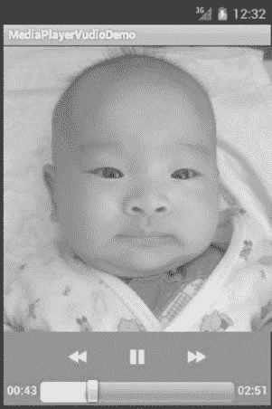
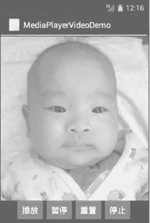

# Android 视频以及视频播放器实例

> 原文：[`c.biancheng.net/view/3086.html`](http://c.biancheng.net/view/3086.html)

首先我们来看一下 Android N 支持的视频文件有哪些。Android N 支持的视频格式下表所示。

**Android N 支持的视频文件**

| 格式/编码 | 支持的文件类型 |
| --- | --- |
| H.263 | 3GPP(.3gp);MpEG-4(.mp4) |
| H.264 AVC | 3GPP(.3gp);MpEG-4(.mp4) MPEG-TS(.ts,AAC audio only,not seekable,Android 3.0+) |
| MPEG-4 SP | 3GPP(.3gp) |
| VP8 | WebM(.webm);Matroska mkv |

## 视频播放器

与音频播放相比，视频播放需要使用视觉组件将影像显示出来。

在 Android SDK 中提供了多种播放视频文件的方法。例如，可以用 VideoView 或 SurfaceView 来播放视频，其中使用 VideoView 组件播放视频最为方便。

实例 VideoPlayDemo 演示了使用 android.widget.VideoView 组件进行视频播放的方法，运行效果如图 1 所示。


图 1  VideoPlayDemo 的运行效果
实例 VideoPlayDemo 中含有两个 Activity，其中 PlayVideo 含有 VideoView 组件对象，用于播放视频。视频文件存放在 SD 卡中，路径为“Movies/movie.3gp”。而 VideoPlayAcitvity 为主 Activity，用于启动 PlayVideo。

实例 VideoPlayDemo 中 MainActivity.java 的代码如下：

```

package introduction.android.videoplaydemo;

import android.app.Activity;
import android.content.Intent;

import android.os.Bundle;
import android.view.View;

import android.view.View.OnClickListener;
import android.widget.Button;

public class MainAcitvity extends Activity {

    /**
     * Called when the activity is first created.
     */
    private Button buttonOl;

    @Override

    public void onCreate(Bundle savedInstanceState) {
        super.onCreate(savedInstanceState);
        setContentView(R.layout.main);
        button01 = (Button) findViewById(R.id.buttonOl);
        button0l.setOnClickListener(new buttonListener());
    }

    class buttonListener implements OnClickListener {
        @Override
        public void onClick(View v) {
            // TODO Auto-generated method stub
            Intent intent = new Intent(MainActivity.this, PlayVideo.class);
            MainAcitvity.this.startActivity(intent);

        }

    }
}
```

实例 VideoPlayDemo 中 PlayVideo.java 的代码如下：

```

package introduction.android.videoplaydemo;

import android.app.Activity;
import android.media.MediaPlayer;
import android.net.Uri;
import android.os.Bundle;
import android.widget.MediaController;
import android.widget.Toast;
import android.widget.VideoView;

public class PlayVideo extends Activity {
    private VideoView videoView;
    private MediaController mc;
    private String path;

    @Override

    public void onCreate(Bundle savedInstanceState) {
        super.onCreate(savedInstanceState);
        setContentView(R.layout.other);

        videoView = (VideoView) this.findViewById(R.id.videoView);
        path = "sdcard/Movies/movie.3gp";
        mc = new MediaController(this);
        videoView.setMediaController(mc);
        videoView.setVideoPath(path);
        videoView.setOnCompletionListener(new MediaPlayer.OnCompletionListener() {
            @Override
            public void onCompletion(MediaPlayer argO) {
                // TODO Auto-generated method stub
                finish();
            }
        });
        videoView.requestFocus();
        videoView.start();
    }
}
```

其中，MediaController 类为 Android SDK 提供的视频控制器，用于显示播放时间，对播放视频进行控制。

通过 VideoView 类的 setMediaController() 方法可以将视频控制器和 VideoView 类结合在一起，对 VideoView 中播放的视频进行控制，大大降低了编码强度。

由于要播放的视频为放置在 SD 卡中的“Movies/movie.3gp”文件，VideoView 组件使用 setVideoPath() 方法即可指定该文件，并通过 start() 方法进行播放。

```

videoView.setOnCompletionListener(new OnCompletionListener(){
    @Override
    public void onCompletion(MediaPlayer argO) {
        // TODO Auto-generated method stub
        finish();
    }
})
```

这行代码指定了 videoView 组件的视频播放完成事件的触发器，当视频播放完成后，关闭当前 Activity。

PlayVideo 使用的布局为 R.layout.other，该布局中含有 VideoView 组件，其所对应的 XML 文件 other.xml 的代码如下：

```

<?xml version="1.0" encoding="utf-8"?>
<LinearLayout xmlns:android="http://schemas.android.com/apk/res/android"
    android:layout_width="fill_parent"
    android:layout_height="fill_parent"
    android:orientation="vertical">
    <VideoView
        android:id="@+id/videoView"
        android:layout_width="320px"
        android:layout_height="240px" />
</LinearLayout>
```

实例 VideoPlayDemo 中 AndroidManifest.xml 文件的代码如下：

```

<?xml version="1.0" encoding="utf-8"?>
<manifest xmlns:android="http://schemas.android.com/apk/res/android"
    package="introduction.android.videoplaydemo">

    <application
        android:allowBackup="true"
        android:icon="@mipmap/ic_launcher"
        android:label="@string/app_name"
        android:roundIcon="@mipmap/ic_launcher_round"
        android:supportsRtl="true"
        android:theme="@style/AppTheme">
        <activity android:name=".MainActivity">
            <intent-filter>
                <action android:name="android.intent.action.MAIN" />
                <category android:name="android.intent.category.LAUNCHER" />
            </intent-filter>
        </activity>
        <activity android:name="introduction.android.playvideo.PlayVideo" />
    </application>

</manifest>
```

此外，VideoView 也支持网络流媒体的播放，只需将 VideoView 的 setVideoPath() 方法替换为 setViewURI()，并指定对应的 URI 即可。

需要注意的是，并不是所有的 MP4 和 3GP 文件都可以被 VideoView 组件播放，只有使用 progressive streamable 模式转化的影片才可以被播放。

播放网络流媒体文件时，需要在 AndroidManifest.xml 文件中添加相应权限：

<uses-permission android:name="android.permission.INTERNET"/>
<uses-permission android:name="android.permission.WAKE_LOCK"/>

*   android.permission.INTERNET 权限使当前应用程序可以访问网络资源；
*   android. permission.WAKE_LOCK 权限使当前应用程序运行时，手机不会进入休眠状态，以便于视频播放。

使用 SurfaceView 组件播放视频的方法也不复杂，而且更加灵活。

实例 MediaPlayerVideoDemo 演示了使用 SurfaceView 和 MediaPlayer 组件播放视频的方法，运行效果如图 2 所示。


图 2  MediaPlayerVideoDemo 的运行效果对应的布局文件 main.xml 的内容如下：

```

<?xml version="1.0" encoding="utf-8"?>
<LinearLayout xmlns:android="http://schemas.android.com/apk/res/android"
    android:layout_width="fill_parent"
    android:layout_height="fill_parent"
    android:orientation="vertical">

    <SurfaceView
        android:id="@+id/surfaceView1"
        android:layout_width="fill_parent"
        android:layout_height="wrap_content"
        android:layout_weight="1.01" />

    <LinearLayout
        android:id="@+id/linearLayout1"
        android:layout_width="match_parent"
        android:layout_height="wrap_content"
        android:gravity="center">

        <Button
            android:id="@+id/button1"
            android:layout_width="wrap_content"
            android:layout_height="wrap_content"
            android:text="播放" />

        <Button
            android:id="@+id/button2"
            android:layout_width="wrap_content"
            android:layout_height="wrap_content"
            android:text="暂停" />

        <Button
            android:id="@+id/button3"
            android:layout_width="wrap_content"
            android:layout_height="wrap_content"
            android:text="重置" />

        <Button
            android:id="@+id/button4"
            android:layout_width="wrap_content"
            android:layout_height="wrap_content"
            android:text="停止" />
    </LinearLayout>
</LinearLayout>
```

实例 MediaPlayerVideoDemo 的配置文件 AndroidManifest.xml 的内容如下：

```

<?xml version="1.0" encoding="utf-8"?>
<manifest xmlns:android="http://schemas.android.com/apk/res/android"
    package="introduction.android.videoPlayDemo"
    android:versionCode="1"
    android:versionName="1.0">

    <uses-sdk android:minSdkVersion="14" />
    <application
        android:icon="@drawable/ic_launcher"
        android:label="@string/app_name">
        <activity
            android:name=".VideoPlayDemoActivity"
            android:label="@string/app_name">
            <intnt-filter>
                <action android:name="android.intent.action.MAIN" />
                <category android:name="android.intent.category.LAUNCHER" />
            </intnt-filter>
        </activity>
    </application>
</manifest>
```

实例 MediaPlayerVideoDemo 中的主 Activity 文件 MainActivity.Java 的代码如下：

```

package introduction.android.videoplaydemo;

import java.io.IOException;

import android.app.Activity;
import android.media.AudioManager;
import android.media.MediaPlayer;
import android.os.Bundle;
import android.util.Log;
import android.view.SurfaceHolder;
import android.view.SurfaceView;
import android.view.View;

import android.view.View.OnClickListener;
import android.widget.Button;

public class MainActivity extends Activity {

    /**
     * Called when the activity is first created.
     */
    private Button playbtn;
    private Button pausebtn;
    private Button replaybtn;
    private Button stopbtn;
    private SurfaceView surview;
    private SurfaceHolder surHolder;
    private MediaPlayer mp;

    private String path = "sdcard/movies/movie.3gp";
    protected boolean pause = false;

    @Override
    public void onCreate(Bundle savedInstanceState) {
        super.onCreate(savedInstanceState);
        setContentView(R.layout.main);

        surview = (SurfaceView) this.findViewById(R.id.surfaceView1);
        surHolder = surview.getHolder();
        surHolder.setType(SurfaceHolder.SURFACE_TYPE_PUSH_BUFFERS);
        mp = new MediaPlayer();
        mp.setOnCompletionListener(new MediaPlayer.OnCompletionListener() {
            @Override
            public void onCompletion(MediaPlayer mp) {
                // TODO Auto-generated method stub
                Log.i("mediaplayer", "播放完成");
            }
        });
        playbtn = (Button) this.findViewById(R.id.buttonl);
        playbtn.setOnClickListener(new OnClickListener() {
            @Override
            public void onClick(View argO) {
                // TODO Auto-generated method stub
                if (!pause) {
                    //开始播放
                    mp.setAudioStreamType(AudioManager.STREAM_MUSIC);
                    mp.setDisplay(surHolder);
                    try {
                        mp.setDataSource(path);
                        mp.prepare();
                        mp.start();
                    } catch (IOException e) {
                        // TODO Auto-generated catch block
                        e.printStackTrace();
                    }
                } else {
                    //暂停播放
                    mp.start();
                    pause = false;
                }
            }
        });
        pausebtn = (Button) this.findViewById(R.id.button2);
        pausebtn.setOnClickListener(new OnClickListener() {
            //暂停播放
            @Override
            public void onClick(View argO) {
                // TODO Auto-generated method stub
                if (mp != null) {
                    pause = true;
                    mp.pause();
                }
            }
        });
        replaybtn = (Button) this.findViewById(R.id.button3);
        replaybtn.setOnClickListener(new OnClickListener() {
            //重新播放
            @Override
            public void onClick(View argO) {
                // TODO Auto-generated method stub
                if (mp != null) {
                    mp.seekTo(0);
                }
            }
        });
        stopbtn = (Button) this.findViewById(R.id.button4);
        stopbtn.setOnClickListener(new OnClickListener() {
            @Override
            public void onClick(View argO) {
// TODO Auto-generated method stub
                if (mp != null) {
                    mp.stop();
                    mp.release();
                }
            }
        });
    }
}
```