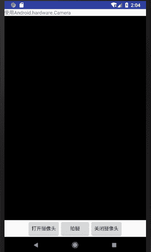

# Android Camera 相机以及相机程序开发实例

> 原文：[`c.biancheng.net/view/3092.html`](http://c.biancheng.net/view/3092.html)

在之前的教程中介绍过拍照程序，是通过 Intent 调用 Android 系统提供的照相机程序实现的。

Android SDK 提供了直接操作移动设备摄像头的 android.hardware.Camera 类，通过该类的相关 API，可以直接操作 Android 手机中的摄像头，以方便开发自己的拍照程序。

使用 Camera 类访问移动设备的摄像头，需要在应用程序的 AndroidManifest.xml 文件中做以下声明：

<uses-permission android:name="android.permission.CAMERA" />
<uses-feature android:name="android.hardware.camera" />

使用 Camera 类进行拍照的步骤如下：

1）使用 Camera.open() 方法获取 Camera 对象实例。

2）使用 Camera.getParameters() 方法获取当前相机的相关设置。

3）根据需要使用 Camera.setParameters() 方法设置相机的相关参数。

4）根据需要使用 Camera.setDisplayOrientation() 设置相机正向。

5）使用 Camera.setPreviewDisplay() 方法为相机设置一个用于显示相机图像的 Surface。

6）使用 Camera.startPreview() 启动预览。

7）使用 Camera.takePicture() 方法进行拍照。

8）进行拍照后，预览视图会停止。使用 Camera.startPreview() 方法重新启动预览。

9）使用 Camera.stopPreview() 停止预览。

10）使用 Camera.release() 方法释放相机对象。应该在应用程序的 onPause() 方法中释放相机对象，在 onResume() 方法中重新打开相机对象。

实例 MyCameraDemo 演示了使用 Camera 类进行拍照的过程，该应用程序的运行效果如图 1 所示。

图 1  MyCameraDemo 运行结果
该视图所使用布局文件 main.xml 的代码如下：

```

<?xml version="1.0" encoding="utf-8"?>
<LinearLayout xmlns:android="http://schemas.android.com/apk/res/android"
    android:layout_width="fill_parent"
    android:layout_height="fill_parent"
    android:orientation="vertical">

    <TextView
        android:layout_width="fill_parent"
        android:layout_height="wrap_content"
        android:text="@string/hello" />

    <SurfaceView
        android:id="@+id/surfaceView1"
        android:layout_width="fill_parent"
        android:layout_height="wrap_content"
        android:layout_weight="0.58" />

    <LinearLayout
        android:id="@+id/linearLayout1"
        android:layout_width="match_parent"
        android:layout_height="wrap_content"
        android:gravity="center">

        <Button
            android:id="@+id/button1"
            android:layout_width="wrap_content"
            android:layout_height="wrap_content"
            android:text="@string/opBtn" />

        <Button
            android:id="@+id/button2"
            android:layout_width="wrap_content"
            android:layout_height="wrap_content"
            android:text="@string/play" />

        <Button
            android:id="@+id/button3"
            android:layout_width="wrap_content"
            android:layout_height="wrap_content"
            android:text="@string/cloBtn" />

    </LinearLayout>

</LinearLayout>
```

实例 MyCameraDemo 使用到的资源文件 string.xml 的代码如下：

```

<resources>
    <string name="hello">使用 Android.hardware.Camera</string>
    <string name="app_name">MyCameraDemo</string>
    <string name="opBtn">打开摄像头</string>
    <string name="play">拍摄</string>
    <string name="cloBtn">关闭摄像头</string>
</resources>
```

由于实例 MyCameraDemo 中涉及将拍摄的照片保存到 SD 卡中的功能，因此需要在该工程的 AndroidManifest.xml 文件中声明相应权限。该文件内容如下：

```

<?xml version="1.0" encoding="utf-8"?>
<manifest xmlns:android="http://schemas.android.com/apk/res/android"
    package="introduction.android.mycamerademo"
    android:versionCode="1"
    android:versionName="1.0">

    <uses-sdk android:minSdkVersion="14" />
    <uses-feature android:name="android.hardware.camera" />

    <uses-permission android:name="android.permission.CAMERA" />
    <uses-permission android:name="android.permission.WRITE_EXTERNAL_STORAGE" />

    <application
        android:allowBackup="true"
        android:icon="@mipmap/ic_launcher"
        android:label="@string/app_name"
        android:roundIcon="@mipmap/ic_launcher_round"
        android:supportsRtl="true"
        android:theme="@style/AppTheme">
        <activity android:name=".MainActivity">
            <intent-filter>
                <action android:name="android.intent.action.MAIN" />

                <category android:name="android.intent.category.LAUNCHER" />
            </intent-filter>
        </activity>
    </application>

</manifest>
```

实例 MyCameraDemo 的主 Activity 为 MainActivity，其代码如下：

```

package introduction.android.mycamerademo;

import java.io.BufferedOutputStream;
import java.io.File;

import java.io.FileNotFoundException;
import java.io.FileOutputStream;
import java.io.IOException;

import android.app.Activity;
import android.graphics.Bitmap;
import android.graphics.BitmapFactory;
import android.graphics.PixelFormat;
import android.hardware.Camera;
import android.hardware.Camera.Parameters;
import android.hardware.Camera.PictureCallback;
import android.os.Bundle;
import android.util.Log;
import android.view.SurfaceHolder;
import android.view.SurfaceView;
import android.view.View;
import android.view.View.OnClickListener;
import android.widget.Button;

public class MainActivity extends Activity {
    private Button opbtn;
    private Button playbtn;
    private Button clobtn;
    private SurfaceView surfaceView;
    private SurfaceHolder surfaceHolder;
    private Camera camera;
    private int previewWidth = 320;
    private int previewHeight = 240;

    protected String filepath = "/sdcard/mypicture.jpg";

    /**
     * Called when the activity is first created.
     */
    @Override
    public void onCreate(Bundle savedInstanceState) {
        super.onCreate(savedInstanceState);
        setContentView(R.layout.activity_main);
        opbtn = (Button) this.findViewById(R.id.button1);
        playbtn = (Button) this.findViewById(R.id.button2);
        clobtn = (Button) this.findViewById(R.id.button3);
        surfaceView = (SurfaceView) this.findViewById(R.id.surfaceView1);
        surfaceHolder = surfaceView.getHolder();
        surfaceHolder.addCallback(new SurfaceHolder.Callback() {

            @Override
            public void surfaceDestroyed(SurfaceHolder holder) {
                // TODO Auto-generated method stub
                Log.i("camera", "surface destroyed.");
            }

            @Override
            public void surfaceCreated(SurfaceHolder holder) {
                // TODO Auto-generated method stub
                Log.i("camera", "surface destroyed");
            }

            @Override
            public void surfaceChanged(SurfaceHolder holder, int format, int width, int height) {
                // TODO Auto-generated method stub
                Log.i("camera", "surface changed.");
            }
        });
        opbtn.setOnClickListener(new OnClickListener() {
            //开启摄像头
            @Override
            public void onClick(View argO) {
                // TODO Auto-generated method stub
                openCamera();
            }
        });
        playbtn.setOnClickListener(new OnClickListener() {
            //拍照
            @Override
            public void onClick(View v) {
                // TODO Auto-generated method stub
                takePicture();
            }
        });
        clobtn.setOnClickListener(new OnClickListener() {
            //关闭摄像头
            @Override
            public void onClick(View v) {
                // TODO Auto-generated method stub
                closeCamera();
            }
        });
    }

    protected void closeCamera() {
        // TODO Auto-generated method stub
        camera.stopPreview();
        camera.release();
        camera = null;
    }

    protected void takePicture() {
        // TODO Auto-generated method stub
        if (checkSDCard()) {
            camera.takePicture(null, null, jpeg);
            try {
                Thread.sleep(1000);
            } catch (InterruptedException e) {
                // TODO Auto-generated catch block
                e.printStackTrace();
            }
            camera.startPreview();
        } else {
            Log.e("camera", "SD CARD not exist.");
            return;
        }
    }

    private void openCamera() {
        // TODO Auto-generated method stub
        try {
            camera = Camera.open(); // attempt to get a Camera instance
        } catch (Exception e) {
            // Camera is not available (in use or does not exist)
            Log.e("camera", "open camera error!");
            e.printStackTrace();
            return;
        }
        Parameters params = camera.getParameters();
        params.setPreviewSize(previewWidth, previewHeight);
        params.setPictureFormat(PixelFormat.JPEG);
        params.setPictureSize(previewWidth, previewHeight);
        camera.setParameters(params);
        try {
            camera.setPreviewDisplay(surfaceHolder);
        } catch (IOException e) {
            // TODO Auto-generated catch block
            Log.e("camera", "preview failed.");
            e.printStackTrace();
        }
        camera.startPreview();
    }

    private PictureCallback jpeg = new PictureCallback() {
        @Override
        public void onPictureTaken(byte[] data, Camera camera) {
            // TODO Auto-generated method stub
            Bitmap bitmap = BitmapFactory.decodeByteArray(data, 0, data.length);
            File pictureFile = new File(filepath);
            if (pictureFile == null) {
                Log.d("camera",
                        "Error creating media file, check storage permissions");
                return;
            }
            try {
                //将拍摄的照片写入 SD 卡中
                FileOutputStream fos = new FileOutputStream(pictureFile);
                BufferedOutputStream bos = new BufferedOutputStream(fos);
                bitmap.compress(Bitmap.CompressFormat.JPEG, 80, bos);
                bos.flush();
                bos.close();
                fos.close();
                Log.i("camera", "jpg file saved.");
            } catch (FileNotFoundException e) {
                Log.d("camera", "File not found: " + e.getMessage());
            } catch (IOException e) {
                Log.d("camera", "Error accessing file: " + e.getMessage());
            }
        }
    };

    private boolean checkSDCard() {
        // 判断 SD 存储卡是否存在
        if (android.os.Environment.getExternalStorageState().equals
                (android.os.Environment.MEDIA_MOUNTED)) {
            return true;
        } else {
            return false;
        }
    }
}
```

其中，openCamera() 方法用于打开当前设备的相机，并通过：

```

Parameters params=camera.getParameters();
params.setPreviewSize(previewWidth, previewHeight);
params.setPictureFormat(PixelFormat.JPEG);
params.setPictureSize(previewWidth, previewHeight);
camera.setParameters(params);
```

设置相机的相关参数，以用于照片拍摄。

通过以下代码：

surfaceView=(SurfaceView)this.findViewById(R.id.surfaceView1);
surfaceHolder=surfaceView.getHolder();
camera.setPreviewDisplay(surfaceHolder);

将布局中的 SurfaceView 组件设置为相机的预览窗口。

由于在拍摄照片后，预览视图会自动停止预览而显示拍摄的照片，因此在本例中人为将照片显示时间设定为 1s，然后重新启动预览。相关代码如下：

```

camera.takePicture(null, null, jpeg);
try {
    Thread.sleep(1000);
} catch (InterruptedException e) {
    // TODO Auto-generated catch block
    e.printStackTrace();
}
camera.startPreview();
```