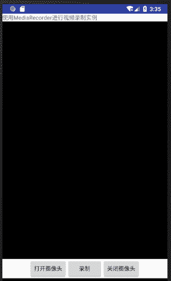

# Android MediaRecorder 录制视频

> 原文：[`c.biancheng.net/view/3095.html`](http://c.biancheng.net/view/3095.html)

视频录制也可以通过 MediaRecorder 类完成，其步骤与音频录制基本相同，只是添加了一些对视频进行处理的操作。

视频录制的基本步骤如下：

**1) 调用 Camera.open()方法打开摄像头。**

**2) 调用 Camera.setPreviewDisplay() 连接预览窗口**
以便将从摄像头获取的图像放置到预览窗口中显示出来。

**3) 调用 Camera.startPreview()启动预览**
显示摄像头拍摄到的图像。

**4) 使用 MediaRecorder 进行视频录制。**

1．使用 Camera.unlock() 方法解锁摄像头，以使 MediaRecorder 获得对摄像头的使用权。

2．配置 MediaRecorder。

1）建立 MediaRecorder 类的对象，并设置音频源和视频源：

MediaRecorder recorder=new MediaRecorder();
recorder.setAudioSource(MediaRecorder.AudioSource.MIC);
recorder.setVideoSource(MediaRecorder.VideoSource.CAMERA);

2）设置视频的输出和编码格式。在 Android 2.2（API Level 8）以上版本的 SDK 中，可以直接调用 MediaRecorder.setProfile 方法进行相关配置：

recorder.setProfile(CamcorderProfile.get(CamcorderProfile.QUALITY_LOW));

其中，MediaRecorder.setProfile() 方法为 Android 2.2（API Level 8）之后 MediaRecorder 类新提供的方法，通过 CamcorderProfile 对象可用于对 MediaRecorder 进行相关设置。

CamcorderProfile 为预先定义好的一组视频录制相关配置信息。

Android SDK 共定义了 14 种 CamcorderProfile 配置，如 CamcorderProfile. QUALITY_HIGH、CamcorderProfile. QUALITY_LOW、CamcorderProfile. QUALITY_TIME_LAPSE_1080P 等。其中，QUALITY_LOW 和 QUALITY_HIGH 两种配置是所有的摄像头都支持的，其他配置则根据硬件性能决定。

每一种配置都涉及文件输出格式、视频编码格式、视频比特率、视频帧率、视频的高和宽、音频编码格式、音频的比特率、音频采样率和音频录制的通道数几个方面。通过使用这些预定义配置能够降低代码复杂度，提高编码效率。

3）设置录制的视频文件的保存位置及文件名：

MediaRecorder.setOutputFile(PATH_NAME);

4）使用 MediaRecorder.setPreviewDisplay() 方法指定 MediaRecorder 的视频预览窗口。

需要注意的是，以上配置过程必须按照顺序进行，否则会发生错误。

3．将录像器置于准备状态：

MediaRecorder.prepare();

4．启动录像器：

MediaRecorder.start();

5．进行视频录制：

**5) 视频录制完成后，可使用以下方法停止视频录制。**

1．停止录像器：

MediaRecorder.stop();

2．重置录像器的相关配置：

MediaRecorder.reset()

3．释放录像器对象：

MediaRecorder.release();

4．调用 Camera.lock() 方法锁定摄像头。从 Android N 开始，该调用也不再必需，除非 MediaRecorder.prepare() 方法失败。

**6) 调用 Camera.stopPreview()方法停止预览。**

**7) 调用 Camera.release()方法释放摄像头 。**

另外，在 Android N 系统下，Camera.unlock() 方法和 Camera.lock() 方法可由 Android 框架来完成。

实例 VideoRecorderDemo 演示了使用 MediaRecorder 进行视频录制的过程，该实例的运行效果如图 1 所示。


图 1  VideoRecorderDemo 
实例 VideoRecorderDemo 使用的布局文件 main.xml 的内容如下：

```

<?xml version="1.0" encoding="utf-8"?>
<LinearLayout xmlns:android="http://schemas.android.com/apk/res/android"
    android:layout_width="fill_parent"
    android:layout_height="fill_parent"
    android:orientation="vertical">

    <TextView
        android:layout_width="fill_parent"
        android:layout_height="wrap_content"
        android:text="@string/hello" />

    <SurfaceView
        android:id="@+id/surfaceView1"
        android:layout_width="fill_parent"
        android:layout_height="wrap_content"
        android:layout_weight="0.58" />

    <LinearLayout
        android:id="@+id/linearLayout1"
        android:layout_width="match_parent"
        android:layout_height="wrap_content"
        android:gravity="center">

        <Button
            android:id="@+id/button1"
            android:layout_width="wrap_content"
            android:layout_height="wrap_content"
            android:text="@string/opBtn" />

        <Button
            android:id="@+id/button2"
            android:layout_width="wrap_content"
            android:layout_height="wrap_content"
            android:text="@string/play" />

        <Button
            android:id="@+id/button3"
            android:layout_width="wrap_content"
            android:layout_height="wrap_content"
            android:text="@string/cloBtn" />

    </LinearLayout>

</LinearLayout>
```

其对应的资源文件 strings.xml 的内容如下：

```

<resources>
    <string name="hello">使用 MediaRecorder 进行视频录制实例</string>
    <string name="app_name">VideoRecorder</string>
    <string name="opBtn">打开摄像头</string>
    <string name="play">录制</string>
    <string name="cloBtn">关闭摄像头</string>
</resources>
```

由于实例 VideoRecorderDemo 中涉及音频录制、使用摄像头、向 SD 卡写文件等操作，因此需要在该工程的 AndroidManifest.xml 文件中声明相应权限。该文件内容如下：

```

<?xml version="1.0" encoding="utf-8"?>
<manifest xmlns:android="http://schemas.android.com/apk/res/android"
    package="introduction.android.mycamerademo"
    android:versionCode="1"
    android:versionName="1.0">

    <uses-sdk android:minSdkVersion="14" />
    <uses-feature android:name="android.hardware.camera.autofocus" />
    <uses-feature android:name="android.permission.CAMERA"/>
    <uses-permission android:name="android.permission.CAMERA" />
    <uses-permission android:name="android.permission.WRITE_EXTERNAL_STORAGE" />

    <application
        android:allowBackup="true"
        android:icon="@mipmap/ic_launcher"
        android:label="@string/app_name"
        android:roundIcon="@mipmap/ic_launcher_round"
        android:supportsRtl="true"
        android:theme="@style/AppTheme">
        <activity android:name=".MainActivity">
            <intent-filter>
                <action android:name="android.intent.action.MAIN" />

                <category android:name="android.intent.category.LAUNCHER" />
            </intent-filter>
        </activity>
    </application>

</manifest>
```

实例 VideoRecorderDemo 的主 Activity 为 VideoRecorderDemoActivity，其代码如下：

```

package introduction.android.mycamerademo;

import java.io.BufferedOutputStream;
import java.io.File;

import java.io.FileNotFoundException;
import java.io.FileOutputStream;
import java.io.IOException;

import android.app.Activity;
import android.graphics.Bitmap;
import android.graphics.BitmapFactory;
import android.graphics.PixelFormat;
import android.hardware.Camera;
import android.hardware.Camera.Parameters;
import android.hardware.Camera.PictureCallback;
import android.media.MediaRecorder;
import android.os.Bundle;
import android.util.Log;
import android.view.SurfaceHolder;
import android.view.SurfaceView;
import android.view.View;
import android.view.View.OnClickListener;
import android.widget.Button;

public class MainActivity extends Activity {
    private Button opbtn;
    private Button playbtn;
    private Button clobtn;
    private SurfaceView surfaceView;
    private SurfaceHolder surfaceHolder;
    private Camera camera;
    private MediaRecorder videoRecorder;
    private String myVideofilepath = "sdcard/myvideo.3gp";

    /**
     * Called when the activity is first created.
     */
    @Override
    public void onCreate(Bundle savedInstanceState) {
        super.onCreate(savedInstanceState);
        setContentView(R.layout.activity_main);
        opbtn = (Button) this.findViewById(R.id.button1);
        playbtn = (Button) this.findViewById(R.id.button2);
        clobtn = (Button) this.findViewById(R.id.button3);
        videoRecorder = new MediaRecorder();
        surfaceView = (SurfaceView) this.findViewById(R.id.surfaceView1);
        surfaceHolder = surfaceView.getHolder();
        surfaceHolder.addCallback(new SurfaceHolder.Callback() {

            @Override
            public void surfaceDestroyed(SurfaceHolder holder) {
                // TODO Auto-generated method stub
                Log.i("camera", "surface destroyed.");
                surfaceHolder = null;
                stopRecording();
                releaseCamera();
            }

            @Override
            public void surfaceCreated(SurfaceHolder holder) {
                // TODO Auto-generated method stub
                Log.i("camera", "surface destroyed");
                surfaceHolder = holder;
            }

            @Override
            public void surfaceChanged(SurfaceHolder holder, int format, int width, int height) {
                // TODO Auto-generated method stub
                Log.i("camera", "surface changed.");
                surfaceHolder = holder;
            }
        });
        opbtn.setOnClickListener(new OnClickListener() {
            @Override
            public void onClick(View argO) {
                // TODO Auto-generated method stub
                openCamera();
            }
        });
        playbtn.setOnClickListener(new OnClickListener() {
            @Override
            public void onClick(View v) {
                // TODO Auto-generated method stub
                benginRecording();
            }
        });
        clobtn.setOnClickListener(new OnClickListener() {
            @Override
            public void onClick(View v) {
                // TODO Auto-generated method stub
                stopRecording();
            }
        });
    }

    @Override
    protected void onPause() {
        // TODO Auto-generated method stub
        super.onPause();
        stopRecording();
        releaseCamera();
    }

    protected void stopRecording() {
        // TODO Auto-generated method stub
        Log.i("videoRecorder", "stopRecording...");
        if (videoRecorder != null) {
            videoRecorder.stop();
            videoRecorder.reset();
            videoRecorder.release();
            videoRecorder = null;
            camera.lock();
        }
    }

    private void releaseCamera() {
        if (camera != null) {
            camera.release();
            camera = null;
        }
    }

    protected void benginRecording() {
        Log.i("videoRecorder", "beginRecording");
        //给摄像头解锁
        camera.unlock();
        //MediaRecorder 获取到摄像头的访问权
        videoRecorder.setCamera(camera);
        //设置视频录制过程中所录制的音频来自手机的麦克风
        videoRecorder.setAudioSource(MediaRecorder.AudioSource.CAMCORDER);
        //设置视频源为摄像头
        videoRecorder.setVideoSource(MediaRecorder.VideoSource.CAMERA);
        //设置视频录制的输出文件为 3gp 文件
        videoRecorder.setOutputFormat(MediaRecorder.OutputFormat.THREE_GPP);
        //设置音频编码方式为 AAC
        videoRecorder.setAudioEncoder(MediaRecorder.AudioEncoder.AAC);
        //设置录制的视频编码为 H.264
        videoRecorder.setVideoEncoder(MediaRecorder.VideoEncoder.H264);
        videoRecorder.setVideoSize(176, 144);
        videoRecorder.setVideoFrameRate(20);
        if (!checkSDCard()) {
            Log.e("videoRecorder", "未找到 SD 卡!");
            return;
        }
        videoRecorder.setOutputFile(myVideofilepath);
        videoRecorder.setPreviewDisplay(surfaceHolder.getSurface());
        try {
            videoRecorder.prepare();
        } catch (IllegalStateException e) {
            // TODO Auto-generated catch block
            e.printStackTrace();
        } catch (IOException e) {
            // TODO Auto-generated catch block
            e.printStackTrace();
        }
        videoRecorder.start();
    }

    private void openCamera() {

        // TODO Auto-generated method stub
        Log.i("videoRecorder", "openCamera.");
        try {
            camera = Camera.open(); // attempt to get a Camera instance
        } catch (Exception e) {
            // Camera is not available (in use or does not exist)
            Log.e("camera", "open camera error!");
            e.printStackTrace();
            return;
        }

        try {
            camera.setPreviewDisplay(surfaceHolder);
        } catch (IOException e) {
            // TODO Auto-generated catch block
            Log.e("camera", "preview failed.");
            e.printStackTrace();
        }
        camera.startPreview();
    }

    private boolean checkSDCard() {
        // 判断 SD 存储卡是否存在
        if (android.os.Environment.getExternalStorageState().equals(
                android.os.Environment.MEDIA_MOUNTED)) {
            return true;
        } else {
            return false;
        }
    }
}
```

该实例中，在对 MediaRecorder 进行设置时，没有使用：

videoRecorder.setProfile(CamcorderProfile.get(CamcorderProfile.QUALITY_LOW));

而是使用以下代码对 MediaRecorder 进行设置：

```

//设置视频录制的输出文件为 3gp 文件
videoRecorder.setOutputFormat(MediaRecorder.OutputFormat.THREE_GPP);
//设置音频编码方式为 AAC
videoRecorder.setAudioEncoder(MediaRecorder.AudioEncoder.AAC);
//设置录制的视频编码为 H.264
videoRecorder.setVideoEncoder(MediaRecorder.VideoEncoder.H264);
//设置视频录制的分辨率，必须放在设置编码和格式的后面，否则报错
videoRecorder.setVideoSize(176, 144);
//设置录制的视频的视频帧率，必须放在设置编码和格式的后面，否则报错
videoRecorder.setVideoFrameRate(20);
```