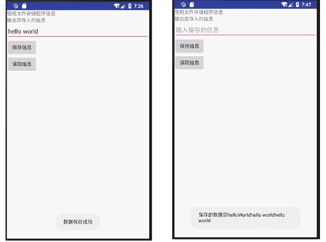

# Android 数据存储之文件存储

> 原文：[`c.biancheng.net/view/3103.html`](http://c.biancheng.net/view/3103.html)

Android 的文件存储方式分为两种：内部存储和外部存储。

#### 1) 内部存储

内部存储是指将应用程序的数据以文件方式存储到设备内存中。以内部存储方式存储的文件属于其所创建的应用程序私有，其他应用程序无权进行操作。

当创建的应用程序被卸载时，其内部存储的文件也随之被删除。当内部存储器的存储空间不足时，缓存文件可能会被删除以释放空间。

因此，缓存文件是不可靠的。当使用缓存文件时，自己应该维护好缓存文件，并且将缓存文件限制在特定大小之内。

使用文件存储信息时，使用 openFileOutput 和 openFileInput 进行文件的读写，这跟 Java 中的 I/O 程序很类似。创建并写内部存储文件的步骤如下：

**1）**通过 Context.openFileOutput(String name, int mode) 方法打开文件并设定读写方式，返回 FileOutputStream。

其中，参数 mode 取值为：

*   MODE_PRIVATE：默认访问方式，文件仅能被创建应用程序访问。
*   MODE_APPEND：若文件已经存在，则在文件末尾继续写入数据，而不抹掉文件原有内容。
*   MODE_WORLD_READABLE：允许该文件被其他应用程序执行读取内容操作。
*   MODE_WORLD_WRITEABLE：允许该文件被其他应用程序执行写操作。

**2)** 调用 FileOutputStream.write() 方法写入数据。

**3)** 调用 FileOutputStream.close() 方法关闭输出流，完成写操作。

内部存储文件的写文件示例代码如下：

```

String FILENAME="hello_file";
String string="hello world";
FileOutputStream fos = openFileOutput(FILENAME,Context.MODE_PRIVATE);
fos.write(string.getBytes());
fos.close();
```

#### 2) 外部存储

外部存储是指将文件存储到一些外部存储设备上。例如 SD 卡或者设备内嵌的存储卡，属于永久性的存储方式。

外部存储的文件不被某个应用程序所特有，可以被其他应用程序共享，当将该外部存储设备连接到计算机上时，这些文件可以被浏览、修改和删除。因此，这种存储方式不具有安全性。

由于外部存储器可能处于被移除、连接到计算机、丢失、只读或者其他各种状态，因此在使用外部存储之前，必须使用 Environment.getExternalStorageState() 方法来确认外部存储器是否可用。

验证外部存储器是否可读写的代码如下：

```

boolean mExternalStorageAvailable=false;
boolean mExternalStorageWriteable=false;
String state = Environment.getExternalStorageState();
if(Environment.MEDIA_MOUNTED.equals(state)){
    //外部存储器可读写
    mExternalStorageAvailable = mExternalStorageWriteable = true;
}else if(Environment.MEDIA_MOUNTED_READ_ONLY.equals(state)){
    //外部存储器可读不可写
    mExternalStorageAvailable=true;
    mExternalStorageWriteable=false;
}else{
    //外部存储器不可读写，处于其他状态
    mExternalStorageAvailable = mExternalStorageWriteable = false;
}
```

此外，在程序开发过程中还可以使用缓存文件（Cache），内部存储和外部存储都可以用于保存缓存文件。

如上述一样，当存储器的存储空间不足时，缓存文件可能会被删除以释放空间。因此，缓存文件是不可靠的。当使用缓存文件时，应该自己维护好缓存文件，并且将缓存文件限制在特定大小之内。

## 使用文件存储功能

实例 FileDemo 演示了使用文件存储的功能，其运行效果如图 1 所示。


图 1  FileDemo 运行结果
该实例将文本框中输入的内容存储到名为 text 的文件中。当该应用程序再次启动时，可以从 text 文件写入的内容中读取并显示出来。

本实例使用内部存储方式，我们可以在 data/data/<your package name>/files 目录下找到名为 text 的文件。

本实例没有将文件放置到 SD 卡 中，可自行实现将文件保存在 SD 卡中的操作。

实例 FileDemo 的布局文件 main.xml 中放置了两个 TextView、一个 EditText 和两个 Button，其代码如下：

```

<?xml version="1.0" encoding="utf-8"?>
<LinearLayout xmlns:android="http://schemas.android.com/apk/res/android"
    android:layout_width="fill_parent"
    android:layout_height="fill_parent"
    android:orientation="vertical">

    <TextView
        android:layout_width="fill_parent"
        android:layout_height="wrap_content"
        android:text="使用文件存储程序信息" />

    <TextView
        android:layout_width="fill_parent"
        android:layout_height="wrap_content"
        android:text="输出您存入的信息" />

    <EditText
        android:id="@+id/phone_text"
        android:layout_width="fill_parent"
        android:layout_height="wrap_content"
        android:hint="输入保存的信息" />

    <LinearLayout
        android:layout_width="wrap_content"
        android:layout_height="wrap_content"
        android:orientation="vertical">

        <Button
            android:id="@+id/SaveButton"
            android:layout_width="wrap_content"
            android:layout_height="wrap_content"
            android:text="保存信息" />

        <Button
            android:id="@+id/LoadButton"
            android:layout_width="wrap_content"
            android:layout_height="wrap_content"
            android:text="读取信息" />

    </LinearLayout>

</LinearLayout>
```

实例 FileDemo 中 AndroidManifest.xml 文件的代码如下：

```

<?xml version="1.0" encoding="utf-8"?>
<manifest xmlns:android="http://schemas.android.com/apk/res/android"
    package="introduction.android.fileDemo"
    android:versionCode="1"
    android:versionName="1.0">

    <uses-sdk android:minSdkVersion="14" />
    <application
        android:allowBackup="true"
        android:icon="@mipmap/ic_launcher"
        android:label="@string/app_name"
        android:roundIcon="@mipmap/ic_launcher_round"
        android:supportsRtl="true"
        android:theme="@style/AppTheme">
        <activity android:name=".MainActivity">
            <intent-filter>
                <action android:name="android.intent.action.MAIN" />

                <category android:name="android.intent.category.LAUNCHER" />
            </intent-filter>
        </activity>
    </application>

</manifest>
```

实例 FileDemo 中 MainActivity.java 的代码如下：

```

import android.app.Activity;
import android.os.Bundle;
import android.view.View;
import android.widget.Button;
import android.widget.EditText;
import android.widget.Toast;

import java.io.FileInputStream;
import java.io.FileOutputStream;

public class MainActivity extends Activity {
    private EditText SaveText;
    private Button SaveButton, LoadButton;

    @Override
    public void onCreate(Bundle savedInstanceState) {
        super.onCreate(savedInstanceState);
        setContentView(R.layout.activity_main);
        SaveText = (EditText) findViewById(R.id.phone_text);
        SaveButton = (Button) findViewById(R.id.SaveButton);
        LoadButton = (Button) findViewById(R.id.LoadButton);
        SaveButton.setOnClickListener(new ButtonListener());
        LoadButton.setOnClickListener(new ButtonListener());
    }

    private class ButtonListener implements View.OnClickListener {
        @Override
        public void onClick(View v) {
            switch (v.getId()) {
                /*保存数据*/
                case R.id.SaveButton:
                    String saveinfo = SaveText.getText().toString().trim();
                    FileOutputStream fos;
                    try {
                        fos = openFileOutput("text", MODE_APPEND);
                        fos.write(saveinfo.getBytes());
                        fos.close();
                    } catch (Exception e) {
                        e.printStackTrace();
                    }
                    Toast.makeText(MainActivity.this, "数据保存成功", Toast.LENGTH_LONG).
                            show();
                    break;
                /*读取数据*/
                case R.id.LoadButton:
                    String get = "";
                    try {
                        FileInputStream fis = openFileInput("text");
                        byte[] buffer = new byte[fis.available()];
                        fis.read(buffer);
                        get = new String(buffer);
                    } catch (Exception e) {
                        e.printStackTrace();
                    }

                    Toast.makeText(MainActivity.this, "保存的数据是" + get,
                            Toast.LENGTH_LONG).show();
                    break;
                default:
                    break;

            }
        }
    }
}
```