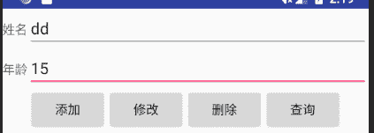

# Android SQLite 数据库操作实例

> 原文：[`c.biancheng.net/view/3112.html`](http://c.biancheng.net/view/3112.html)

上一节教程我们主要介绍了如何使用 Android SQLite 数据库存储数据，那么这一节我们就来实际操作一下吧！

实例 MyDbDemo 演示了使用 SQLiteOpenHelper 和 SQLiteDatabase 对数据库进行操作的过程，其运行效果如图 1 所示。


图 1  MyDbDemo 界面
实例 MyDbDemo 使用 SQLiteOpenHelper 对象建立了数据库文件“mydb”，通过 SQLiteDatabase 对象对该数据库进行数据的查询、插入、修改和删除操作，并显示到 ListView 组件中。

实例 MyDbDemo 的运行界面实际上由两个 XML 文件组成，分别是 main.xml 和 listview.xml。其中 main.xml 文件的代码如下：

```

<?xml version="1.0" encoding="utf-8"?>

<LinearLayout xmlns:android="http://schemas.android.com/apk/res/android"
    android:layout_width="fill_parent"
    android:layout_height="fill_parent"
    android:orientation="vertical">

    <LinearLayout
        android:layout_width="fill_parent"
        android:layout_height="wrap_content"
        android:addStatesFromChildren="true">

        <TextView
            android:layout_width="wrap_content"
            android:layout_height="wrap_content"
            android:text="姓名"
            android:textColor="?android:attr/textColorSecondary" />

        <EditText
            android:id="@+id/et_name"
            android:layout_width="wrap_content"
            android:layout_height="wrap_content"
            android:layout_weight="1"
            android:singleLine="true" />
    </LinearLayout>

    <LinearLayout
        android:layout_width="fill_parent"
        android:layout_height="wrap_content"
        android:addStatesFromChildren="true">

        <TextView
            android:layout_width="wrap_content"
            android:layout_height="wrap_content"
            android:text="年龄"
            android:textColor="?android:attr/textColorSecondary" />

        <EditText
            android:id="@+id/et_age"
            android:layout_width="wrap_content"
            android:layout_height="wrap_content"
            android:layout_weight="1"
            android:singleLine="true" />
    </LinearLayout>

    <LinearLayout
        android:layout_width="fill_parent"
        android:layout_height="wrap_content"
        android:addStatesFromChildren="true"
        android:gravity="center">

        <Button
            android:id="@+id/bt_add"
            android:layout_width="wrap_content"
            android:layout_height="wrap_content"
            android:onClick="addbutton"
            android:text="添加"></Button>

        <Button
            android:id="@+id/bt_modify"
            android:layout_width="wrap_content"
            android:layout_height="wrap_content"
            android:onClick="updatebutton"
            android:text="修改"></Button>

        <Button
            android:id="@+id/bt_del"
            android:layout_width="wrap_content"
            android:layout_height="wrap_content"
            android:onClick="updatebutton"
            android:text="删除"></Button>

        <Button
            android:id="@+id/bt_query"
            android:layout_width="wrap_content"
            android:layout_height="wrap_content"
            android:onClick="querybutton"
            android:text="查询"></Button>
    </LinearLayout>

    <ListView
        android:id="@+id/listView"
        android:layout_width="fill_parent"
        android:layout_height="wrap_content"
        android:padding="5dip"></ListView>
</LinearLayout>
```

由代码可见，main.xml 实际上实现的是如图 2 所示的效果。


图 2  main.xml 界面
该布局中放置了两个 TextView、两个 EditText 和 4 个按钮，在按钮的下面是一个 ListView 组件，但是该 ListView 没有对显示效果进行任何的限制。

实例 MyDbDemo 中 listview.xml 文件的代码如下：

```

<?xml version="1.0" encoding="utf-8"?>
<LinearLayout xmlns:android="http://schemas.android.com/apk/res/android"
    android:id="@+id/linear"
    android:layout_width="wrap_content"
    android:layout_height="wrap_content"
    android:padding="5dip">

    <TextView
        android:id="@+id/tvID"
        android:layout_width="80dp"
        android:layout_height="wrap_content" />

    <TextView
        android:id="@+id/tvName"
        android:layout_width="80dp"
        android:layout_height="wrap_content" />

    <TextView
        android:id="@+id/tvAge"
        android:layout_width="80dp"
        android:layout_height="wrap_content" />
</LinearLayout>

```

可见 listview.xml 布局中横向放置了三个 TextView 用于显示数据。

该实例实际的运行效果是使用 listview.xml 中的数据格式替换 main.xml 中 ListView 组件的数据格式后实现的。该效果通过 LayoutInflater 类的对象进行实现。

实例 MyDbDemo 中 AndroidManifest.xml 文件的代码如下：

```

<?xml version="1.0" encoding="utf-8"?>
<manifest xmlns:android="http://schemas.android.com/apk/res/android"
    package="introduction.android.mydbdemo"
    android:versionCode="1"
    android:versionName="1.0">

    <uses-sdk android:minSdkVersion="14" />
    <application
        android:allowBackup="true"
        android:icon="@mipmap/ic_launcher"
        android:label="@string/app_name"
        android:roundIcon="@mipmap/ic_launcher_round"
        android:supportsRtl="true"
        android:theme="@style/AppTheme">
        <activity android:name=".MainActivity">
            <intent-filter>
                <action android:name="android.intent.action.MAIN" />
                <category android:name="android.intent.category.LAUNCHER" />
            </intent-filter>
        </activity>
    </application>

</manifest>
```

实例 MyDbDemo 中 SQLiteOpenHelper 的子类 dbHelper 的实现代码如下：

```

package introduction.android.mydbdemo;

import android.content.Context;
import android.database.sqlite.SQLiteDatabase;
import android.database.sqlite.SQLiteDatabase.CursorFactory;
import android.database.sqlite.SQLiteOpenHelper;

public class dbHelper extends SQLiteOpenHelper {
    public static final String TB_NAME = "friends";

    public dbHelper(Context context, String name, CursorFactory factory, int version) {
        super(context, name, factory, version);
        // TODO Auto-generated constructor stub
    }

    @Override
    public void onCreate(SQLiteDatabase db) {
        // TODO Auto-generated method stub
        db.execSQL("CREATE TABLE IF NOT EXISTS " +
                TB_NAME + " ( _id integer primary key autoincrement," +//
                "name varchar," +
                "age integer" +
                ") ");
    }

    @Override
    public void onUpgrade(SQLiteDatabase db, int oldVersion, int newVersion) {
        // TODO Auto-generated method stub
        db.execSQL("DROP TABLE IF EXISTS " + TB_NAME);
        onCreate(db);
    }
}
```

子类 dbHelper 重写了父类 SQLiteOpenHelper 的两个抽象方法 onCreate() 和 onUpgrade()。

在 onCreate() 方法中创建了一个名为 friends 的数据表，该数据表有 _id、name 和 age 三个字段，其中 _id 为自增加主键。

onUpgrade() 方法实现了删除现有数据表并且重建的功能。

实例 MyDbDemo 中的主 Activity 所对应文件 MainActivity.java 的代码如下：

```

package introduction.android.mydbdemo;

import android.app.Activity;
import android.content.ContentValues;
import android.database.Cursor;
import android.database.sqlite.SQLiteDatabase;
import android.os.Bundle;
import android.util.Log;
import android.view.View;
import android.widget.AdapterView;
import android.widget.Button;
import android.widget.EditText;
import android.widget.ListView;
import android.widget.SimpleAdapter;

import java.util.ArrayList;
import java.util.HashMap;
import java.util.Map;

public class MainActivity extends Activity {
    private static String DB_NAME = "mydb";
    private EditText et_name;
    private EditText et_age;
    private ArrayList<Map<String, Object>> data;
    private dbHelper dbHelper;
    private SQLiteDatabase db;
    private Cursor cursor;
    private SimpleAdapter listAdapter;
    private View view;
    private ListView listview;
    private Button selBtn, addBtn, updBtn, delBtn;
    private Map<String, Object> item;
    private String selId;
    private ContentValues selCV;

    /**
     * Called when the activity is first created.
     */
    @Override
    public void onCreate(Bundle savedInstanceState) {
        super.onCreate(savedInstanceState);
        setContentView(R.layout.activity_main);
        et_name = (EditText) findViewById(R.id.et_name);
        et_age = (EditText) findViewById(R.id.et_age);
        listview = (ListView) findViewById(R.id.listView);
        selBtn = (Button) findViewById(R.id.bt_query);
        addBtn = (Button) findViewById(R.id.bt_add);
        updBtn = (Button) findViewById(R.id.bt_modify);
        delBtn = (Button) findViewById(R.id.bt_del);
        selBtn.setOnClickListener(new Button.OnClickListener() {
            @Override
            public void onClick(View v) {
                // TODO Auto-generated method stub
                dbFindAll();
            }
        });

        addBtn.setOnClickListener(new Button.OnClickListener() {
            @Override
            public void onClick(View v) {
                // TODO Auto-generated method stub
                dbAdd();
                dbFindAll();
            }
        });
        updBtn.setOnClickListener(new Button.OnClickListener() {
            @Override
            public void onClick(View v) {
                // TODO Auto-generated method stub
                dbUpdate();
                dbFindAll();
            }
        });
        delBtn.setOnClickListener(new Button.OnClickListener() {
            @Override
            public void onClick(View v) {
                // TODO Auto-generated method stub
                dbDel();
                dbFindAll();
            }
        });
        dbHelper = new dbHelper(this, DB_NAME, null, 1);
        db = dbHelper.getWritableDatabase();// 打开数据库
        data = new ArrayList<Map<String, Object>>();
        dbFindAll();
        listview.setOnItemClickListener(new AdapterView.OnItemClickListener() {
            @Override
            public void onItemClick(AdapterView<?> parent, View v, int position, long id) {
                // TODO Auto-generated method stub
                Map<String, Object> listItem = (Map<String, Object>) listview.getItemAtPosition(position);
                et_name.setText((String) listItem.get("name"));
                et_age.setText((String) listItem.get("age"));
                selId = (String) listItem.get("_id");
                Log.i("mydbDemo", "id=" + selId);
            }
        });
    }

    //数据删除
    protected void dbDel() {
        // TODO Auto-generated method stub
        String where = "_id=" + selId;
        int i = db.delete(dbHelper.TB_NAME, where, null);
        if (i > 0)
            Log.i("myDbDemo", "数据删除成功!");
        else
            Log.i("myDbDemo", "数据未删除!");
    }

    private void showList() {
        // TODO Auto-generated method stub
        listAdapter = new SimpleAdapter(this, data,
                R.layout.listview, new String[]{"_id", "name", "age"}, new int[]{R.id.tvID, R.id.tvName, R.id.tvAge});
        listview.setAdapter(listAdapter);
    }

    //更新列表中的数据
    protected void dbUpdate() {
        // TODO Auto-generated method stub
        ContentValues values = new ContentValues();
        values.put("name", et_name.getText().toString().trim());
        values.put("age", et_age.getText().toString().trim());
        String where = "_id=" + selId;
        int i = db.update(dbHelper.TB_NAME, values, where, null);
        if (i > 0)
            Log.i("myDbDemo", "数据更新成功！");
        else
            Log.i("myDbDemo", "数据未更新");

    }

    //插入数据
    protected void dbAdd() {
        // TODO Auto-generated method stub
        ContentValues values = new ContentValues();
        values.put("name", et_name.getText().toString().trim());
        values.put("age", et_age.getText().toString().trim());
        long rowid = db.insert(dbHelper.TB_NAME, null, values);
        if (rowid == -1)
            Log.i("myDbDemo", "数据插入失败！");
        else
            Log.i("myDbDemo", "数据插入成功!" + rowid);
    }

    //查询数据
    protected void dbFindAll() {
        // TODO Auto-generated method stub
        data.clear();
        cursor = db.query(dbHelper.TB_NAME, null, null, null, null, null, "_id ASC");
        cursor.moveToFirst();
        while (!cursor.isAfterLast()) {
            String id = cursor.getString(0);
            String name = cursor.getString(1);
            String age = cursor.getString(2);
            item = new HashMap<String, Object>();
            item.put("_id", id);
            item.put("name", name);
            item.put("age", age);
            data.add(item);
            cursor.moveToNext();
        }
        showList();
    }
}
```

MainActivity 在 onCreate() 方法中调用 dbHelper 创建了数据库文件“mydb”，获取到该数据库的可写 SQLiteDatabase 对象，并将数据库中所有的数据显示到 listview 中。

MainActivity 为 main.xml 中的 4 个按钮分别添加按钮单击监视器并进行处理，通过 SQLiteDatabase 对象实现对数据库的 CRUD 操作。

其中：

```

listAdapter = new SimpleAdapter(this, data,
                R.layout.listview,
                new String[]{"_id", "name", "age"},
                new int[]{R.id.tvID, R.id.tvName, R.id.tvAge});
listview.setAdapter(listAdapter);
```

这几行代码通过 SimpleAdapter 将 listview.xml 文件中定义的 TextView 组件与 main.xml 中的 ListView 组件进行关联，这样就使 main.xml 中的 ListView 组件以 listview.xml 文件中定义的格式将数据显示出来。

```

cursor = db.query(dbHelper.TB_NAME, null, null, null, null, null, "_id ASC");
cursor.moveToFirst();
while (!cursor.isAfterLast()) {
    String id = cursor.getString(0);
    String name = cursor.getString(1);
    String age = cursor.getString(2);
    item = new HashMap<String, Object>();
    item.put("_id", id);
    item.put("name", name);
    item.put("age", age);
    data.add(item);
    cursor.moveToNext();
}
```

这几行代码从 friends 数据表中查询出所有数据，并按 _id 升序排列。

cursor.getString() 方法按照列将每条数据的对应字段分别取出来，通过 while 循环将所有数据保存到 data 中。

```

listview.setOnItemClickListener(new AdapterView.OnItemClickListener() {
    @Override
    public void onItemClick(AdapterView<?> parent, View v, int position, long id) {
        // TODO Auto-generated method stub
        Map<String, Object> listItem = (Map<String, Object>) listview.getItemAtPosition(position);
        et_name.setText((String) listItem.get("name"));
        et_age.setText((String) listItem.get("age"));
        selId = (String) listItem.get("_id");
        Log.i("mydbDemo", "id=" + selId);
    }
});
```

这几行代码为 ListView 组件添加了单击监听器，并对单击事件进行了处理。

当用户单击 ListView 组件中的某条数据时，将该条数据的 name 和 age 字段显示到 main.xml 文件的 EditText 中，并将该记录的“_id”值存储到 selId 中，以便于对该条记录进行操作。

实例 MyDbDemo 中对数据库的 CRUD 操作分别通过 SQLiteDatabase 对象的 query、insert、update、delete 方法实现，此处不再描述。