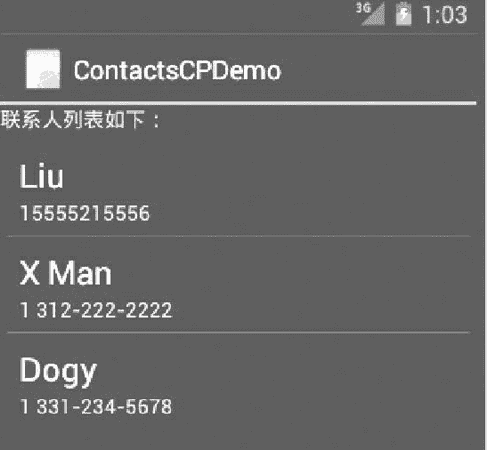

# Android 使用系统提供的 ContentProvider

> 原文：[`c.biancheng.net/view/3115.html`](http://c.biancheng.net/view/3115.html)

Android 系统提供了很多 ContentProvider，以便在应用程序间共享系统数据。

系统提供的 ContentProvider 都存放在 android.provider 包下，例如 android.provider.ContactsContract、android.provider.MediaStore、android.provider.CalendarContract 等。

本节以访问系统联系人列表为例，讲解如何通过系统提供的 ContentProvider 获取数据。

在 Android 2.0（API Level 5）之前，系统所提供的联系人 ContentProvider 为 android.provider.Contacts。

从 Android 2.0 开始，联系人列表相关信息被存放在 android.provider.ContactsContract 中。使用 ContactsContract 获取系统联系人列表的方法与之前有所不同，虽然形式上较以前复杂了一点，但是可以获取一个联系人的多个电话号码。

实例 ContactsCPDemo 演示了使用 ContactsContract 获取系统中所有联系人的名字和电话号码，并且显示出来的过程。为方便起见，假定每个联系人仅有一个电话号码，其运行效果如图 1 所示。


图 1  ContactsCPDemo 界面
该效果由 ListView 组件实现。实例 ContactsCPDemo 中布局文件 main.xml 的代码如下：

```

<?xml version="1.0" encoding="utf-8"?>
<LinearLayout xmlns:android="http://schemas.android.com/apk/res/android"
    android:layout_width="fill_parent"
    android:layout_height="fill_parent"
    android:orientation="vertical">

    <TextView
        android:layout_width="fill_parent"
        android:layout_height="wrap_content"
        android:text="联系人列表如下:" />

    <ListView
        android:id="@+id/listView"
        android:layout_width="fill_parent"
        android:layout_height="wrap_content"
        android:padding="5dip" />
</LinearLayout>        
```

实例 ContactsCPDemo 要访问系统联系人列表，需要拥有“android.permission.READ_CONTACTS”权限。

实例 ContactsCPDemo 中 AndroidManifest.xml 文件的代码如下：

```

<?xml version="1.0" encoding="utf-8"?>
<manifest xmlns:android="http://schemas.android.com/apk/res/android"
    package="introduction.android.contactscpdemo">

    <uses-permission android:name="android.permission.READ_CONTACTS" />
    <application
        android:allowBackup="true"
        android:icon="@mipmap/ic_launcher"
        android:label="@string/app_name"
        android:roundIcon="@mipmap/ic_launcher_round"
        android:supportsRtl="true"
        android:theme="@style/AppTheme">
        <activity android:name=".MainActivity">
            <intent-filter>
                <action android:name="android.intent.action.MAIN" />
                <category android:name="android.intent.category.LAUNCHER" />
            </intent-filter>
        </activity>
    </application>

</manifest>
```

实例 ContactsCPDemo 中 MainActivity.java 文件的代码如下：

```

package introduction.android.contactscpdemo;

import java.util.ArrayList;
import java.util.HashMap;
import java.util.Map;

import android.app.Activity;
import android.database.Cursor;
import android.os.Bundle;
import android.provider.ContactsContract;
import android.widget.ListView;
import android.widget.SimpleAdapter;

public class MainActivity extends Activity {
    private SimpleAdapter listAdapter;
    private ListView listview;

    private ArrayList<Map<String, String>> data;
    private HashMap<String, String> item;

    /**
     * Called when the activity is first created.
     */

    @Override
    public void onCreate(Bundle savedInstanceState) {
        super.onCreate(savedInstanceState);
        setContentView(R.layout.activity_main);
        listview = (ListView) this.findViewById(R.id.listView);
        data = new ArrayList<Map<String, String>>();
        Cursor cursor = this.getContentResolver().query(ContactsContract.Contacts.CONTENT_URI, null, null, null, null);
        while (cursor.moveToNext()) {
            int idFieldIndex = cursor.getColumnIndex(ContactsContract.Contacts._ID);
            int id = cursor.getInt(idFieldIndex);//根据列名取得该联系人的 id
            int nameFieldIndex = cursor.getColumnIndex(ContactsContract.Contacts.DISPLAY_NAME);
            String name = cursor.getString(nameFieldIndex);
            //根据列名取得该联系人的 name
            int numCountFieldIndex = cursor.getColumnIndex
                    (ContactsContract.Contacts.HAS_PHONE_NUMBER);
            //获取联系人的电话号码个数
            int numCount = cursor.getInt(numCountFieldIndex);
            String phoneNumber = "";
            if (numCount > 0) {  //联系人至少有一个电话号码
                //在类 ContactsContract.CommonDataKinds.Phone 中根据 id 查询相应联系人的所有电话
                Cursor phonecursor = getContentResolver().query(
                        ContactsContract.CommonDataKinds.Phone.CONTENT_URI, null, ContactsContract.CommonDataKinds.Phone.CONTACT_ID + "=?", new String[]{Integer.toString(id)}, null);
                if (phonecursor.moveToFirst()) {
                    //仅读取第一个电话号码
                    int numFieldIndex = phonecursor.getColumnIndex(ContactsContract.
                            CommonDataKinds.Phone.NUMBER);
                    phoneNumber = phonecursor.getString(numFieldIndex);
                }
            }
            item = new HashMap<String, String>();
            item.put("name", name);
            item.put("phoneNumber", phoneNumber);
            data.add(item);
        }
        listAdapter = new SimpleAdapter(this, data,
                android.R.layout.simple_list_item_2, new String[]{
                "name", "phoneNumber"
        },
                new int[]{android.R.id.text1, android.R.id.text2});
        listview.setAdapter(listAdapter);

    }
}
```

其中：

```

listAdapter = new SimpleAdapter(this, data,
    android.R.layout.simple_list_item_2, new String[]{
    "name", "phoneNumber"
},
    new int[]{android.R.id.text1, android.R.id.text2});
listview.setAdapter(listAdapter);
```

使用了 Android 系统提供的 simple_list_item_2 布局，并将该布局应用到 main.xml 文件的 ListView 组件中。