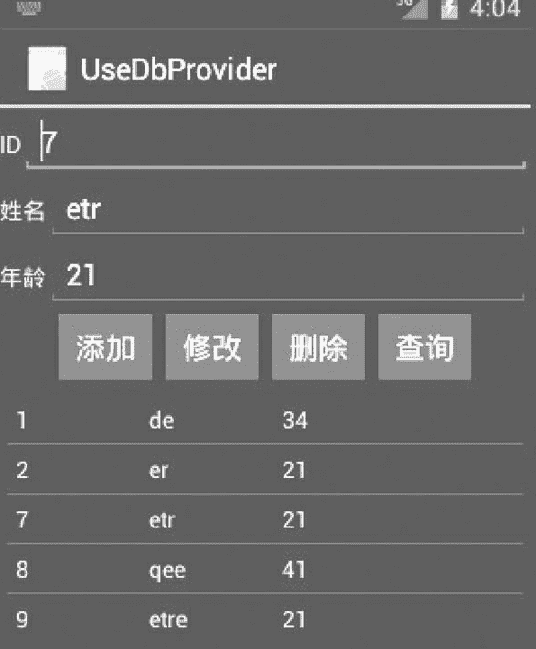
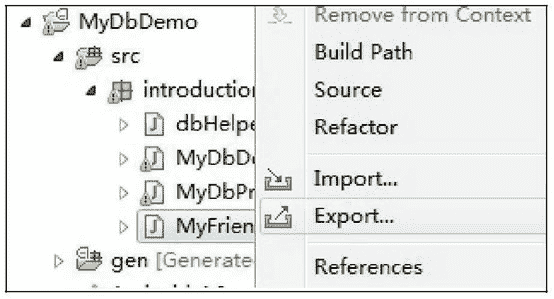
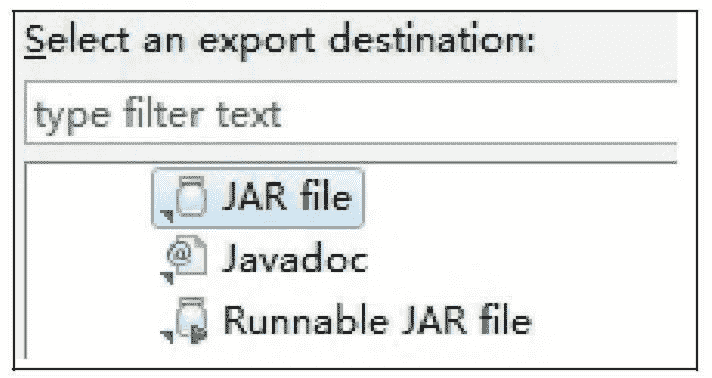
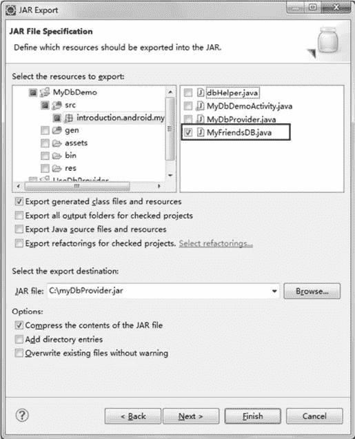
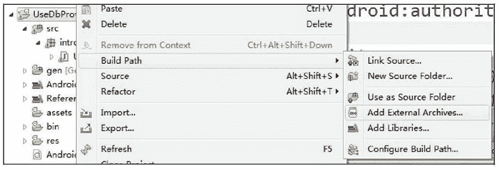

# Android 使用自定义 ContentProvider

> 原文：[`c.biancheng.net/view/3125.html`](http://c.biancheng.net/view/3125.html)

上一节教程我们学习了如何自定义 ContentProvider，接下来将讲解如何通过 ContentProvider 访问其他应用程序中的数据，并对数据进行更改。

实例 UseDbProvider 演示了通过我们之前建立的自定义 ContentProvider MyDbProvider 访问实例 MyDbDemo 中建立的 SQLite 数据库 mydb，并对其中的数据进行 CRUD 操作的过程。

实例 UseDbProvider 对 MyDbProvider 相关信息的访问是从 MyFriendsDB 类中获取的。

实例 UseDbProvider 的运行效果如图 2 所示。该视图和实例 MyDbDemo 一样，由 main.xml 和 list.xml 组成。


图 2  UseDbProvider 界面
该实例实现的步骤如下：

**1）**在 Eclipse 中建立工程 UseDbProvider，定义包为“introduction.android.useDbprovider”，定义 Activity 为 UseDbCPActivity。

**2）**从工程 MyDbDemo 中导出 MyDbProvider 的信息描述类 MyFriendsDB。具体操作方法如下：

*   右击工程 MyDbDemo，在弹出的菜单中选择 Export 选项，如图 3 所示。
*   在弹出的对话框中选择导出类型为 Java|JAR file，单击 Next 按钮，如图 4 所示。


图 3  选择 Export 选项
图 4  选择导出类型在弹出的对话框中选择导出资源为 MyFriendsDB.Java，导出的目标文件为“C:\MyDbProvider.jar”，单击 Finish 按钮。这样，就把 MyFriendsDB 类导出到 myProvider.jar 文件中，也就可以导出到其他文件中使用了，如图 5 所示。
图 5  导出过程**3）**在工程 MyFriendsDB 中导入 MyFriendsDB。右击 UseDbProvider，选择 Build Path | Add External Archives 选项（如图 6 所示），在弹出的对话框中选中 MyDbProvder.jar，即可将 MyFriendsDB 类导入工程中。
图 6  选择 Add External Archives 选项
编写 UseDbCPActivity 类，通过 ContentResolver 完成对 MyDbProvider 的访问，进而完成对数据的操作。

实例 UseDbProvider 中 UseDbCPActivity.java 的代码如下：

```

import android.app.Activity;
import android.content.ContentUris;
import android.content.ContentValues;
import android.database.Cursor;
import android.net.Uri;
import android.os.Bundle;
import android.util.Log;
import android.view.View;
import android.widget.AdapterView;
import android.widget.Button;
import android.widget.EditText;
import android.widget.ListView;
import android.widget.SimpleAdapter;

import android.widget.AdapterView.OnItemClickListener;

import java.util.ArrayList;
import java.util.HashMap;
import java.util.List;
import java.util.Map;

public class UseDbCPActivity extends Activity {
    private List<Map<String, String>> data;
    private SimpleAdapter listAdapter;
    private ListView listview;
    private HashMap<String, String> item;
    private Button selBtn, addBtn, updBtn, delBtn;
    private EditText et_name;
    private EditText et_age;
    private EditText et_id;

    /**
     * Called when the activity is first created.
     */

    @Override
    public void onCreate(Bundle savedInstanceState) {
        super.onCreate(savedInstanceState);
        setContentView(R.layout.activity_main);
        et_name = (EditText) findViewById(R.id.et_name);
        et_age = (EditText) findViewById(R.id.et_age);
        et_id = (EditText) findViewById(R.id.et_id);
        listview = (ListView) findViewById(R.id.listView);
        selBtn = (Button) findViewById(R.id.bt_query);
        addBtn = (Button) findViewById(R.id.bt_add);
        updBtn = (Button) findViewById(R.id.bt_modify);
        delBtn = (Button) findViewById(R.id.bt_del);
        selBtn.setOnClickListener(new Button.OnClickListener() {
            @Override
            public void onClick(View v) {
                // TODO Auto-generated method stub
                if (et_id.getText().toString().equals(""))
                    dbFindAll(MyFriendsDB.CONTENT_TYPE);
                else
                    dbFindAll(MyFriendsDB.CONTENT_ITEM_TYPE);
            }
        });

        addBtn.setOnClickListener(new Button.OnClickListener() {
            @Override
            public void onClick(View v) {
                // TODO Auto-generated method stub
                dbAdd(null);
                dbFindAll(MyFriendsDB.CONTENT_TYPE);
            }
        });

        updBtn.setOnClickListener(new Button.OnClickListener() {
            @Override
            public void onClick(View v) {
                // TODO Auto-generated method stub
                dbUpdate(null);
                dbFindAll(MyFriendsDB.CONTENT_TYPE);
            }
        });
        delBtn.setOnClickListener(new Button.OnClickListener() {
            @Override
            public void onClick(View v) {
                // TODO Auto-generated method stub
                dbDel(-1);
                dbFindAll(MyFriendsDB.CONTENT_TYPE);
            }
        });
        data = new ArrayList<Map<String, String>>();
        dbFindAll(MyFriendsDB.CONTENT_TYPE);
        listview.setOnItemClickListener(new OnItemClickListener() {
            private String selId;

            @Override
            public void onItemClick(AdapterView<?> parent, View v, int position, long id) {
                // TODO Auto-generated method stub
                Map<String, Object> listltem = (Map<String, Object>) listview.getItemAtPosition(position);
                et_name.setText((String) listltem.get("name"));
                et_age.setText((String) listltem.get("age"));
                et_id.setText((String) listltem.get("_id"));
                Log.i("UseDB", "id=" + selId);
            }
        });
    }

    private void showList() {
        // TODO Auto-generated method stub
        listAdapter = new SimpleAdapter(this, data,
                R.layout.listview,
                new String[]{"_id", "name", "age"},
                new int[]{R.id.tvID, R.id.tvName, R.id.tvAge});
        listview.setAdapter(listAdapter);
    }

    protected void dbDel(long iid) {
        // TODO Auto-generated method stub
        if (iid < 0) {
            String id = et_id.getText().toString().trim();
            if (id.equals("")) {
                Log.e("UseDB", "未指定更新数据");
                return;
            }
            iid = Long.parseLong(id);
        }

        Uri uri = ContentUris.withAppendedId(MyFriendsDB.CONTENT_URI, iid);
        int i = this.getContentResolver().delete(uri, null, null);
        if (i > 0) {
            Log.i("UseDB", " 已删除数据 id=" + iid);
        } else {
            Log.i("UseDB", "数据未删除。");
        }

    }

    protected void dbUpdate(ContentValues values) {
        // TODO Auto-generated method stub
        String id = et_id.getText().toString().trim();
        if (id.equals("")) {
            Log.e("UseDB", "未指定更新数据。");
            return;
        }
        Long selid = Long.parseLong(id);
        Uri uri = ContentUris.withAppendedId(MyFriendsDB.CONTENT_URI, selid);
        if (values == null) {
            values = new ContentValues();
            values.put("name", et_name.getText().toString().trim());
            values.put("age", et_age.getText().toString().trim());
        }
        int i = this.getContentResolver().update(uri, values, null, null);
        if (i > 0) {
            Log.i("UseDB", "已更新数据 id=" + selid);
        } else {
            Log.e("UseDB", "数据更新失败!");
        }
    }

    protected void dbAdd(ContentValues values) {
        // TODO Auto-generated method stub
        if (values == null) {
            values = new ContentValues();
            values.put("name", et_name.getText().toString().trim());
            values.put("age", et_age.getText().toString().trim());
        }
        Uri uri = this.getContentResolver().insert(MyFriendsDB.CONTENT_URI, values);
        if (uri == null) {
            Log.e("UseDB", "数据插入失败！");
        }
    }

    protected void dbFindAll(String type) {
        // TODO Auto-generated method stub
        data.clear();
        Cursor cursor;
        Uri uri;
        if (type == MyFriendsDB.CONTENT_TYPE) {
            uri = MyFriendsDB.CONTENT_URI;
        } else {
            Long selid = Long.parseLong(et_id.getText().toString().trim());
            uri = ContentUris.withAppendedId(MyFriendsDB.CONTENT_URI, selid);
            Log.d("UseDB", uri.toString());
        }
        cursor = this.getContentResolver().query(uri, null, null, null, null);
        cursor.moveToFirst();
        while (!cursor.isAfterLast()) {
            String id = cursor.getString(0);
            String name = cursor.getString(1);
            String age = cursor.getString(2);
            item = new HashMap<String, String>();
            item.put("_id", id);
            item.put("name", name);
            item.put("age", age);
            data.add(item);
            cursor.moveToNext();
        }
        showList();
    }
}
```

由于工程 MyDbDemo 中定义了 MyDbProvider 的访问权限，因此实例 UseDbProvider 的 AndroidManifest.xml 文件中也必须声明相应权限。

AndroidManifest.xml 文件的代码如下：

```

<?xml version="1.0" encoding="utf-8"?>
<manifest xmlns:android="http://schemas.android.com/apk/res/android"
    package="introduction.android.useDbdemo"
    android:versionCode="1"
    android:versionName="1.0">

    <uses-sdk android:minSdkVersion="14" />
    <uses-permission android:name="introduction.android.permission.USE_MYDB" />
    <application
        android:allowBackup="true"
        android:icon="@mipmap/ic_launcher"
        android:label="@string/app_name"
        android:roundIcon="@mipmap/ic_launcher_round"
        android:supportsRtl="true"
        android:theme="@style/AppTheme">
        <activity android:name=".UseDbCPActivity">
            <intent-filter>
                <action android:name="android.intent.action.MAIN" />
                <category android:name="android.intent.category.LAUNCHER" />
            </intent-filter>
        </activity>
    </application>

</manifest>
```

在实例 UseDbProvider 中对 SQLite 数据库 mydb 进行 CRUD 操作后，运行 MyDbDemo 进行查询，可发现数据库中的数据确实被改变了。由此实现了在一个应用程序中通过自定义的 ContentProvider 修改另一个应用程序中的持久化数据的功能。