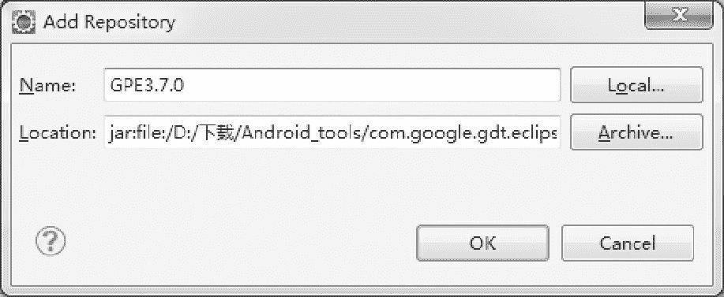
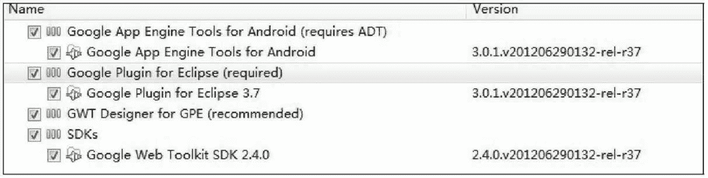

# 借助 GPE 让 Android APP 和 Google App Engine 通信

> 原文：[`c.biancheng.net/view/3148.html`](http://c.biancheng.net/view/3148.html)

编写将数据同步到云端的应用程序是很难的事情，需要确保很多的细节工作正确。例如服务器端授权、客户端授权、共享的数据模型和 API 等。

幸运的是，开发者不需要自己来完成每一件事，借助于 GPE（Google Plugin for Eclipse）可以大大简化开发的过程。

GPE 是用于管理 Android 设备与 Google App Engine 间对话的管道。

#### 1) 准备环境

安装 GPE 和 GWT SDK。从 [`developers.google.com/eclipse/docs/install-from-zip?hl=zh-CN`](https://developers.google.com/eclipse/docs/install-from-zip?hl=zh-CN) 页面可以获得安装 GPE 的帮助。安装 GPE 的方法很简单。

单击 Eclipse 界面的 Help | install new software | add | Archive 命令，在弹出的对话框中选择下载的 gpe-e37-latest-updatesite.zip 文件，单击 OK 按钮。如图 1 所示。


图 1  安装 GPE 3.7
在弹出的对话框中选择要安装的组件，并进行安装，如图 2 所示。


图 2  安装 GPE 组件
安装 Java App Engine SDK。从 [`developers.google.com/appengine/downloads?hl=zh-CN#Google_App_Engine_SDK_ for_Java`](https://developers.google.com/appengine/downloads?hl=zh-CN#Google_App_Engine_SDK_ for_Java) 页面下载 Google App Engine SDK for Java。

解压到硬盘后，在 Eclipse | Windows | Preferences | Google | App Engine | add 界面添加解压目录，Eclipse 会检测到 App Engine SDK 并完成安装。

注册一个 Google 账号，以便于 C2DM（Android Cloud to Device Messaging）功能访问。

C2DM 是 Android 云到设备信息的传递框架，用于从云端发送少量数据到 Android 客户端设备。要获取服务器上不定时更新的信息，一般有两种方法：

*   客户端使用拉（Pull）的方式，隔一段时间就去服务器上获取信息，看是否有更新的信息出现。
*   服务器使用推送（Push）的方式，当服务器端有新信息时，把最新的信息推送到客户端上。

相比之下，推送方法更好一些，不仅可以节省客户端的网络流量，更能够节省电量。

Android 从 2.2 版本开始增加了 C2DM 框架，用于将服务器的信息推送到客户端。

#### 2) 创建工程

当安装好 GPE 后，Eclipse 会出现 App Engine Connected Android Project 工程类型。工程创建向导会提示输入 C2DM 账户信息，这个账户就是在上面注册的新账户。

工程创建完成后，会出现两个项目，一个是 Android 应用程序，另一个是 App Engine 应用程序。

工程向导在这两个项目中创建了示例代码，允许用户通过 AccountManager 来验证 Android 设备与 App Engine 之间的交互。

右击 Android 项目，选择 Debug As | Local App Engine Connected Android Application。这样就能够测试 C2DM 的功能，同时启动一个 App Engine 的本地实例对象，里面包含用户的程序。

#### 3) 创建数据层

上一步创建了能够在 Android 设备与 App Engine 间进行交互的工程，下面修改相关代码实现自己的功能。

首先创建数据层，它定义 Android 设备与 App Engine 之间共享的数据。

打开 App Engine 项目的文件夹，定位到（yourApp）-AppEngine | src |（yourapp）| server。创建一个新的类，该类包含需要存储到云端的数据。示例代码如下：

```

package com.cloudtasks.server;

import javax.persistence.*;

@Entity
public class Task {
    private String emailAddress;
    private String name;
    private String userId;
    private String note;

    @Id
    @GeneratedValue(strategy = GenerationType.IDENTITY)
    private Long id;

    public Task() {

    }

    public String getEmailAddress() {
      return emailAddress;
    }

    public void setEmailAddress(String emailAddress) {
      this.emailAddress = emailAddress;
    }

    public String getName() {
      return name;
    }

    public void setName(String name) {
      this.name = name;
    }

    public String getUserId() {
      return userId;
    }

    public void setUserId(String userId) {
      this.userId = userId;
    }

    public String getNote() {
      return note;
    }

    public void setNote(String note) {
      this.note = note;
    }

    public Long getId() {
      return id;
    }

    public void setId(Long id) {
      this.id = id;
    }

}
```

代码中的 @Entity、@Id 与 @GeneratedValue 都来自 Java 持久化 API，这些注释都是必需的。

@Entity 需要被注释在类声明的上面，表明这个类是被定义在数据层的一个实体。

@Id 与 @GeneratedValue 分别表明了实体类的 id 与该 id 形成的规则。在上面的代码中，GenerationType. IDENTITY 表示该实体的 id 是从数据库中生成的。

完成实体数据类的创建后，需要创建 Android 与 App Engine 程序之间交互的方法。这种交互的方法是通过创建一个 Remote Procedure Call（RPC）服务完成的。具体实现的过程相对复杂，但是 GPE 提供了简单的实现方式。

右击 App Engine 项目的源码文件夹，选择 New | Other，再选择 Google | RPC Service，会出现向导，罗列出所有已创建的实体类，单击 Finish 按钮，向导会创建一个 Service 类，它包含对所有实体类的创建、查询、更新和删除（CRUD）操作。

#### 4) 创建持久层

持久层是用于长期存放应用程序数据的地方。根据要存储的数据类型，开发者有几种可选择的实现方法，其中由 Google 管理的可实现持久层的方法为 Google Storage for Developers 和 App Engine 的内建 DataStore。

下面是一个使用 DataStore 实现持久层的示例。

在 com.cloudtasks.server 包下创建一个类用来处理持久层的输入与输出。为了访问这些数据，需要使用 PersistenceManager 类。可以使用在 com.google.android.c2dm.server.PMF 包下的 PMF 类生成这个类的一个实例，然后使用该实例来执行基本的 CRUD 操作：

```

/**
  * Remove this object from the data store
  */
public void delete(Long id){
    PersistenceManager pm = PMF.get().getPersistenceManager();
    try{
        Task item = pm.getObjectById(Task.class,id);
        pm.deletePersistent(item);
    }finally{
        pm.close();
    }
}
```

此外，也可以使用 Query 对象从 Datastore 来检索数据。

```

public Task find(Long id){
    if(id == null){
        return null;
    }
    PersistenceManager pm = PMF.get().getPersistenceManager();
    try{
        Query query = pm.newQuery("select from"+Task.class.getName()+"where id =="+id.toString()+"&&emailAddress ==+'"+getUserEmail()+"'");
        List list = (List)query.execute();
        return list.size() == 0?null:list.get(0);
    }catch(RuntimeException e){
        System.out.println(e);
        throw e;
    }finally{
        pm.close();
    }
}
```

#### 5) 从 Android 应用程序进行查询和更新

为保证 Android 设备与 App Engine 的同步，Android 端应用程序需要完成两件事情：从云端拉取数据和向云端发送数据。这些功能已经由示例代码生成了，开发者需要进行修改以完成自己的功能。

首先，需要将示例代码中的 Activity.java 中的 setHelloWorldScreenContent() 方法删除，用实际的功能代码替换。

然后，交互操作应该在 AsyncTask 类中完成，以避免网络操作导致 UI 线程卡住。

最后，访问云端数据，使用 RequestFactory 来进行操作，该类由 Eclipse plugin 提供。

如果云端数据模型包含一个叫作 Task 的对象，那么这个对象会在生成 RPC layer 的时候自动创建一个 TaskRequest 类对象，以及一个代表单独的 Task 的 TaskProxy 对象。

下面的代码演示了向服务器请求所有 task 的列表的功能。

```

public void fetchTasks (Long id) {
    // Request is wrapped in an AsyncTask to avoid making a network request
    // on the UI thread.
    new AsyncTask(){
        @Override
        protected List doInBackground (Long... arguments) {
            final List list=new ArrayList();
            MyRequestFactory factory=Util.getRequestFactory (mContext, MyRequestFactory.class) ;
            TaskRequest taskRequest=factory.taskNinjaRequest();

            if (arguments.length==0 || arguments[0]==-1) {
                factory.taskRequest().queryTasks().fire (new Receiver<list> (){
                @Override
                public void onSuccess (List arg0) {
                        list.addAll (arg0) ;
                }
            }
        }) ;
    } else {
        newTask=true;
        factory.taskRequest().readTask (arguments[0]).fire(new Receiver(){
            @Override
            public void onSuccess(TaskProxy arg0) {
                list.add(arg0) ;
            }
        });
    }
    return list;
}

    @Override
    protected void onPostExecute (List result) {
        TaskNinjaActivity.this.dump(result) ;
    }

    }.execute (id);
}
...
public void dump (List tasks) {
    for (TaskProxy task : tasks) {
        Log.i ("Task output", task.getName()+"\n"+task.getNote()) ;
    }
}
```

AsyncTask 类返回了一个 TaskProxy 对象的列表，并且将该列表作为参数发送给了 dump 方法。

为了创建一个新的任务并发送到云端，需要创建一个新的请求对象并使用它来创建一个 proxy 对象。然后通过 proxy 对象执行它的更新方法。

这个过程应该在 AsyncTask 中执行，以避免阻塞 UI 线程。相关代码如下：

```

new AsyncTask(){
    @Override
    protected Void doInBackground (Void...arg0) {
        MyRequestFactory factory=(MyRequestFactory)Util.getRequestFactory(TasksActivity.this,MyRequestFactory.class);
        TaskRequest request=factory.taskRequest();

        //Creat your local proxy object,populate it
        TaskProxy task = request.create(TaskProxy.class);
        task.setName(taskName);
        task.setNote(taskDetails);
        task.setDueDate(dueDate);

        //To the cloud!
        request.updateTask(task).fire();
        return null;
    }
}.execute();
```

#### 6) 配置 C2DM 服务器端

为了配置 C2DM 的消息以便能被发送到 Android 设备，我们回到 App Engine 的代码处并打开生成 RPC 层时创建的 Service 类。

如果项目名是 Foo，该 Service 类的名字就叫 FooService。为 Service 每一个方法都添加代码，允许执行增加、删除和更新数据的操作，这样 C2DM 消息才能被发送到用户的设备上。对数据进行更新的相关示例代码如下：

```

public static Task updateTask (Task task) {
    task.setEmailAddress (DataStore.getUserEmail ()) ; task=db.update (task) ;
    DataStore.sendC2DMUpdate (TaskChange.UPDATE+TaskChange.SEPARATOR+task.getId()) return task;
}

// Helper method. Given a String, send it to the current user's device via C2DM.
public static void sendC2DMUpdate (String message) {
    UserService userService=UserServiceFactory.getUserService();
    User user=userService.getCurrentUser();
    ServletContext context=RequestFactoryServlet.getThreadLocalRequest().getSession().getServletContext() SendMessage.sendMessage (context, user.getEmail(), message) ;
}
```

下面的示例代码中创建了一个帮助类 TaskChange。

```

public class TaskChange{
    public  static String UPDATE="Update";
    public  static String DELETE="Delete";
    public  static String SEPAPATOR=":";
}
```

该类中创建了一些常量，能够使得 App Engine 与 Android 应用程序之间的交互更加简单。帮助类应该被创建在共享文件夹中。

#### 7) 配置 C2DM 客户端

为了定义当 Android 应用程序接收到 C2DM 的消息时的行为，我们打开 C2DMReceiver 类，找到 onMessage() 方法并根据接收到的消息类型修改这个方法。

```

//In your C2DMReceiver class
public void notifyListener (Intent intent) {
    if (listener !=null) {
        Bundle extras=intent.getExtras();
            if (extras !=null) {
                String message= (String) extras.get ("message") ;
                String[] messages=message.split (Pattern.quote (TaskChange.SEPARATOR)) ; listener.onTaskUpdated (messages[0], Long.parseLong (messages[1])) ;
            }
        }
    }

//Elsewhere in your code, wherever it makes sense to perform local updates
public void onTasksUpdated (String messageType, Long id) {
    if (messageType.equals (TaskChange.DELETE)) {
        // Delete this task from your local data store
        ...
    } else {
        // Call that monstrous Asynctask defined .earlier.
        fetchTasks (id) ;
    }
}
```

至此，C2DM 消息触发了本地 Android 设备中信息的更新，同步到云端操作完成。