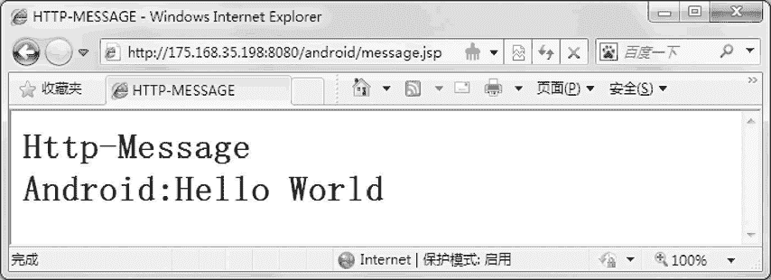
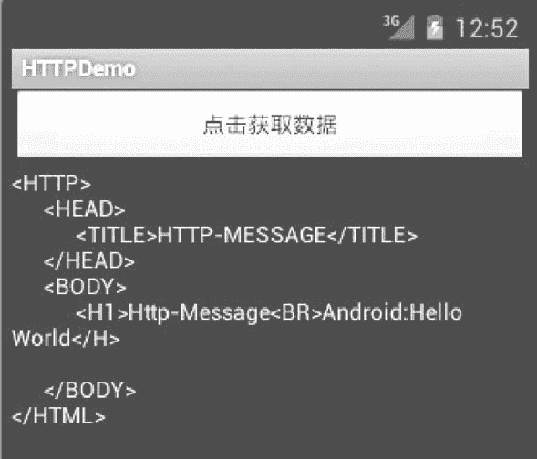

# Android HttpURLConnection 访问互联网资源

> 原文：[`c.biancheng.net/view/3151.html`](http://c.biancheng.net/view/3151.html)

为了可以通过 AVD 调试网络访问应用程序，首先在本地计算机上架设网络服务器端。使用 Tomcat 做服务器，在其 webapps 目录下建立 android 目录，并在该目录下建立 message.jsp 文件。

```

<HTTP>
    <HEAD>
        <TITLE>HTTP-MESSAGE</TITLE>
    </HEAD>
    <BODY>
        <%
            OUT.PRINTln("<H1>Http-Message<BR>Android:Hello World</H>");
        %>
    </BODY>
</HTML>

```

由于本地计算机在网络上的 IP 为 175.168.35.198，因此 message.jsp 的网络 URL 为 http://175.168.35.198:8080/android/message.jsp。将该地址输入 IE 地址栏打开，其运行效果如图 1 所示。


图 1  message.jsp 的运行效果这样，我们就有了可以通过 AVD 来访问的网络上的资源。

使用 java.net.URLConnection 访问 URL 指定的网络资源的基本过程的代码如下：

```

URL url=new URL("ftp://mirror.csclub.uwaterloo.ca/index.html");//建立 URL
URLConnection urlConnection=url.openConnection();//打开连接
InputStream in=new BufferedInputStream(
    urlConnection. getlnputStream());//从连接建立输入流
    try {
        readstream (in); //读取数据操作
    }finally{
        in.close();
    }
}
```

URLConnection 内建对多种网络协议的支持，如 HTTP/HTTPS、File、FTP 等。

在创建连接之前，可以对连接的一些属性进行设置，如下表所示。

**URLConnection 属性**

| 属性名称 | 属性描述 |
| --- | --- |
| setReadTimeout(3000) | 设置读取数据的超时时间为 3 秒钟 |
| setUseCaches(false) | 设置当前连接是否允许使用缓存 |
| setDoOutput(true) | 设置当前连接是否允许建立输出流 |
| setDoInput(true) | 设置当前连接是否允许建立输入流 |

HttpURLConnection 继承于 URLConnection 类，二者都是抽象类，所以无法直接实例化，其对象主要通过 URL 的 openConnection 方法获得。

URLConnection 可以直接转换成 HttpURLConnection，以便于使用一些 HTTP 连接特定的方法，如 getResponseMessage()、setRequestMethod() 等。

使用 HttpURLConnection 访问网络资源的基本过程的代码如下：

```

URL url=new URL("http://www.android.com/");
HttpURLConnection urlConnection=(HttpURLConnection)url.openConnection();
try {
    InputStream in=new BufferedInputStream(urlConnection.getInputStream());
    readstream(in);
}finally{
    urlConnection.disconnect();
}
```

需要注意的是，使用 openConnection 方法所创建的 URLConnection 或者 HttpURLConnection 实例不具有重用性，每次调用 openConnection 方法都将创建一个新的实例。

实例 URLDemo 中演示了使用 URL 访问指定资源的过程，运行效果如图 2 所示。

图 2  URLDemo 的运行效果
实例 URLDemo 中 main.xml 的代码如下：

```

<?xml version="1.0” encoding="utf-8"?>

<LinearLayout
    xmlns:android="http://schemas.android.com/apk/res/android"
    android:orientation="vertical"
    android:layout_width="fill_parent"
    android:layout_height="fill_parent">

    <Button
        android:id="@+id/Button_HTTP"
        android:layout_width="fill_parent"
        android:layout_height="wrap_content"
        android:text="@string/button_name01"/>

    <TextView
        android:id="@+id/TextView_HTTP"
        android:layout_width="fill_parent"
        android:layout_height="wrap_content"/>

</LinearLayout>
```

实例 URLDemo 中 AndroidManifest.xml 的代码如下：

```

<?xml version="l.0" encoding="utf-8"?>
<manifest xmlns:android="http://schemas.android.com/apk/res/android"
    package="com.android.activity"
    android:versionCode="1"
    android:versionName="1.0">

    <uses-sdk android:minSdkVersion="4" />

    <uses-permission android:name="android.permission.INTERNET" />

    <application android:icon="@drawable/ic_launcher"
        android:label="@string/app_name">
        <activity android:name=".MainActivity"
            android:label="@string/app_name">

            <intent-filter>
                <action android:name="android.intent.action.MAIN" />
                <category android:name="android.intent.category.LAUNCHER" />
            </intent-filter>

        </activity>
    </application>
</manifest>
```

实例 URLDemo 中 MainActivity.java 的具体实现代码如下：

```

package introdction.android.URLDemo;

import java.io.BufferedReader;
import java.io.IOException;
import java.io.InputstreamReader;
import java.net.HttpURLConnection;
import java.net.MalformedURLException;
import java.net.URL;
import com.android.activity.R;
import android.app.Activity;
import android.os.Bundle;
import android.view.View;
import android.view.View.OnClickListener;
import android.widget.Button;
import android.widget.TextView;

public class MainActivity extends Activity {
    /** Called when the activity is first created. */

    private TextView textView_HTTP;

    @Override
    public void onCreate (Bundle savedInstanceState) { 
        super.onCreate (savedInstanceState);
        setContentView (R.layout.main);
        textView_HTTP= (TextView) findViewById (R.id.TextView_HTTP);
        Button button_http= (Button) findViewById (R.id.Button_HTTP) ;

        button_http. setOnClickListener (new OnClickListener () {
            //给 button_http 按钮设置监听器
            public void onClick (View v) {//事件处理

            String httpUrl="http://175.168.35.198:8080/android/message.jsp";
            String resultData="";//定义一个 resultData 用于存储获得的数据
            URL url=null; //定义 URL 对象
            try {
                url=new URL (httpUrl); //构造一个 URL 对象时需要使用异常处理
            } catch (MalformedURLException e) {
                System.out.println (e.getMessage ());//打印出异常信息
            }

            if (url !=null) {//如果 URL 不为空时
                try{
                    //有关网络操作时，需要使用异常处理
                    HttpURLConnection urlConn= (HttpURLConnection)url.openConnection (); //使用 HttpURLConnection 打开连接

                    InputStreamReader in=new InputStreamReader (urlConn.getInputStream());//得到读取的内容
                    BufferedReader buffer=new BufferedReader (in);//为输出创建 BufferedReader
                    String inputLine=null;
                    while (((inputLine=buffer.readLine()) !=null)) {
                        // 读取获得的数据
                        resultData+=inputLine+"\n"; // 加上"\n"实现换行
                    }

                    in.close();//关闭 InputStreamReader
                    urlConn.disconnect(); //关闭 HTTP 连接
                    if (resultData !=null) {//如果获取到的数据不为空
                        textView_HTTP.setText(resultData) ;
                    } else {
                        textView_HTTP.setText("Sorry,the content is null");//获取到的数据为空时显示
                    }

                } catch (IOException e) {
                    textView_HTTP.setText (e.getMessage());
                    //出现异常时，打印异常信息
                }

            } else {
                textView_HTTP.setText ("url is null"); //当 url 为空时输出
            }
        }

    }) ;

}
```

以上代码中，

String httpUrl = "http://175.168.35.198:8080/android/message.jsp ";

指定了要访问的网络资源的地址，测试时改成自己本机的 IP 地址即可。