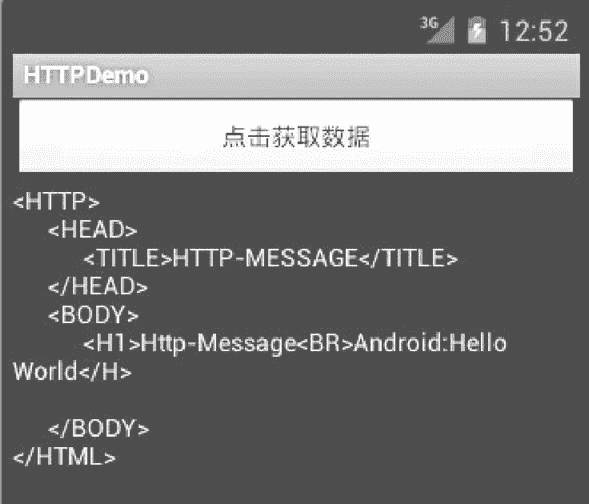

# Android 通过 GET 方式获取互联网资源

> 原文：[`c.biancheng.net/view/3153.html`](http://c.biancheng.net/view/3153.html)

HTTP 通信中可以使用 GET 和 POST 方式，GET 方式可以获取静态页面，也可以把参数放在 URL 字符后面传递给服务器。

例如地址“http://175.168.35.198:8080/android/getMessage.jsp?message=Helloworld”就是使用 GET 方式，在 URL 中，“?”后面直接加入参数 message 的信息，而 POST 方式的参数是放在 HTTP 请求中的，不会直接出现在 URL 中。

与 GET 类似，POST 参数也是被 URL 编码的。然而，两者已经有了很多不同：

| POST | GET |
| --- | --- |
| 服务器传送数据 | 服务器获取数据 |
| 数据放置在 HTML HEADER 内提交 | URL 提交数据，数据在 URL 中可以看到 |
| 服务器端用 Request.Form 获取提交的数据 | 服务器端用 Request.QueryString 获取变量的值 |
| POST 不限制提交数据大小 | 提交的数据最多只能有 1024 字节 |
| 参数不会显示在地址栏上 | 参数会显示在地址栏上 |

由此，如果这些数据是中文数据而且是非敏感数据，那么使用 GET 方式；如果用户输入的数据不是中文字符而且包含敏感数据，那么还是使用 POST 方式为好。

HttpURLConnection 默认的访问方式为 Get，以 POST 方式获取网页数据时需要使用 setRequestMethod 方法设置访问方式为 POST。

在 TOMCAT 根目录下的“webapps\android”目录下建立 getMessage.jsp 文件作为网络服务资源文件，该文件代码如下：

```

<% @page language="java" import="java.util.*" pageEncoding="gb2312"%>

<HTTP>
    <HEAD>
        <TITLE>Get-HTTP-MESSAGE</TITLE>
    </HEAD>
    <BODY>
        <%
            String message=request.getParameter ("message") ;
            String result=new String (message.getBytes ("iso-8859-1") ,"gb2312");
            out.println ("<Hl>Android-message:"+result+"</H>") ;
        %>
    </BODY>
</HTML>
```

该文件从访问该文件的 request 中获取名为 message 的参数信息并在页面上显示出来。

GET 方式获取网页数据的实现方式和指定 URL 方式很相似，不同的是要在将要访问的地址后面加上要传递的参数。

实例 GETDemo 中演示了使用 GET 方式访问指定网页的过程，运行效果如图 1 所示。


图 1  实例 GETDemo 的演示过程实例 GETDemo 中 main.xml 的具体实现代码如下：

```

<?xml version="1.0" encoding="utf-8"?>

<LinearLayout
    xmlns:android="http://schemas.android.com/apk/res/android"
    android:orientation="vertical"
    android:layout_width="fill_parent"
    android:layout_height="fill_parent">

    <Button
        android:id="@+id/Button_Get"
        android:layout_width="fill_parent"
        android:layout_height="wrap_content"
        android:text="@string/button_name"/>

    <TextView
        android:id="@+id/TextView_Get"
        android:layout_width="fill_parent"
        android:layout_height="wrap_content"/>

</LinearLayout>
```

实例 GETDemo 中 AndroidManifest.xml 的具体实现代码如下：

```

<?xml version="l.0" encoding="utf-8"?>

<manifest xmlns:android="http;//schemas.android.com/apk/res/android"
    package="com.android.activity"
    android:versionCode="1"
    android:versionName="1.0">

    <uses-sdk android:minSdkVersion="4" />

    <uses-permission android:name="android.permission.INTERNET" />

    <application android:icon="@drawable/ic_launcher" android:label="@string/app_name">
        <activity android:name=".MainActivity"
            android:label="@string/app_name">
            <intent-filter>
                <action android:name="android.intent.action.MAIN" />
                <category android:name="android.intent.category.LAUNCHER" />
            </intent-filter>
        </activity>
    </application>
</manifest>
```

其中：

<uses-permission android:name="android.permission.INTERNET"/>

设置可以访问网络的权限。

实例 GETDemo 中 MainActivity.java 的具体实现代码如下：

```

package introdction.android.getDemo;
import java.io.BufferedReader;
import java.io.IOException;
import java.io.InputStreamReader;
import java.net.HttpURLConnection;
import java.net.MalformedURLException;
import java.net.URL;
import android.app.Activity;
import android.os.Bundle;
import android.view.View;
import android.view.View.OnClickListener;
import android.widget.Button;
import android.widget.TextView;

public class MainActivity extends Activity {
    private TextView textView_Get;

    @Override
    public void onCreate (Bundle savedInstanceState) { 
        super.onCreate (savedInstanceState) ; setContentView (R.layout.main) ;
        textView_Get= (TextView) findViewById (R.id.TextView_Get)
        Button button_Get= (Button) findViewById (R.id.Button_Get);
        button_Get.setOnClickListener (new OnClickListener () {
            public void onClick (View v) {
                String httpUrl="http:// 175.168.35.198:8080/android/getMessage.jsp?message=Helloworld";
                String resultData ="";
                URL url=null;

                try {
                    url=new URL (httpUrl) ;
                } catch (MalformedURLException e) {
                    System.out.println (e.getMessage());
                }

                if (url !=null) {
                    try {
                        HttpURLConnection urlConn= (HttpURLConnection) url .openConnection();
                        InputStreamReader in=new InputStreamReader (urlConn .getlnputStream()) ;
                        BufferedReader buffer=new BufferedReader (in) ;
                        String inputLine=null;

                        while (((inputLine=buffer.readLine()) !=null)) { 
                            resultData+=inputLine+"\n";
                        }
                        in.close ();
                        urlConn.disconnect();
                        if (resultData !=null) {
                            textView_Get.setText (resultData) ;
                        } else {
                            textView_Get.setText ("Sorry,the content is null");
                        }
                    } catch (IOException e) {
                        textView_Get.setText (e.getMessage () ) ;
                    }
                } else {
                    textView_Get.setText ("url is null") ;
                }
            }
        });
    }
}
```

其中：

String httpUrl = "http://175.168.35.198:8080/android/getMessage.jsp?message=Helloworld"

设置要访问的网页的 URL，“message=Helloworld”设置要传递的参数 message 的值为 Helloworld。