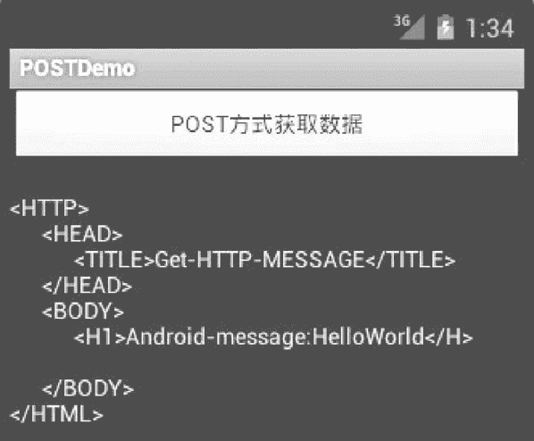

# Android 通过 POST 方式获取互联网资源

> 原文：[`c.biancheng.net/view/3154.html`](http://c.biancheng.net/view/3154.html)

上一节教程我们演示了 Android 使用 GET 获取网络资源的运行效果和实例，下面实例 POSTDemo 中演示了使用 POST 方式访问 getMessage.jsp 的过程，运行效果如图 1 所示。


图 1  实例 POSTDemo 的运行效果
实例 POSTDemo 中 main.xml 的具体实现代码如下：

```

<?xml version="1.0" encoding="utf-8"?>

<LinearLayout
    xmlns:android="http://schemas.android.com/apk/res/android"
    android:orientation="vertical"
    android:layout_width="fill_parent"
    android:layout_height="fill_parent">

    <Button
        android:id="@+id/Button_POST"
        android:layout_width="fill_parent"
        android:layout_height="wrap_content"
        android:text="@string/button_name"/>

    <TextView
        android:id="@+id/TextView_POST"
        android:layout_width="fill_parent"
        android:layout_height="wrap_content"/>

</LinearLayout>
```

实例 POSTDemo 中 AndroidManifest.xml 的具体实现代码如下：

```

<?xml version="l.0" encoding="utf-8"?>

<manifest xmlns:android="http;//schemas.android.com/apk/res/android"
    package="com.android.activity"
    android:versionCode="1"
    android:versionName="1.0">

    <uses-sdk android:minSdkVersion="4" />

    <uses-permission android:name="android.permission.INTERNET" />

    <application android:icon="@drawable/ic_launcher" android:label="@string/app_name">
        <activity android:name=".MainActivity"
            android:label="@string/app_name">
            <intent-filter>
                <action android:name="android.intent.action.MAIN" />
                <category android:name="android.intent.category.LAUNCHER" />
            </intent-filter>
        </activity>
    </application>
</manifest>
```

其中：

<uses-permission android:name="android.permission.INTERNET" />

设置可以访问网络的权限。

实例 POSTDemo 中 MainActivity.java 的具体实现代码如下：

```

package introdction.android.POSTDemo;
import java.io.BufferedReader;
import java.io.IOException;
import java.io.InputStreamReader;
import java.net.HttpURLConnection;
import java.net.MalformedURLException;
import java.net.URL;
import android.app.Activity;
import android.os.Bundle;
import android.view.View;
import android.view.View.OnClickListener;
import android.widPOST.Button;
import android.widPOST.TextView;

public class MainActivity extends Activity {
    private TextView textView_POST;

    @Override
    public void onCreate (Bundle savedInstanceState) {
        super.onCreate (savedInstanceState); 
        setContentView (R.layout.main);
        textView_POST= (TextView) findViewById (R.id.TextView_POST)
        Button button_POST= (Button) findViewById (R.id.Button_POST);

        button_POST.setOnClickListener (new OnClickListener() {
            public void onClick (View v) {
                String httpUrl="http:// 175.168.35.198:8080/android/POSTMessage.jsp?message=Helloworld";
                String resultData ="";
                URL url=null;
                try {
                    url=new URL (httpUrl) ;
                } catch (MalformedURLException e) {
                    System.out.println (e.POSTMessage());
                }

                if (url !=null) {
                    try {
                        HttpURLConnection urlConn= (HttpURLConnection) url .openConnection();
                        urlConn.setDoOutput(true);
                        urlConn.setDoInput(true);
                        urlConn.setRequestMethod("POST");
                        urlConn.setUseCaches(false);
                        urlConn.setInstanceFollowRedirects(true);
                        urlConn.setRequestProperty("Content-Type","application/x-www-form-urlencoded")
                        urlConn.connect();
                        DataOutputStream out = new DataOutputStream(urlConn.getOutputStream());
                        String content="message="+URLEncoder.encode("HelloWorld","gb2312");
                        out.writeBytes(content);
                        out.flush();
                        out.close();

                        BufferedReader buffer=new BufferedReader (new InputStreamReader(urlConn.getInputStream()));
                        String inputLine=null;
                        while (((inputLine=buffer.readLine()) !=null)) {
                            resultData+=inputLine+"\n";
                        }
                        reader.close ();
                        urlConn.disconnect();
                        if (resultData !=null) {
                            textView_POST.setText (resultData) ;
                        } else {
                            textView_POST.setText ("Sorry,the content is null") ;
                        }
                    } catch (IOException e) {
                        textView_POST.setText (e.getMessage () ) ;
                    }
                } else {
                    textView_POST.setText ("url is null") ;
                }
            }
        });
    }
}
```

其中：

String httpUrl="http:// 175.168.35.198:8080/android/getMessage.jsp"

设置要访问的 URL 地址，urlConn.setRequestMethod("POST") 设置访问方式为 POST 方式。

String content="message="+URLEncoder.encode("HelloWorld", "gb2312");
out.writeBytes(content);

将要传递的 message 的值传递给服务器。

此外，Android 开发包还提供了 org.apache.http.client.methods.HttpGet 和 org.apache.http.client.methods.HttpPost 两个类，分别用于处理 GET 和 POST 网络访问方式。