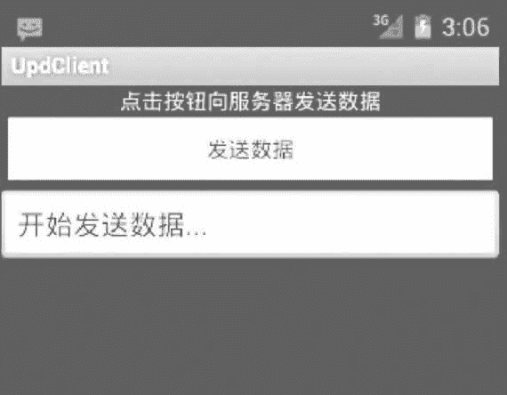
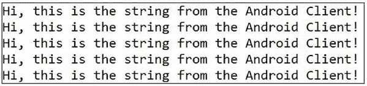

# Android Socket 编程（附带实例）

> 原文：[`c.biancheng.net/view/3161.html`](http://c.biancheng.net/view/3161.html)

关于 Socket 的具体介绍和 Java 网络编程的介绍这一节就不过多讲解了，如果大家还不是很了解，可参考《Socket 教程》和《Java 网络编程教程》。

下面我们编写的小程序主要使用 java.net 包下的 DatagramSocket 和 DatagramPacket 类，大家也可以直接参考 《Java UDP 通信：Java DatagramSocket 类和 DatagramPacket 类教程》。

下面我们编写一个由 Android 手机客户端向 PC 服务器端发送信息的小程序，客户端详细代码记录在实例 SocketClientDemo 中，服务器端由纯 Java 开发，详细代码在实例 SocketServerDemo 中，运行效果如图 1 所示。


图 1  Socket 编程效果
手机客户端运行效果如图 2 所示。
图 2  手机客户端运行效果
实例 SocketServerDemo 中 Server.java 的具体实现代码如下：

```

package introduction.android.server;

import java.io.IOException;
import java.net.DatagramPacket;
import java.net.DatagramSocket;
import java.net.SocketException;

public class Server {
    public static void main (String[] args) {
        // TODO Auto-generated method stub
        // 创建一个 DatagramSocket 对象，并指定监听的端口号
        DatagramSocket socket;
        try {
            socket=new DatagramSocket(12345);
            byte data[]=new byte[1024];
            //创建一个空 DatagramPacket 对象
            DatagramPacket packet=new DatagramPacket (data, data.length);
            // 使用 receive 方法接收客户端所发送的数据 while (true) {
                try {
                    socket.receive (packet);
                    String result=new String (packet.getData(), packet.getOffset(), packet.getLength());
                    System.out.println (result) ;
                } catch (IOException e) {
                    // TODO Auto-generated catch block
                    e.printStackTrace();
                }
            }

        } catch (SocketException el) {
            // TODO Auto-generated catch block
            el.printStackTrace();
        }
    }
}
```

Server.java 在 PC 服务器端建立 DatagramSocket 对象，并监听 12345 端口。当有客户端请求时，从该端口读取客户端传入的数据，并打印出来。

实例 SocketClientDemo 的 AndroidManifest.xml 中需要注册访问网络的相关权限，代码如下：

```

<?xml version="l.0" encoding="utf-8"?>

<manifest xmlns:android="http://schemas.android.com/apk/res/android"
    package="introduction.android.udpDemo"
    android:versionCode="l"
    android:versionName="1.0">

    <uses-sdk android:minSdkVersion="4" />

    <uses-permission android:name="android.permission.ACCESS_NETWORK_STATE"/>
    <uses-permission android:name="android.permission.INTERNET"/>
    <application android:icon="@drawable/icon"
        android:label="@string/app_name">
        <activity android:name=".UdpClient"
            android:label="@string/app_name">
            <intent-filter>
                <action android:name="android.intent.action.MAIN" />
                <category android:name="android.intent.category.LAUNCHER"/>
            </intent-filter>
        </activity>
    </application>
</manifest>
```

实例 SocketClientDemo 中 UdpClient.java 的具体实现代码如下：

```

package introduction.android.udpDemo;

import java.net.DatagramPacket;
import java.net.DatagramSocket;
import java.net.InetAddress;
import android.app.Activity;
import android.os.Bundle;
import android.os.Handler;
import android.os.Message;
import android.util.Log;
import android.view.View;
import android.view.View.OnClickListener;
import android.widget.Button;
import android.widget.EditText;

public class UdpClient extends Activity {
    private Button btn_listen;
    private EditText et;

    @Override
    public void onCreate (Bundle savedInstanceState) {
        super.onCreate (savedInstanceState);
        setContentView (R.layout.main);
        et= (EditText) findViewById (R.id.editTextl);
        btn_listen= (Button) findViewById (R.id.btn_listen);
        btn_listen.setOnClickListener (new OnClickListener(){
            @Override
            public void onClick (View v) {
                // TODO Auto-generated method stub
                et.setText ("开始发送数据...");
                new ServerThread().start();
            }
        });
    }
class ServerThread extends Thread {
    public void run(){
        try {
            //首先创建一个 DatagramSocket 对象
            DatagramSocket socket=new DatagramSocket (12344);
            //创建一个 InetAddree,自己测试的时候要设置成自己的 IP 地址
            InetAddress serverAddress=InetAddress.getByName ("169.254.31.8");

            while (true) {
                String str="Hi, this is the string from the Android Client!";
                byte data []=str.getBytes ();

                //创建一个 DatagramPacket 对象，并指定要将这个数据包发送到网络当中的哪个地址以及端口号
                DatagramPacket packet=new DatagramPacket (data,data.length,serverAddress,12345);

                //调用 socket 对象的 send 方法，发送数据
                socket.send (packet) ;
                Log.d ("server", "sending...") ;
                Thread.sleep (1000) ;
            }

        } catch (Exception e) {
            // TODO Auto-generated catch block 
            e.printStackTrace();
        }
    }
}
```

UdpClient.java 在手机客户端创建 DatagramSocket 对象，并请求与 IP 地址为“169.254.31.8”的主机进行 UDP 连接。当连接建立后，将要传递的信息封装在 DatagramPacket 对象中，并通过 DatagramSocket.send() 方法发送出去。