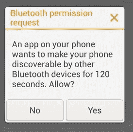

# Android 蓝牙通信开发教程（详解版）

> 原文：[`c.biancheng.net/view/3169.html`](http://c.biancheng.net/view/3169.html)

Android 系统提供蓝牙 API 包 android.bluetooth，允许手机设备通过蓝牙与其他设备进行无线连接。

Android 的蓝牙 API 可提供以下功能：

*   查找并配对蓝牙设备。
*   建立 RFCOMM 通道。
*   通过服务发现（Device Discovery）与其他无线设备进行连接。
*   与其他设备进行蓝牙数据传输。
*   管理多个蓝牙连接。

需要说明的是，Android 模拟器不支持蓝牙功能，因此蓝牙相关的应用程序只能在真机上调试。

要使用蓝牙功能，需要在 AndroidManifest.xml 中声明相应权限。蓝牙权限有两种，分别为：

<uses-permission android:name="android.permission.BLUETOOTH" />

或者：

<uses-permission android:name="android.permission.BLUETOOTH_ADMIN" />

如果想在应用程序中请求或者建立蓝牙连接并传递数据，必须声明 Bluetooth 权限。若想初始化设备发现功能或者对蓝牙设置进行更改，则必须声明 BLUETOOTH_ADMIN 权限。

要在应用程序中使用蓝牙功能，必须保证当前设备具有蓝牙并且启用该功能。若当前设备支持蓝牙，但是没有启用相关功能，则需要人工启用蓝牙功能。

首先使用 BluetoothAdapter 类的对象来确认设备具有蓝牙功能，然后使用 Intent 开启蓝牙功能。相关代码如下：

```

BluetoothAdapter mBluetoothAdapter=BluetoothAdapter.getDefaultAdapter(); 
if (mBluetoothAdapter==null) {
    //设备不支持蓝牙功能
    return;
}
//设备支持蓝牙功能
if (!mBluetoothAdapter.isEnabled()) {
    //用于启动蓝牙功能的 Intent
    Intent enableBtIntent=new Intent (BluetoothAdapter.ACTION_REQUEST_ENABLE);
    startActivityForResult (enableBtIntent, REQUEST_ENABLE_BT);
}
```

startActivityForResult(enableBtIntent,REQUEST_ENABLE_BT) 调用后，会显示如图 1 所示的对话框，要求用户确认是否启用蓝牙功能。


图 1  请求启用蓝牙功能对话框
若用户单击 Yes 按钮，则 Android 系统会启用蓝牙功能。若蓝牙功能启用成功，onActivityResult() 方法会返回 RESULT_OK；若蓝牙功能启用失败或者用户单击 No 按钮，则返回 RESULT_CANCELED。

通过 BluetoothAdapter 类对象可以发现其他的蓝牙设备。在启动设备发现服务前，应该首先对配对设备列表进行查询，以确定要连接的无线设备是否已知。

配对设备列表中存储了以前配对过的蓝牙设备的基本信息，如设备名称、设备类型、设备的 MAC 地址等。通过设备列表查找设备可以节省大量查找时间。查询设备列表的代码如下：

```

Set<BluetoothDevice> pairedDevices=mBluetoothAdapter.getBondedDevices();
//已配对设备列表存在
if(pairedDevices.size() > 0) {
    //列表内循环查找
    for(BluetoothDevice device : pairedDevices) {
        //将列表内的设备名字添加到 ArrayAdapter 中
        mArrayAdapter.add (device.getName()+"\n"+device.getAddress());
    }
}
```

当设备列表中未发现要连接的设备时，需要启动设备发现服务来发现远端蓝牙设备，扫描周围无线设备的时间为 12 秒钟左右。

启动设备发现服务的方法很简单，只要调用 startDiscovery() 方法即可。但是为了接收设备发现服务返回的设备信息，应用程序需要注册用于接收含有 ACTION_FOUND 消息的 Intent 的 BroadcastReceiver。其代码如下：

```

private final BroadcastReceiver mReceiver=new BroadcastReceiver(){
    public void onReceive(Context context,Intent intent){
        String action=intent.getAction();
        //发现服务发现远端设备时
        if (BluetoothDevice.ACTION_FOUND.equals(action)){
            //从 Intent 对象中获取 BluetoothDevice 对象信息
            BluetoothDevice device=intent.getParcelableExtra (BluetoothDevice.EXTRA_DEVICE);
            //当发现的新设备不存在于设备配对列表中时，将设备的名字和地址添加到 ArrayAdapter 中
            if(device.getBondState()!=BluetoothDevice.BOND_BONDED) {
                mArrayAdapter.add (device.getName()+"\n"+device.getAddress()) ;
            }
        }
    }
};
//注册 BroadcastReceiver
IntentFilter filter=new IntentFilter (BluetoothDevice.ACTION_FOUND);
registerReceiver(mReceiver,filter);
```

使用 registerReceiver() 方式注册的 BroadcastReceiver，在应用程序结束时要记得注销。

蓝牙设备间建立连接的过程和 TCP 连接的过程很相似。

服务器端提供 BluetoothServerSocket 类在服务器端进行监听，当有客户端连接请求时，用于建立连接；客户端提供 BluetoothSocket 类用于对蓝牙服务提交连接请求，并建立连接。

服务器端处理连接请求的示例代码如下：

```

private class AcceptThread extends Thread {
    private final BluetoothServerSocket mmServerSocket; 
    private final String NAME="MY_BLUETOOTH_SERVICE";

    public AcceptThread(){
        BluetoothServerSocket tmp=null;
        try {
            //MY_UUID 用于唯一标识当前的蓝牙服务，在建立连接时会被客户端使用
            tmp=mBluetoothAdapter.listenUsingRfcommWithServiceRecord(NAME,MY_UUID);
        } catch (IOException e) {
            e.printStackTrace()
        }
        mmServerSocket=tmp;
    }

    public void run(){
        BluetoothSocket socket=null;
        //保持监听状态，并阻塞线程，当连接建立时返回。
        while (true) {
            try {
                socket=mmServerSocket.accept();
            } catch (IOException e) {
                break;
            }
            //连接已经建立
            if (socket !=null) {
                //在单独的线程中对连接进行管理，本线程结束
                manageConnectedSocket(socket); mmServerSocket.close();
                break;
            }
        }
    }

    public void cancel(){
        try {
            mmServerSocket.close();
        } catch (IOException e) {
            e.printStackTrace()
        }
    }
}
```

UUID（Universally Unique Identifier）为通用唯一识别码，是一个 128 位的字符串，在该处用于唯一标识蓝牙服务。客户端通过 UUID 搜寻到该服务。

客户端用于请求连接的示例代码如下：

```

private class ConnectThread extends Thread {
    private final BluetoothSocket mmSocket;
    private final BluetoothDevice mmDevice;

    public ConnectThread (BluetoothDevice device) {
        BluetoothSocket tmp=null;
        mmDevice=device;
        //通过 BluetoothDevice 建立 BluetoothSocket 对象

        try {
            tmp=device.createRfcommSocketToServiceRecord (MY_UUID);
        } catch (IOException e) {
            e.printStackTrace();
        }
        mmSocket=tmp;
    }

    public void run(){
        //发现服务会减慢连接建立速度，因此关闭掉
        mBluetoothAdapter.cancelDiscovery();
        try {
            //请求连接，该操作会阻塞线程
            mmSocket.connect()/
        } catch (IOException connectException) {
            //建立连接失败
            try {
                mmSocket.close() ;
            } catch (IOException closeException) {

            }
            return;
        }
        //连接已建立，在单独的线程中对连接进行管理
        manageConnectedSocket (mmSocket) ;
    }

    public void cancel (){
        try {
            mmSocket.close();
        } catch (IOException e) {

        }
    }
}
```

由于连接建立的过程会阻塞进程，属于耗时操作，因此连接的建立和管理都需要在单独的线程中进行。在实际的工程开发过程中，建立蓝牙连接的技巧是将每个蓝牙设备初始化为服务器端并监听连接，这样每个设备都可以自动在服务器端和客户端之间进行转化。

从已经建立的连接中读取和写入数据的过程也属于耗时操作，因此也应该在单独的线程中进行。

通过 getInputStream() 和 getOutputStream() 方法可以获取输入流 InputStream 和输出流 OutputStream，通过 read(byte[]) 和 write(byte[]) 方法可以对数据进行读写。示例代码如下：

```

private class ConnectedThread extends Thread {

    private final BluetoothSocket mmSocket;
    private final InputStream mmInStream;
    private final OutputStream mmOutStream;

    public ConnectedThread (BluetoothSocket socket) {
        mmSocket=socket;
        InputStream tmpln=null;
        OutputStream tmpOut=null;
        // Get the input and output streams, using temp objects because
        // member streams are final
        try {
            tmpIn=socket.getInputStream(); tmpOut=socket.getOutputStream();
        } catch (IOException e) {

        }
        mmInStream=tmpIn;
        mmOutStream=tmpOut;
    }

    public void run(){
        byte[] buffer=new byte[1024];
        //持续监听 InputStream
        while (true) {
            try {
                //读取 InputStream 的数据
                bytes=mmInStream.read (buffer);
                // 更新 UI
                mHandler.obtainMessage (MESSAGE_READ, bytes, -1, buffer).sendToTarget();
            } catch (IOException e) {
                break;
            }
        }
    }

    public void write (byte[] bytes) {
        try {
            mmOutStream.write (bytes);
        } catch (IOException e) {

        }
    }

    public void cancel (){
        try {
            mmSocket.close();
        } catch (IOException e) {

        }
    }
}
```